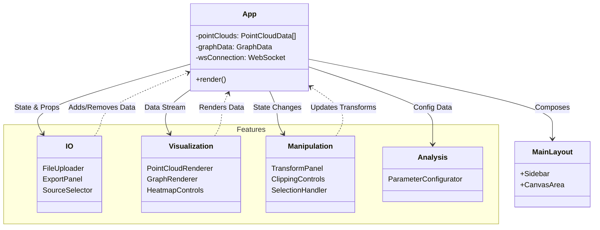

# System Architecture & Node Interactions

This document outlines the architecture of the **ToPo Fuzzy Viewer** after refactoring based on `RDD.md`. The system is divided into a React frontend (organized by feature modules) and a ROS2-integrated backend.

## 1. High-Level System Overview

```mermaid
graph TD
    subgraph Production_Environment [Field / Production]
        LiDAR[LiDAR Sensor] --> |Points| ROS[ROS2 Node Graph]
        GNG[AiS-GNG Node] --> |Graph/Clusters| ROS
    end

    subgraph Backend [Viewer Backend (C++)]
        ROS2Bridge[ROS2 Bridge\n(Listener)]
        SourceMgr[Source Manager]
        ParamMgr[Parameter Manager]
        WSServer[Viewer Server\n(uWebSockets)]

        ROS --> |Topics| ROS2Bridge
        ROS2Bridge --> |Internal Data| WSServer
        SourceMgr --> |Topic List| WSServer
        ParamMgr <--> |Get/Set| ROS
    end

    subgraph Frontend [Web Frontend (React)]
        WSClient[WebSocket Client\n(useWebSocket)]
        App[App Controller]
        Layout[Main Layout]
        
        subgraph Features [Feature Modules]
            IO[IO (Input/Output)]
            VZ[Visualization]
            MN[Manipulation]
            AN[Analysis]
        end

        WSClient <--> |JSON protocols| WSServer
        App --> Layout
        Layout --> VZ
        Layout --> MN
    end
```

## 2. Frontend Component Interactions

The frontend is refactored into domain-specific modules to ensure extensibility. `App.tsx` acts as the composition layer, injecting state into the `Layout` and `Features`.



## 3. Directory Structure

The codebase is organized by functionality (`Features`) rather than technical type (`Components`), making it easy to add new capabilities (e.g., adding a new tool to `MN` or a new analysis view to `AN`).

```
frontend/src/
├── features/           # Feature Modules (Domain Logic + UI)
│   ├── io/             # [IO-xx] Import/Export, Source Selection
│   ├── visualization/  # [VZ-xx] Renderers, Heatmaps
│   ├── manipulation/   # [MN-xx] Transforms, Clipping, Selection
│   └── analysis/       # [AN-xx] Parameters, Future Analytics
├── layout/             # [UI-xx] Sidebar, MainLayout
├── hooks/              # Shared logic (WebSocket, State)
├── types/              # Domain Types (PointCloud, Graph)
└── App.tsx             # Composition Root
```
