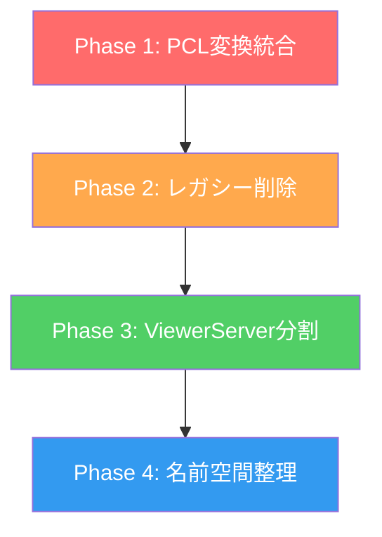

# PC Server Refactoring Plan

## 概要

`backend/src/topo_fuzzy_viewer` パッケージのリファクタリング計画。肥大化したコードベースの整理、重複コードの統合、およびアーキテクチャの改善を目的とする。

## 完了ステータス

## Phase 1: PCL Converter Utility - ✓ 完了
- `include/utils/pcl_converter.h` と `src/utils/pcl_converter.cpp` を作成
- `ros2_source_manager.cpp` を更新（約93行削減）
- `pointcloud_file_manager.cpp` を更新（約50行削減）
- CMakeLists.txt を更新

## Phase 2: Legacy Code Deletion - ✓ 完了  
- `PointCloudBridge` クラスを `ros2_bridge.h` から削除
- `ros2_bridge.cpp` ファイル全体を削除（171行）

## Phase 3: ViewerServer Modularization - 未着手
- 今後の拡張時に実施予定

## Documentation - ✓ 完了
- `doc/BACKEND_API.md` を作成（23 RPCメソッドを文書化）

---

# 以下は元の分析と計画

## 現状分析

### ファイル構成と行数

| ファイル | 行数 | 責務 |
|---------|------|------|
| `core/ViewerServer.cpp` | 1105 | WebSocket RPC ハンドラ (48メソッド) |
| `ros2_source_manager.cpp` | 405 | ROS2 トピック購読・パブリッシュ |
| `pointcloud_file_manager.cpp` | 215 | PCD/PLY ファイル読み込み |
| `gng_process_manager.cpp` | 203 | GNG プロセス起動・停止 |
| `ros2_bag_manager.cpp` | 186 | Rosbag 再生管理 |
| `ros2_bridge.cpp` | 171 | **レガシー**: PointCloudBridge |
| `ros2_parameter_manager.cpp` | 150 | ROS2 パラメータ操作 |
| `processing_api.cpp` | 112 | PCL フィルタ処理 |
| `cloud_manager.cpp` | 74 | クラウドストレージ管理 |

**合計: 約 2,600 行** (ヘッダー除く)

---

## 🔴 問題点

### 1. 重複コード: PointCloud 変換ロジック

3つのファイルで **ほぼ同一の PCL 変換コード** が存在:

```
ros2_bridge.cpp:68-168          (pointCloudCallback)
ros2_source_manager.cpp:117-209 (handlePointCloud)
pointcloud_file_manager.cpp:94-157, 159-203 (loadPCD, loadPLY)
```

**パターン**:
- hasRGB / hasIntensity のフラグチェック
- XYZRGB / XYZI / XYZ 型別のループ処理
- NaN チェック付きの positions/colors/intensities 抽出

### 2. レガシークラス: `PointCloudBridge`

- `ros2_bridge.cpp` の `PointCloudBridge` クラスは `ROS2SourceManager` とほぼ同じ機能
- 現在の `main.cpp` では **使用されていない**
- 削除候補

### 3. ViewerServer の肥大化

- 1105 行、48 メソッドの巨大クラス
- 全 RPC ハンドラが1ファイルに集約
- JSON パース/生成のヘルパー関数が分散

### 4. 名前空間の不整合

| Namespace | 用途 |
|-----------|------|
| `core` | ViewerServer, types |
| `ros2_bridge` | ROS2 関連全般 |
| `pcd_server` | CloudManager, processing |
| `pcd_protocol` | バイナリプロトコル |

→ `pcd_server` と `ros2_bridge` の境界が曖昧

---

## ✅ リファクタリング提案

### Phase 1: 重複コード統合 (優先度: 高)

#### 1.1 PointCloud 変換ユーティリティの抽出

**新規ファイル**: `include/utils/pcl_converter.h`, `src/utils/pcl_converter.cpp`

```cpp
namespace utils {

struct PointCloudData {
    std::vector<float> positions;
    std::vector<uint8_t> colors;
    std::vector<float> intensities;
    size_t pointCount;
    uint8_t dataMask;
};

// ROS2 PointCloud2 → 内部形式
PointCloudData convertFromRosMsg(const sensor_msgs::msg::PointCloud2::SharedPtr& msg);

// PCL Cloud → 内部形式
PointCloudData convertFromPclCloud(const pcl::PointCloud<pcl::PointXYZRGB>::Ptr& cloud);
PointCloudData convertFromPclCloud(const pcl::PointCloud<pcl::PointXYZI>::Ptr& cloud);
PointCloudData convertFromPclCloud(const pcl::PointCloud<pcl::PointXYZ>::Ptr& cloud);

// 内部形式 → ROS2 PointCloud2
sensor_msgs::msg::PointCloud2 convertToRosMsg(const PointCloudData& data, const std::string& frame_id);

} // namespace utils
```

**効果**: 約 200 行の重複コード削減

---

### Phase 2: レガシーコード削除 (優先度: 中)

#### 2.1 `PointCloudBridge` クラスの削除

- `ros2_bridge.cpp` の `PointCloudBridge` クラス全体を削除
- `ros2_bridge.h` から該当クラス宣言を削除

**影響範囲**: なし (現在未使用)

---

### Phase 3: ViewerServer 分割 (優先度: 中)

#### 3.1 RPC ハンドラのモジュール化

**提案構造**:

```
src/core/
├── ViewerServer.cpp          # コア (接続管理、ルーティング)
├── handlers/
│   ├── SourceHandlers.cpp    # getSources, subscribeSource, unsubscribeSource
│   ├── ParameterHandlers.cpp # getParameters, setParameter
│   ├── RosbagHandlers.cpp    # listRosbags, playRosbag, stopRosbag
│   ├── FileHandlers.cpp      # listPointCloudFiles, loadPointCloudFile
│   ├── GngHandlers.cpp       # startGng, stopGng, getGngStatus
│   └── CloudHandlers.cpp     # uploadCloud, deletePoints, publishCloud
└── rpc/
    └── JsonRpc.h/.cpp        # extractJsonField, createJsonResponse, createJsonError
```

**効果**: ViewerServer.cpp を約 500 行に削減

---

### Phase 4: 名前空間整理 (優先度: 低)

#### 4.1 統一名前空間への移行

```
現状:
  pcd_server::CloudManager
  pcd_server::processing::*
  pcd_protocol::*
  ros2_bridge::*
  core::*

提案:
  topo_fuzzy_viewer::core::*          # ViewerServer, types
  topo_fuzzy_viewer::ros2::*          # ROS2関連
  topo_fuzzy_viewer::protocol::*      # プロトコル
  topo_fuzzy_viewer::processing::*    # PCL処理
  topo_fuzzy_viewer::utils::*         # ユーティリティ
```

> [!WARNING]
> 名前空間変更は破壊的変更。慎重に段階的移行が必要。

---

## 削除候補ファイル/コード

| ファイル/クラス | 理由 | アクション |
|----------------|------|----------|
| `PointCloudBridge` クラス | `ROS2SourceManager` で代替済み | 削除 |
| `loadLAS()` 未実装関数 | スタブのみ | コメントで明記 or 削除 |
| `publishStaticCloud()` deprecated | 警告出力のみ | 削除検討 |

---

## 実装優先順位



| Phase | 作業量 | リスク | 優先度 |
|-------|--------|--------|--------|
| 1 | 中 | 低 | 🔴 高 |
| 2 | 小 | 低 | 🟠 中 |
| 3 | 大 | 中 | 🟢 中 |
| 4 | 大 | 高 | 🔵 低 |

---

## 確認事項

1. **Phase 1** の `pcl_converter` ユーティリティの API 設計について確認
2. **Phase 3** の ViewerServer 分割粒度は適切か
3. 他に統合/削除すべきコードがあるか
