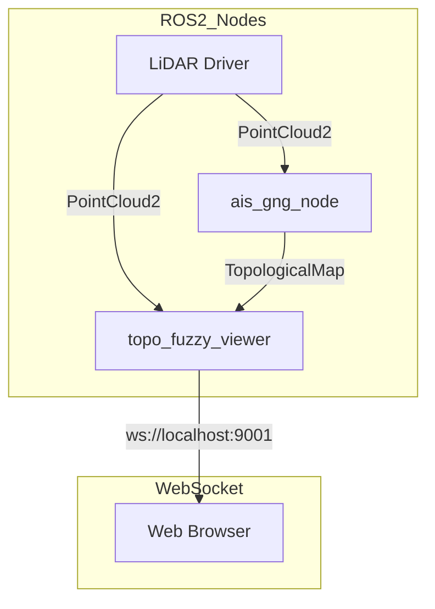

# ROS2 Workspace Setup

## Prerequisites
- ROS2 Humble installed
- Workspace sourced: `source /opt/ros/humble/setup.bash`
- PyTorch (for ais_gng classification features)

## Building the Workspace

```bash
cd /path/to/ToPoFuzzyViewer/backend

# Source ROS2
source /opt/ros/humble/setup.bash

# Build all packages
colcon build --symlink-install

# Source the workspace
source install/setup.bash
```

### Building Specific Packages

```bash
# Build only the viewer
colcon build --packages-select topo_fuzzy_viewer

# Build only message definitions
colcon build --packages-select ais_gng_msgs

# Build with dependencies
colcon build --packages-up-to ais_gng
```

## Running

### Viewer Server
```bash
ros2 launch topo_fuzzy_viewer viewer_stack.launch.py
```
- Starts WebSocket server on port 9001
- Launches split backend nodes (`viewer_ws_gateway_node`, `viewer_source_node`, `viewer_edit_node`, etc.)
- Bridges data to the web frontend with WebSocket Protocol v2

### GNG Processing Node
```bash
ros2 run ais_gng ais_gng_node
```
- Processes point cloud data with Growing Neural Gas algorithm
- Publishes TopologicalMap results

### Verifying Setup
```bash
# Check available packages
ros2 pkg list | grep -E "(topo_fuzzy|ais_gng|gng_)"

# Check running nodes
ros2 node list

# Check available topics
ros2 topic list
```

## Packages Overview

| Package | Description |
|---------|-------------|
| `topo_fuzzy_viewer` | WebSocket server bridging ROS2 to web frontend |
| `ais_gng` | GNG processing node |
| `ais_gng_msgs` | Message definitions (TopologicalMap, TopologicalNode, TopologicalCluster) |
| `gng_cpu` | CPU-based GNG library |
| `gng_classification` | Classification library (requires PyTorch) |

## Topics

### Subscribed by topo_fuzzy_viewer
- `/points` (sensor_msgs/PointCloud2) - Point cloud data
- `/topological_map` (ais_gng_msgs/TopologicalMap) - GNG results

### Published by ais_gng
- `/topological_map` (ais_gng_msgs/TopologicalMap) - GNG processing results

## Architecture



## Troubleshooting

### Package not found
```bash
# Rebuild and re-source
colcon build
source install/setup.bash
```

### gng_cpu build fails (OpenSSL)
The gng_cpu package may require OpenSSL. Install with:
```bash
sudo apt install libssl-dev
```

### PyTorch not found
For ais_gng classification features:
```bash
pip install torch
```
