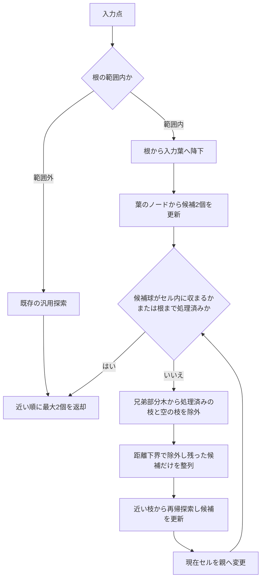

# GNGノードの最近傍2点探索：現時点の最速構成

記録日：2026-09-06。実学習の比較を2026-09-07に追記。

葉容量の追加比較により、最新版の既定値は **分割32・統合8**。同じ比較器内の20/4に対し、実bag2回の探索＋更新は5.431→4.796 ms（約11.7%短縮）。探索アルゴリズムの変更なし。[容量の比較記録](../tmp/gng_spatial_20260906/compact_plane/capacity/report.md)

これは索引単体での選定。固有の補助処理を外した[基本学習比較](../tmp/gng_spatial_20260906/compact_plane/learning_compare/basic/report.md)では、同じ初期状態・学習入力・5,000ノードでボクセル5.913→木4.524 ms（23.5%短縮）。`attention()` 等を含む[元の仕様での比較](../tmp/gng_spatial_20260906/compact_plane/learning_compare/report.md)は学習7.301 / 7.616 ms、GNG全体25.367 / 38.341 msであり、別条件。通常ROSパッケージはボクセル版を維持。

## 1. 対象と全体像

この文書は、指定した実点群bagで比較した際に最速だったSpatialTree2派生の検証実装を説明する。対象は、入力点に近い**GNGノード2個の探索**と、学習によって移動するノードの**空間索引の更新**。入力点群のボクセル化、GNGの辺更新、共分散計算などは別の処理である。

基本手順は次のとおり。

1. ノード数に応じて分割する八分木に、GNGノードを格納する。
2. 入力点を含む葉セルへ根から降り、その葉のノードから近傍2個の暫定候補を得る。
3. 候補が確定しなければ親へ探索範囲を広げ、未探索の兄弟部分木を調べる。
4. 空の枝を占有ビットで除外し、残った枝もセルまでの最短距離で除外する。
5. 除外されなかった枝だけを近い順に調べ、候補を更新する。
6. 現在の第2候補より近いノードが外側に存在し得なくなったら終了する。

葉セル同士の隣接グラフは、この最速構成では使用・維持していない。異なる深さのセルや空の入力セルへの対応には、木の親子関係を使う。検証用GNGへの組み込みは別の比較プログラムで実施済み。通常ROSパッケージの索引置換は未実施であり、本書は検証版の説明である。



## 2. 記録した実装構成

対象ソース：[compact_plane/search_tree.hpp](../tmp/gng_spatial_20260906/compact_plane/search_tree.hpp)。旧最速版は[child_search/search_tree.hpp](../tmp/gng_spatial_20260906/child_search/search_tree.hpp)に保存。

```cpp
using fastest_tree = compact_spatial::AdaptiveTree<indexed_node, float, 3>;

fastest_tree tree(
    compact_spatial::BoundingBox<float, 3>{center, half_extents},
    {});
tree.find_child_best<false, false, 4>(point, found);
tree.updatePosition(node, next_position);
```

これは既存の型・関数名をそのまま抜粋したもの。設定の意味は以下のとおり。

| 項目 | 計測した最速構成 |
| --- | --- |
| 座標 | 3次元、`float` |
| 入力葉の取得 | 根から子番号を計算して降下：`enable_lookup=false` |
| 子探索 | 入力を含む親では3距離項、それ以外は6項を共用し、候補を挿入整列：`strategy=4` |
| 探索の診断カウンタ | 時間計測時は無効：`enable_counts=false` |
| 入力葉の対応表 | 維持・確保・セル内フィールドを削除 |
| Morton区間による検索 | 関連処理とフィールドを削除 |
| 葉の隣接グラフ | 関連処理とフィールドを削除 |
| 移動時のセル余白 | `margin=0` |
| 子の探索順を返す参照表 | 不使用 |

旧最速版に残っていた未使用の対応表の維持を停止し、葉グラフ・Morton区間・整数セル座標などの未使用フィールドを削除した。セル本体は200→112バイトになった。この実装変更時点ではノード座標・所属・木構造・分割統合条件を旧最速版と共通にして比較。その後の葉容量比較では、同じノード座標と操作列を使い、閾値に応じた木構造の違いを許容している。

以下は、有限な座標を持つ登録済みノードが固定した根の範囲内にあり、探索とノード更新を同時実行しない条件での手順。新規登録には`add`、登録後の移動には`updatePosition`を使う。根の自動拡張を行うアルゴリズムではない。

## 3. データ構造と分割

各セルは軸に平行な直方体であり、中心座標`center`と各軸の半幅`half_extents`を持つ。根は立方体でなくてもよい。内部セルを分割すると、各軸を半分にした8個の子セルを作る。

| 格納場所 | フィールド | 用途 |
| --- | --- | --- |
| セル | `parent`、`depth` | 祖先への移動と深さ |
| セル | `children_block` | 連続領域に確保した8個の子セル |
| 葉セル | `elements` | 所属ノードへのポインタ配列 |
| セル | `subtree_element_count` | 自分以下のノード数 |
| 内部セル | `active_child_mask` | ノードのある子部分木を示す8ビット |
| セル | `child_bit` | 親から見た自分のビット位置 |
| 内部セル | `subdivided_children_count` | 内部セルになっている直接の子の数 |
| ノード | `spatial_handle` | 所属する葉セルへの参照 |
| ノード | `index_in_cell` | 葉のポインタ配列内の位置 |

空の子セルも確保されるが、ノード数が0の部分木は占有ビットが0になる。したがって「空セルを構造上なくす」方式ではなく、「探索時に空の部分木を一括して除外する」方式である。

各ノードは1個の葉にだけ所属する。内部セルの`elements`は空で、ノードは子孫の葉に格納する。葉のポインタ配列と8個の子セルはそれぞれ連続しているが、ノード本体の座標が葉ごとに連続配置されるとは限らない。

### 子番号の決定

入力点を`q`、現在セルの中心を`c`とすると、子番号は次の3ビットで決まる。

```text
child_idx = int(q.x >= c.x)
          | (int(q.y >= c.y) << 1)
          | (int(q.z >= c.z) << 2)
```

x方向がビット0、y方向がビット1、z方向がビット2。例えば中心よりxとzが正側、yが負側なら`101₂ = 5`となる。これを葉に達するまで繰り返す。座標から葉へ1回の表参照で到達する方式は、今回の最速経路では使っていない。

## 4. 探索で使う二つの判定

### 4.1 部分木を丸ごと除外できる条件

葉のノードを調べて見つけた近傍候補2個のうち、遠い方までの二乗距離を`r²`とする。候補が2個になる前は、距離による除外を行わない。

セルの中心を`c`、半幅を`h`とすると、点`q`からセルまでの距離下界は、厳密算術では次式になる。

$$
g_a = \max(0, |q_a-c_a|-h_a),\qquad
L^2 = g_x^2+g_y^2+g_z^2
$$

セル内のノードはすべて`L²`以上離れている。そのため、**候補が2個あり、`L² > r²`なら、そのセル以下を探索する必要がない**。同値の場合は除外しない。

ここで比較するのはセル中心までの距離ではなく、セルの領域までの最短距離である。この下界を使うため、セルのサイズが違っていても同じ判定を適用できる。

### 4.2 祖先へ戻らず終了できる条件

現在セルの内部は、探索済み、または4.1の条件で除外済みとする。入力点を中心とする半径`r`の球がそのセルの内部に完全に収まれば、外のノードが候補を改善することはない。

各軸について次の条件をすべて満たす場合に終了できる。

$$
t_a = h_a-|q_a-c_a| > 0,\qquad t_a^2 > r^2
$$

球が面に触れる場合や候補が2個未満の場合は、親へ探索を広げる。距離の平方根を求める必要はない。

### 4.3 実装の丸め誤差対策

実装では、深い分割による浮動小数点の境界ずれを考慮して判定に余白を加える。根の中心・半幅を`c_root`、`h_root`、セルの深さを`d`とすると、軸ごとの余白は次のとおり。

$$
\delta_a = 4\epsilon_{\mathrm{float}}
  (1+|c_{\mathrm{root},a}|+h_{\mathrm{root},a}),\qquad
G_a(d)=(d+2)\delta_a
$$

4.1では`g_a = max(0, |q_a-c_a|-h_a-G_a(d))`とし、セルを少し広げた下界を使う。4.2では`t_a = h_a-|q_a-c_a|-G_a(d)`とし、セルを少し狭めて球の包含を判定する。どちらも探索を省略しにくい方向の調整であり、ノードまでの距離そのものは変えない。

セル境界は包含判定上は両側に含まれる。境界上のノードが移動前の葉に残り、入力の根からの降下先と異なる場合も、境界で早期終了しないことで反対側を確認する。

この余白は実装上の保守的な対策であり、任意の座標スケール・オーバーフローを含む浮動小数点演算全体の形式的証明ではない。また、根の外にある入力は既存の汎用探索へ分岐するため、その経路はここで説明した共有軸項と余白付き枝刈りの経路とは異なる。

## 5. 最近傍2点探索の具体的手順

以下の疑似コードは通常の根の範囲内の探索を中心に示す。`state`は、入力点、候補数、候補2個、遠い候補の二乗距離を保持する。

### 5.1 入力葉から祖先へ探索を広げる

```text
find_nearest_two(q):
    if q が根の範囲外:
        return 既存の汎用探索(q, 2)

    state = 候補が空の状態(q)
    cell = root
    while cell が内部セル:
        cell = cell.children[子番号(q, cell.center)]

    scan_leaf(cell, state)

    while cell.parent が存在:
        if 候補が2個あり、候補球がcellの内部に収まる:
            break
        search_children(cell.parent, excluded=cell, state)
        cell = cell.parent

    return stateの候補を近い順に並べたもの
```

最初の葉が空でも同じ手順を使う。候補がないまま親へ進み、占有している兄弟部分木を調べる。直近の兄弟がすべて空なら、さらに上の階層へ戻る。候補が2個揃うまでは、球の包含による終了も距離による枝刈りも行わない。

### 5.2 葉のノードから候補2個を更新する

```text
scan_leaf(leaf, state):
    for node in leaf.elements:
        dist_sq = (node.position - state.q)の二乗ノルム
        if 候補数が2未満:
            候補へ追加
            2個揃ったら遠い方を候補配列の先頭へ配置
        else if dist_sq < 現在の遠い候補の二乗距離:
            遠い候補をnodeへ置換
            遠い方が先頭になるよう候補2個を配置
```

候補の記憶領域は固定長2で、ヒープや動的確保を使わない。探索中は遠い候補を先頭に置き、枝刈りの基準をすぐ参照する。返却時だけ近い順にする。距離が完全に同じ候補への置換は行わないため、同距離時に最小IDのノードを返す規約はない。

### 5.3 占有ビットと距離によって子を絞る

```text
search_children(parent, excluded, state):
    active_mask = parent.active_child_mask
    if excluded が存在:
        active_mask &= ~excluded.child_bit
    if active_mask == 0:
        return

    if active_mask の立っているビットが1個だけ:
        child = そのビットに対応する子
        lower_bound_sq = childまでの余白付き距離下界
        if 候補数が2未満 or lower_bound_sq <= state.worst_dist_sq:
            visit(child, state)
        return

    terms = 親から求めた6個の軸距離項
    candidates = 最大8個の固定長配列
    while active_mask != 0:
        child_idx = 最下位の立っているビットの位置
        active_mask &= active_mask - 1
        lower_bound_sq = termsから求めた子の距離下界
        if 候補数が2個 and lower_bound_sq > state.worst_dist_sq:
            continue
        candidatesへ距離下界の昇順を保つ位置に挿入

    for candidate in candidates:
        if 候補数が2個 and candidate.lower_bound_sq > state.worst_dist_sq:
            break
        visit(candidate.cell, state)

visit(cell, state):
    if cell が葉:
        scan_leaf(cell, state)
    else:
        search_children(cell, excluded=なし, state)
```

占有ビットの列挙には`ctz`と`mask &= mask - 1`を使う。8個の子すべてのノード数を読み直す必要はない。占有子が1個なら、6項の配列生成と整列自体を省く。

複数の占有子があっても、**距離で除外した後の候補だけを整列する**。最初から8個すべてを整列するわけではない。再帰探索中に第2候補が近くなるため、各候補を訪問する直前にも距離を判定する。候補配列は下界の昇順なので、その時点の基準を超えたら以降をまとめて省略できる。

これは親ごとに近い枝から潜る探索であり、木全体の未探索セルを1個の優先度付きキューで管理する方式ではない。

### 5.4 兄弟8セルで軸の距離計算を共用する

一般の親セルの各軸について、子の領域は負側と正側の2通りしかない。親の半幅を`h_a`、中心を`c_a`、深さを`d`とすると、次の6項を一度計算する。

$$
u_a=h_a/2,\qquad
c_{a,b}=c_a+(2b-1)u_a\quad(b\in\{0,1\})
$$

$$
T_{a,b}=\left[\max\left(0,
  |q_a-c_{a,b}|-u_a-G_a(d+1)
\right)\right]^2
$$

子番号`i`の3ビットを`b_x, b_y, b_z`とすれば、その子の距離下界は次の加算だけで得られる。

$$
L_i^2=(T_{x,b_x}+T_{y,b_y})+T_{z,b_z}
$$

例えば子番号5なら、`T[x][1] + T[y][0] + T[z][1]`となる。最大8子について3軸ずつ別々に計算する代わりに、6項を共用する。実装では子の中心を生成するときと同じ演算順序を使う。

入力葉から祖先へ戻る経路では、入力点を含む子が分かっている。この場合は各軸で入力側の距離項を0とし、反対側の3項だけを計算する。処理済みの子の`child_bit`から3軸の側を取得し、上式の配列の半分を0として、子番号による距離項の選択を共用する。

反対側の3項は従来と同じ子中心の生成・引き算・丸め余裕の差し引きの順序で計算する。別の部分木へ再帰すると入力がその親の外にある場合もあるため、そこでは従来の6項計算を使用する。占有する子が1個だけの場合は、従来と同じ直接計算のままである。

これは現在の入力に対する親セル内での計算結果の共用であり、過去の入力の探索順を残すキャッシュではない。

### 5.5 CPUのハードウェアキャッシュとの関係

CPUのハードウェアキャッシュを利用するために、子探索順の参照表を自作する必要はない。参照表はプログラムが明示的に検索するデータ構造であり、ハードウェアキャッシュはメモリアクセスを高速化する仕組みである。比較した実装はいずれも通常のCPUキャッシュが働く条件で実行している。

キャッシュを活用する検討対象は、探索中に読む情報の配置とアクセス順である。現実装では8個の子セルと各葉のノードポインタ配列はそれぞれ連続配置だが、再帰先やポインタの参照先まで連続しているとは限らない。今回の最速構成では未使用フィールドを削除してセルを縮小した。指定bagでは縮小だけによる時間短縮は確認できず、距離計算の簡略化を組み合わせた構成を採用した。ノード座標そのものを葉ごとに連続配置する変更は未実施である。作業データ量とアクセスの局所性、ハードウェアによる先読みの活用は、[Intelの性能解析ガイド](https://cdrdv2-public.intel.com/848603/vtune-profiler_user-guide_2025.1-766319-848603.pdf)でもメモリ待ちを減らす検討事項として挙げられている。

探索順の比較としては、同じデータ配置・距離計算・更新列のまま、次の二つを比べると整列の有無の影響を確認できる。

- 距離下界で候補を絞り、残った候補を距離順に整列して探索する。
- 距離下界で候補を絞り、整列せずに子番号順、つまり子セル配列の配置順に探索する。

後者では各枝を訪問する直前にも距離で除外するが、遠い枝が現れても後続全体を打ち切れない。後ろに近い枝がある可能性があるため、5.3の疑似コードの`break`に相当する処理は、当該枝だけを飛ばす処理に変える。CPUキャッシュが幾何学的な近さを判断して探索順を決めるわけではない。

距離順の利点は、近い候補を早く見つけて後続の探索を減らせること。配置順の利点として検証したいのは、整列費用の削減とメモリアクセスの局所性である。配列順に子を選んでも、その先では再帰やポインタ参照が発生するため、キャッシュヒット率の向上を自動的に保証するものではない。

この二方式を単独で比較する[追加検証](gng_spatial_development_notes.md)を実施した。同じ型・セル配置・入力・ノード更新を使い、候補の整列と後続全体の打切りの有無だけを切り替えた。指定bagの2回平均では、探索5000回と索引更新の合計が距離順5.885 ms、配置順5.961 msで、配置順が約1.3%遅かった。合成した入力とノード群の乖離では4.48 → 16.73 ms、1軸大移動では24.64 → 50.37 msとなり、今回は距離順を維持する。

保存した実学習列15000探索では、配置順によって整列がなくなる一方、ノードとの距離計算が343978回から400221回へ約16.4%増えた。近い第2候補を早く得ることで後続の探索を減らす効果が、配置順では弱くなる。キャッシュミス率はOSの権限制限により未計測であり、キャッシュそのものの効果や、セル・座標の格納形式を変える効果まで評価した結果ではない。

この追加比較は2索引で実施しており、8節の6索引比較とは比較器の負荷が異なる。二つの実験の絶対時間から改善率を求めず、各実験内の対応する結果を使う。

### 5.6 空セルと異深度セルを扱う例

```text
root
├─ A
│  ├─ L : 入力点の葉。空でもよい
│  ├─ S : ノードあり。さらに細分化されていてもよい
│  └─ その他の子
├─ B : Aと同じ深さの部分木
└─ その他の子
```

最初に`L`を調べる。次に`A`の子から`L`と空の枝を除き、`S`などを調べる。まだ外側を除外できなければ、`root`の子から処理済みの`A`と空の枝を除いて調べる。

`S`や`B`が細かく分割されていれば、その内部で同じ処理を繰り返す。ここでいう兄弟部分木は「同じ親を持つ枝」であり、葉同士が面で接触していることは条件ではない。

各段階で処理済みの枝全体を除くため、同じノードを再訪しない。入力葉と各祖先の未探索兄弟部分木によって、根の全ノードを重複なく覆う。この構造により、訪問済み集合や葉グラフを持たずに探索範囲を広げられる。

## 6. 学習によるノード移動と索引の更新

### 6.1 同じ葉の内部にとどまる場合

`spatial_handle`から現在の葉を直接取得し、移動先をその葉が含むか判定する。含む場合は座標だけを書き換えて終了する。セルのノード配列、祖先の個数、占有ビットは変えない。

この経路の索引更新は定数時間。計測時の`margin`は0なので、セル外へのはみ出しを許す余白はない。

### 6.2 別の葉へ移る場合

1. 現在の葉から親をたどり、移動先を含む最も近い祖先を見つける。
2. 古い葉の配列からノードを除く。記録した添字の要素を末尾のノードで埋め、末尾を削除し、埋めたノードの添字を更新する。
3. 古い葉と、その親から共通祖先の直前までのノード数・占有ビットを更新する。対象の祖先で統合条件を満たしたら統合する。
4. 共通祖先のノード数を一時的に1減らし、新しい座標で共通祖先から挿入する。挿入側の増分と相殺され、共通祖先とその上位の総数は変わらない。
5. 新しい経路を子番号で降り、所属・ノード数・占有ビットを更新する。葉が分割条件を満たしたら分割する。

移動先の探索にも葉の隣接グラフは使わない。近い移動なら近い祖先から降り直せるため、常に根へ戻って挿入する必要はない。大きな移動では根まで戻る可能性がある。

根の外へノードを移動させる場合、現コードには根から再挿入する分岐があるが、根の範囲を拡張する処理はない。その分岐を範囲外ノード対応の保証として扱わず、本書の探索の前提は根の範囲内に限定する。

### 6.3 占有ビットの差分更新

各セルのノード数が`0 → 1`になったとき、親の対応ビットを立てる。`1 → 0`になったとき、そのビットを消す。所属変更の経路上で更新するため、探索のたびに占有状態を作り直す必要はない。

新規ノードの追加は根から挿入し、削除は所属葉から末尾交換で除去した後に祖先へ反映する。固定の周期で木全体を走査する更新方式ではない。

### 6.4 分割・統合の条件

追加比較で選定したパラメータは次のとおり。最新版のヘッダにも既定値32/8を反映し、構築引数 `{}` で適用可能。以前の比較は `{20, 4, 0.01f, 32}` を明示して再現する。保存した比較基準ヘッダは20/4のまま保持。

| パラメータ | 値 | 用途 |
| --- | ---: | --- |
| `max_nodes_per_cell` | 32 | 葉の収容数による分割判定 |
| `min_nodes_for_merge` | 8 | 子部分木の合計数による統合判定 |
| `min_cell_size` | 0.01 | x軸方向のセル幅による分割停止判定。座標と同じ単位 |
| `max_depth` | 32 | 分割の深さ制限 |

**分割**：葉のノード数が32を超え、現在の葉のx軸幅が0.01より大きく、深さが32未満なら8個の子を生成する。既存ノードを子へ配り、各ノードの所属と添字を更新する。必要なら再帰的に分割する。

`min_cell_size`は現実装では「分割前の親のx軸幅」の判定であり、分割後の全軸の幅が0.01以上であるという保証ではない。

**統合**：直接の子がすべて葉で、合計ノード数が8以下なら親へまとめる。子の配列からノードを親へ集め、所属と添字を更新し、子セルを解放する。削除や移動元の経路で条件を判定する。

入力葉の対応表と葉グラフはこの構成から削除したため、分割・統合でそれらを更新する費用は発生しない。

## 7. 正確性と計算量

厳密算術で、ノードが所属セル内にあり、所属・個数・占有ビットが正しいとき、次の理由で最近傍2点を探索できる。

1. 距離下界が第2候補より大きい枝には、その候補を改善するノードがない。
2. 候補球が処理済みのセル内に収まれば、そのセル外にも改善するノードがない。
3. それ以外の枝は、入力葉から祖先へ戻る過程で重複なく探索対象になる。

したがって、接触葉だけを調べて打ち切る近似探索にはならない。登録ノードが2個未満なら、その個数だけを返す。同距離のノードをどのID順に選ぶかは保証対象外。

木の深さを`D`、探索で訪問・判定するセル数を`C`、実際に距離を計算するノード数を`P`とすると、探索時間は`O(D + C + P)`。各親の整列は最大8個で、固定長配列を使う。探索の作業領域は再帰の深さに比例し、最速経路に全セル規模の探索キューはない。

同じ葉内の移動は`O(1)`。別の葉への移動は主に旧経路・新経路の長さと、分割・統合時のノード再配置に依存する。新しい最速構成には入力葉の対応表の更新費用はない。

入力からノード群が遠い、ノードが偏っている、頻繁な大移動で所属変更や分割・統合が増える、といった条件では処理が重くなる。最悪の場合は多くのセルと全ノードを調べるため、常に`O(log N)`や一定時間になる保証はない。

## 8. 過去の計測結果：葉容量20/4での実装比較

以下は葉容量を20/4に固定した前段階の比較。[未使用データ削除とセル距離計算の簡略化](../tmp/gng_spatial_20260906/compact_plane/report.md)。容量32/8の最新結果は12節を参照。

指定bag：`/rosbag/uraki/rosbag2_2026_04_22-19_10_41_transformed`

入力topic：`/camera/camera/depth/color/points`

Release、`-O3 -DNDEBUG`、C++20。各フレーム10万入力点、学習5000回、ノード上限5000。同一実行内の各索引に、同じノード座標・探索入力・移動・追加・削除を適用した。探索と更新ごとに4方式の全24順列を巡回して実行順を均等化した。各回755フレームのうち先頭30を除く725フレーム、最終2回の平均は以下のとおり。

| 対象 | 旧最速版 | 新最速版 |
| --- | ---: | ---: |
| 最近傍2点探索5000回 | 4.823 ms/フレーム | 4.620 ms/フレーム |
| 探索1回への換算 | 0.965 µs/回 | 0.924 µs/回 |
| 索引更新 | 1.392 ms/フレーム | 1.509 ms/フレーム |
| 探索と索引更新の合計 | 6.216 ms/フレーム | 6.129 ms/フレーム |

探索は約4.2%、合計は約1.4%短縮した。索引更新はこの実bag比較では増加している。保存列や合成条件の結果も含めて[検証記録](../tmp/gng_spatial_20260906/compact_plane/report.md)に示す。セル縮小だけでは合計6.308 msとなり、軸距離項の簡略化を組み合わせた構成を採用した。

この時間はGNG処理全体や点群のボクセル化を含まない。学習を駆動する勝者は従来グリッドで求め、各検証索引に同じ更新列を適用した比較である。複数索引の比較と検証に時間がかかるため、フレームをキューに保持して処理しており、単独GNGの30 Hz動作を示す数字ではない。

同一実行内で各方式の入力・状態は共通。最終2回の実行間でも点数・探索数・移動数などの件数は一致したが、ノード座標列全体の実行間同一性を証明した記録ではない。

比較した計755万探索で基準版との近傍ID・距離の不一致は0。周期的な総当たり検証7万5500回でも不一致は0。状態・所属・占有ビットの照合に加え、境界、深さ32、分割・統合などの別試験が保存されている。これは確認した試験範囲の結果である。

「最速」は指定bagのこの比較条件を指す。保存した一部の学習列では入力葉の対応表を使う構成の方が速かったため、すべての点群分布で同じ構成が最速とは限らない。合成した1軸大移動の条件では、旧最速版24.435 msに対して新最速版24.453 ms/合成フレームであり、この条件の短縮は確認できていない。

候補整列が残っている理由も計測で確認した。保存した1万5000探索では、複数の占有子を扱った3万9728回の呼び出しに対し、距離判定後に整列対象へ残った候補は合計4万7042個、平均1.18個だった。これは0候補の呼び出しを含む平均であり、毎回8個を整列する処理ではない。子順序の参照表化は今回の実bagではこの構成を上回らなかった。

## 9. 実装との対応と保存先

本書の対象は`compact_plane/search_tree.hpp`の`strategy=4`である。通常ROSパッケージの索引置換は未実施。容量20/4での計測時のソースのSHA-256は以下のとおり。現在のソースとの差は既定値2項目の32/8への変更。

```text
b6114d83d6a190432e61bf079d5b69d73bfb64bc3a2f676a885bfd92fed8b65e
```

| 本書の処理 | 対応する実装関数 |
| --- | --- |
| 入力点の子番号 | `Cell::getChildIndex` |
| 根から入力葉の取得 | `find_input_cell<false, false>` |
| 近傍2点探索の入口 | `find_child_best<false, false, 4>` |
| 葉の走査・候補更新 | `search_leaf`、`SearchState::add_match_small` |
| 単独子の距離下界 | `subtree_dist_sq` |
| 軸距離項の共用 | `child_axis_terms`、`child_dist_sq` |
| 兄弟部分木の除外・整列・再帰探索 | `search_shared_siblings<false, true>` |
| 候補球による終了判定 | `contains_candidate_ball` |
| 所属を使った移動 | `updatePosition`、`Cell::removeDirect`、`Cell::add` |
| 占有数・ビット更新 | `Cell::decrement_count`、`Cell::add` |
| 分割・統合 | `Cell::shouldSubdivide`、`Cell::subdivide`、`Cell::shouldMerge`、`Cell::merge` |

構成の呼び出しは[compact_plane/benchmark.cpp](../tmp/gng_spatial_20260906/compact_plane/benchmark.cpp)の`child_tree`と`mode == 3`、実bag試験は[compact_plane/live.cpp](../tmp/gng_spatial_20260906/compact_plane/live.cpp)を参照。

8節の実装比較は[summary.json](../tmp/gng_spatial_20260906/compact_plane/summary.json)、フレーム別計測は[live_run_1/comparison.csv](../tmp/gng_spatial_20260906/compact_plane/live_run_1/comparison.csv)と[live_run_2/comparison.csv](../tmp/gng_spatial_20260906/compact_plane/live_run_2/comparison.csv)。最新の容量比較は[capacity/summary.json](../tmp/gng_spatial_20260906/compact_plane/capacity/summary.json)と、その隣の `live_run_1/2` に保存。

参照先の`tmp/`はGit管理外の実験保存先である。この文書自体は通常の文書として保存し、本文だけでも探索・更新の手順と計測対象を追えるようにしている。今回の変更は`compact_plane`内の検証版であり、通常GNG・SpatialTree2原本・旧最速版など185ソースファイルは退避・一致・復元を確認済み。変更前の文書は[algorithm_before.md](../tmp/gng_spatial_20260906/compact_plane/algorithm_before.md)に保存。

## 10. 過去の比較：占有隣接葉の優先探索と入力葉を使う移動判定

入力葉の候補を得た後、面で接する占有葉をセルまでの距離順に調べ、その候補と訪問済みの印を木探索へ引き継ぐ方式を[追加検証](gng_spatial_development_notes.md)した。異深度の占有葉だけの接続を、占有状態の変化・分割・統合に応じて更新する。空葉や角・辺でのみ接する葉は接続に含めず、木の確認で探索の正確性を保つ。

移動では、探索済みの入力葉とノードの現在の所属葉を利用する。計算済みの移動後座標が現在の葉に収まれば、既存と同様に終了する。セルを越える場合、移動後座標が入力葉の内部にあると確認できれば、その入力葉へ直接挿入する。セル座標の共通上位ビットから共通祖先の深さを求め、必要な所属数・占有ビット・統合を更新する。探索後に分割・統合があった場合は入力葉の参照を使わず、既存の移動経路へ戻す。

入力とノードが同じ直方体にあり、入力へ係数0〜1で引き寄せる場合は、厳密算術では移動後もそのセル内にある。ただし汎用の移動APIには引き寄せ以外も入り、境界では丸めの扱いも必要なため、この実装は実際の移動後座標の確認を残す。入力葉を使った移動先の再利用に、葉グラフは必要ない。

指定bagを2回再生し、全方式に同じ入力・GNGノード座標・更新を適用した。Release、毎フレーム5000探索、ノード上限5000。5方式の実行順を全120順列で巡回し、各回755フレームの先頭30フレームを除外した平均。単位はms/フレーム。

| 方式 | 探索 | 索引更新 | 合計 |
| --- | ---: | ---: | ---: |
| 当時の保存した最速版 | 5.143 | 1.543 | 6.686 |
| 占有葉の接続維持のみ | 5.236 | 1.638 | 6.874 |
| 隣接葉の優先探索 | 5.389 | 1.606 | 6.996 |
| 隣接葉の優先探索＋入力葉による移動 | 5.402 | 1.496 | 6.898 |
| 入力葉による移動のみ、グラフなし | 5.177 | 1.550 | 6.726 |

この比較では当時の最速構成を上回らず、通常GNGへの組み込みを行わなかった。比較器の索引数が以前と異なるため、以前の絶対時間との差を改善率として扱わない。比較索引の検索結果は学習を駆動せず、既存の固定グリッドが生成する共通の更新列を使う。

保存した実学習列15000探索では、隣接葉優先によってノード距離の計算が343978→339394回と約1.3%減った一方、セル距離の判定は180107→242231回と約34.5%増えた。訪問印により18904回の葉の再走査を省けたが、木の枝の判定までは全て消えない。

同じ保存列の99848移動では99234回、約99.4%が元の葉内で終了し、セル越え614回中304回で入力葉を移動先に使えた。移動先探索を省く条件は成立しているが、全移動の約0.30%であり、探索側の受け渡し費用も含めた実bagの合計時間を短縮するには至らなかった。合成した集中・分散では、接続維持だけでも索引更新が0.748→2.417 msとなり、環境急変時の接続更新費用も残る。

最終2回の755万入力探索と75500回の総当たり照合で距離不一致0。境界・分割統合・深さ32と、統合で解放された入力葉の参照の棄却をASan/UBSanで確認した。通常GNG・SpatialTree2原本・保存した最速版など177ファイルの一致と、退避アーカイブからの復元を確認済み。詳細と実行コマンドは[検証記録](gng_spatial_development_notes.md)を参照。


## 11. 派生版の整理と開発記録

展開した探索実装は最新版 `compact_plane` と比較基準 `child_search` の2版。2ヘッダの内容は整理前と同一で、比較プログラムの過去版へのinclude依存を除去した。採用・不採用の理由と未検証事項は[開発メモ](gng_spatial_development_notes.md)、旧版の実装・詳細レポートの復元と再実行は[実験README](../tmp/gng_spatial_20260906/README.md)を参照。過去の章の保存件数は各試作時点の記録であり、今回の整理は全履歴3,106ファイルをアーカイブ化したもの。

## 12. 葉容量の追加比較：32/8の選定

分割容量4〜64と統合容量を組み合わせた27構成を、同じ5000ノード・5000探索・移動列で比較。保存列では48/12が速かったが、入力とノード群が離れた合成条件で約12%悪化。候補4構成を実ROSで2回比較し、32/8を選定した。

| 分割/統合 | 探索5000回 ms | 索引更新 ms | 合計 ms |
| --- | ---: | ---: | ---: |
| 20/4 | 3.910 | 1.522 | 5.431 |
| 32/4 | 3.347 | 1.463 | 4.810 |
| 32/8 | 3.338 | 1.458 | 4.796 |
| 48/12 | 3.445 | 1.424 | 4.869 |

各回755フレームの先頭30フレーム除外。全24実行順を巡回し、2回目は構成のスロットも逆順。全755万探索の距離・ID・状態不一致0。通常GNGへの組み込みと、セルごとのオンライン容量調整は未実施。

32/8では保存列の点検査は約43%増えるが、セル判定と軸距離項は約22%減る。実bagの合計短縮は20/4比11.7%。32/4との差は約0.3%で、統合8の効果は小さい。環境変化の再確認では1軸大移動が24.400→16.112 ms。一方、入力乖離のp95は5.459→5.505 ms、最大は5.521→5.726 msへ増加し、全フレーム改善を保証しない。

別比較器の8節の絶対時間とは直接比較しない。コストモデル、条件、全CSV、復元、起動・終了の記録は[容量比較レポート](../tmp/gng_spatial_20260906/compact_plane/capacity/report.md)を参照。
