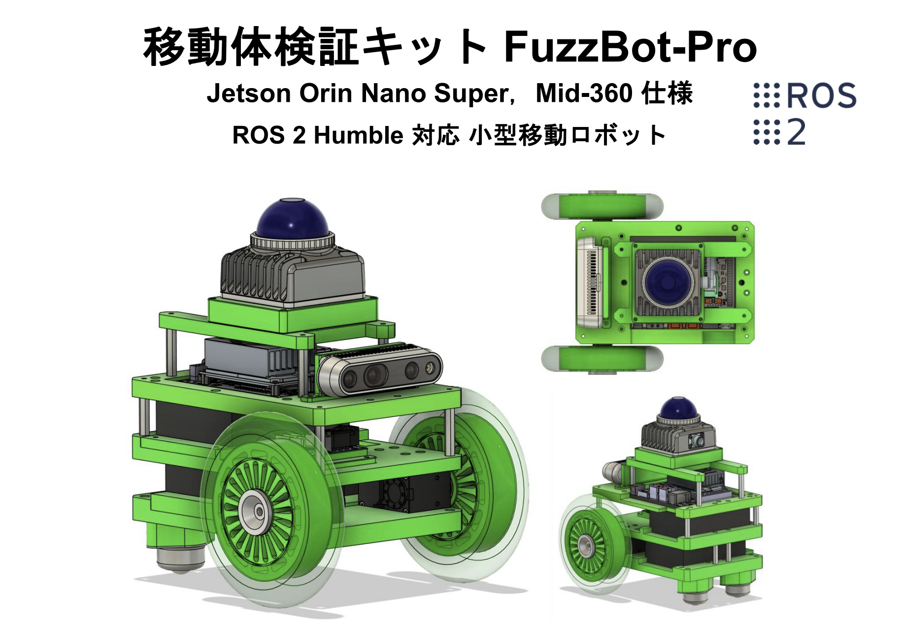
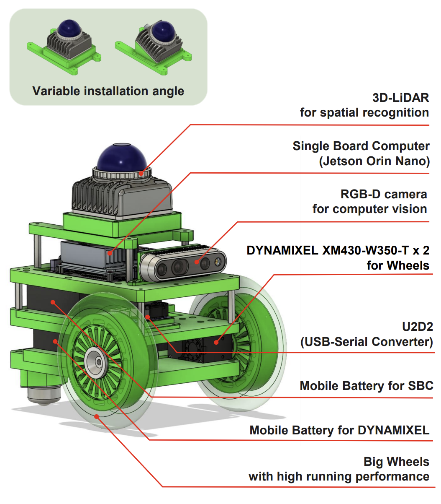
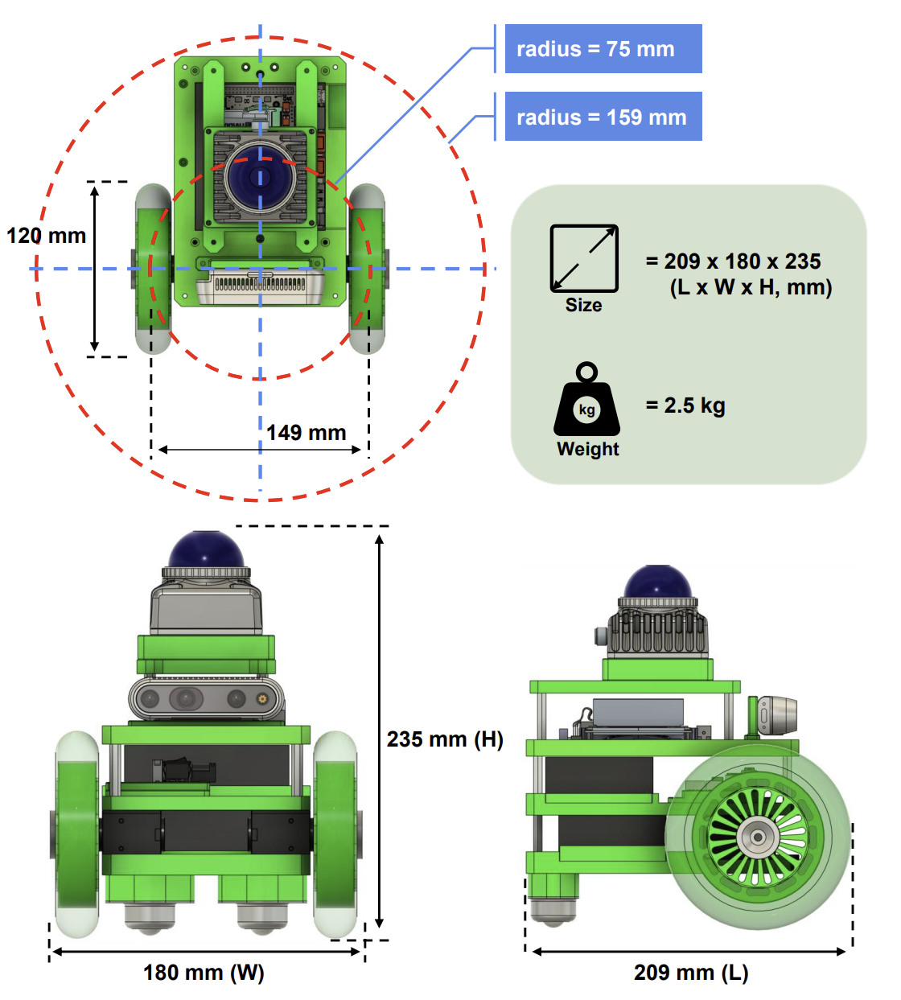
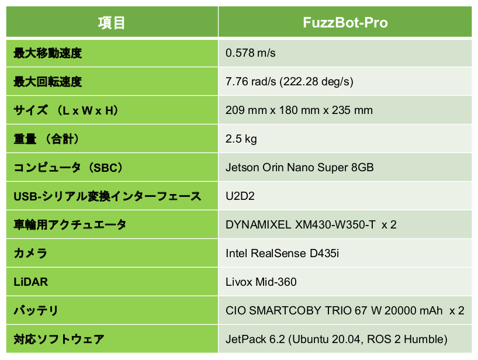

# Fuzzbot


### Fuzzbot　搭載部品


### Fuzzbot 寸法


### Fuzzbot 性能


## セットアップ手順（Quick Start Guide）

### 1. Jetson Orin Nano の環境設定

#### 1.1. Jetson Orin Nano のセットアップについて

Fuzzbotを利用するには，Jetson Orin NanoにJetpack 6.xをインストールする必要があります．

1. Ubuntu 22.04がインストールされたPC（以下，リモートPC）を用意してください．
2. [SDK Manager](https://developer.nvidia.com/sdk-manager)をインストールしてください．
3. [公式のインストールガイド](https://docs.nvidia.com/sdk-manager/install-with-sdkm-jetson/index.html)に従って，Jetpack 6.xをインストールしてください．

#### 1.2. ROS 2 Humble のインストール

[ROS 公式のインストールガイド](https://docs.ros.org/en/humble/Installation/Ubuntu-Install-Debians.html)に従って，ROS 2 Humbleをインストールします．

まず，Ubuntu Universe リポジトリが有効になっていることを確認します．
```
$ sudo apt install -y software-properties-common
$ sudo add-apt-repository universe
```

ROS 2 Humbleをインストールします．
```
$ sudo apt update && sudo apt -y install curl gnupg lsb-release
$ sudo curl -sSL https://raw.githubusercontent.com/ros/rosdistro/master/ros.key -o /usr/share/keyrings/ros-archive-keyring.gpg
$ echo "deb [arch=$(dpkg --print-architecture) signed-by=/usr/share/keyrings/ros-archive-keyring.gpg] http://packages.ros.org/ros2/ubuntu $(. /etc/os-release && echo $UBUNTU_CODENAME) main" | sudo tee /etc/apt/sources.list.d/ros2.list > /dev/null
$ sudo apt update
$ sudo apt install -y ros-humble-desktop
$ echo "source /opt/ros/humble/setup.bash" >> ~/.bashrc
$ source ~/.bashrc
$ sudo apt install -y python3-colcon-common-extensions python3-pip
```

ワークスペースを作成します．
```
$ mkdir -p ~/fuzzbot_ws/src
$ cd ~/fuzzbot_ws && colcon build --symlink-install && . install/setup.bash
```
ワークスペースやROS_DOMAIN，FUZZBOT_MODELを設定します．
```
$ echo '. ~/fuzzbot_ws/install/setup.bash' >> ~/.bashrc
$ echo 'export ROS_DOMAIN_ID=30' >> ~/.bashrc
$ echo 'export FUZZBOT_MODEL=fuzzbot_pro' >> ~/.bashrc
$ source ~/.bashrc
```

#### 1.3. Intel RealSense SDK 2.0のインストール

Intel RealSense SDK 2.0でCUDAを有効化するために，Jetson Orin Nanoでビルドしてインストールします．
```
$ sudo apt install -y git libssl-dev libusb-1.0-0-dev pkg-config libgtk-3-dev
$ cd ~/Downloads/
$ git clone https://github.com/IntelRealSense/librealsense.git -b v2.55.1
$ cd ./librealsense/
$ sudo cp config/99-realsense-libusb.rules /etc/udev/rules.d/
$ sudo cp config/99-realsense-d4xx-mipi-dfu.rules /etc/udev/rules.d/
$ sudo udevadm control --reload-rules && sudo udevadm trigger
$ mkdir build && cd build
$ cmake .. -DBUILD_EXAMPLES=true -DCMAKE_BUILD_TYPE=release -DFORCE_RSUSB_BACKEND=true -DBUILD_WITH_CUDA=true && make -j$(($(nproc)-1)) && sudo make install
```

#### 1.4. Realsense D435i のセットアップ

Realsense D435i内部のファームウェアのバージョンをIntel RealSense SDK 2.0のバージョンと合わせる必要があります．

Realsense D435iを Jetson Orin Nano を通して，セットアップを行います．
```
$ cd ~/Downloads/ && curl -sSL --output ./Signed_Image_UVC_5_16_0_1.zip https://www.intelrealsense.com/download/23422/?tmstv=1713899242
$ unzip ./Signed_Image_UVC_5_16_0_1.zip
$ cd ./Signed_Image_UVC_5_16_0_1/
$ rs-fw-update -f ./Signed_Image_UVC_5_16_0_1.bin
```

#### 1.5. realsense-rosのインストール

ROSでIntel Realsense SDK 2.0を読み込むために，realsense-rosをインストールします．
```
$ cd ~/fuzzbot_ws/src
$ git clone https://github.com/IntelRealSense/realsense-ros -b 4.55.1
$ cd ~/fuzzbot_ws
$ sudo apt install -y python3-rosdep
$ sudo rosdep init
$ rosdep update
```

一度，ターミナルに入り直してください．
```
$ cd ~/fuzzbot_ws
$ rosdep install -i --from-path src --rosdistro $ROS_DISTRO --skip-keys=librealsense2 -y
$ cd ~/fuzzbot_ws && colcon build --symlink-install && . install/setup.bash
```

#### 1.6. DynamixelHandler-ros2のインストール

Robotis社のDynamixelをROSから制御するために，DynamixelHandler-ros2をインストールします．
```
$ cd ~/fuzzbot_ws/src
$ git clone --recursive https://github.com/ROBOTIS-JAPAN-GIT/DynamixelHandler-ros2.git
$ cd ~/fuzzbot_ws && colcon build --symlink-install --packages-up-to dynamixel_handler
$ source ~/fuzzbot_ws/install/setup.bash
```

#### 1.7. Livox-SDK2のインストール

Livox Mid-360を扱うためにLivox-SDK2をJetson Orin Nanoでビルドしてインストールします．
```
$ git clone https://github.com/Livox-SDK/Livox-SDK2.git
$ cd ./Livox-SDK2/
$ mkdir build
$ cd build
$ cmake .. && make -j4
$ sudo make install
```

#### 1.8. livox_ros_driver2のインストール

Livox Mid-360をROSで扱うために
livox_ros_driver2を git clone します．
```
$ source /opt/ros/humble/setup.bash
$ mkdir -p ~/livox_ws/src
$ cd ~/livox_ws/src && git clone https://github.com/fuzzrobo/livox_ros_driver2.git
$ cd livox_ros_driver2 && ./build.sh humble
```

システムのライブラリキャッシュを更新して，共有ライブラリのパスを再設定します．
```
$ sudo ldconfig
```

livox_wsを読み込むよう，.bashrcに追加します．
```
$ echo '. ~/livox_ws/install/setup.bash' >> ~/.bashrc && source ~/.bashrc
```

#### 1.9. SLAMパッケージのインストール

##### 1.9.1 GLIM（参考ドキュメント：https://koide3.github.io/glim/）

PPAを登録しglim_ros2 (CUDA 12.6)と必要なツール・ライブラリをインストールします．
```
$ curl -s https://koide3.github.io/ppa/setup_ppa.sh | sudo bash
$ sudo apt update
$ sudo apt install -y libiridescence-dev libboost-all-dev libglfw3-dev libmetis-dev
$ sudo apt install -y libgtsam-points-cuda12.6-dev
$ sudo apt install -y ros-humble-glim-ros-cuda12.6
```

システムのライブラリキャッシュを更新して，共有ライブラリのパスを再設定します．
```
$ sudo ldconfig
```

#### 1.10. FuzzBotのROS2パッケージのインストール

FuzzBotのROS2パッケージをインストールします．
```
$ cd ~/fuzzbot_ws/src
$ git clone https://github.com/fuzzrobo/fuzzbot.git
$ cd ~/fuzzbot_ws && colcon build --symlink-install && . install/setup.bash
```

### 2. リモートPCの環境設定

#### 2.1. リモートPC のセットアップについて

リモートPC側にも必要なROS 2パッケージや，ドライバをインストールする必要があります．

#### 2.2. ROS 2 Humbleのインストール

- ROS 2 がインストールされている場合

    ワークスペースを作成します．
    ```
    $ mkdir -p ~/fuzzbot_ws/src
    $ cd ~/fuzzbot_ws && colcon build --symlink-install && . install/setup.bash
    ```
    ワークスペースやROS_DOMAIN，FUZZBOT_MODELを設定します．
    ```
    $ echo '. ~/fuzzbot_ws/install/setup.bash' >> ~/.bashrc
    $ echo 'export ROS_DOMAIN_ID=30' >> ~/.bashrc
    $ echo 'export FUZZBOT_MODEL=fuzzbot_pro_normal' >> ~/.bashrc
    $ source ~/.bashrc
    ```


- ROS 2 がインストールされていない場合
    <details>
  
    <summary><a href="#12-ros-2-humble-のインストール">1.2. ROS 2 Humble のインストール</a>と同様です．</summary>
    <a href="[#12-ros-2-humble-のインストール](https://docs.ros.org/en/humble/Installation/Ubuntu-Install-Debians.html))">ROS 公式のインストールガイド</a>に従って，ROS 2 Humbleをインストールします．
    まず，Ubuntu Universe リポジトリが有効になっていることを確認します．
    ```
    $ sudo apt install -y software-properties-common
    $ sudo add-apt-repository universe
    ```

    ROS 2 Humbleをインストールします．
    ```
    $ sudo apt update && sudo apt -y install curl gnupg lsb-release
    $ sudo curl -sSL https://raw.githubusercontent.com/ros/rosdistro/master/ros.key -o /usr/share/keyrings/ros-archive-keyring.gpg
    $ echo "deb [arch=$(dpkg --print-architecture) signed-by=/usr/share/keyrings/ros-archive-keyring.gpg] http://packages.ros.org/ros2/ubuntu $(. /etc/os-release && echo $UBUNTU_CODENAME) main" | sudo tee /etc/apt/sources.list.d/ros2.list > /dev/null
    $ sudo apt update
    $ sudo apt install -y ros-humble-desktop
    $ echo "source /opt/ros/humble/setup.bash" >> ~/.bashrc
    $ source ~/.bashrc
    $ sudo apt install -y python3-colcon-common-extensions python3-pip
    ```

    ワークスペースを作成します．
    ```
    $ mkdir -p ~/fuzzbot_ws/src
    $ cd ~/fuzzbot_ws && colcon build --symlink-install && . install/setup.bash
    ```
    ワークスペースやROS_DOMAIN，FUZZBOT_MODELを設定します．
    ```
    $ echo '. ~/fuzzbot_ws/install/setup.bash' >> ~/.bashrc
    $ echo 'export ROS_DOMAIN_ID=30' >> ~/.bashrc
    $ echo 'export FUZZBOT_MODEL=fuzzbot_pro' >> ~/.bashrc
    $ source ~/.bashrc
    ```
    </details>

#### 2.3. FuzzBotのROS2パッケージのインストール

FuzzBotのROS2パッケージをインストールします．
```
$ cd ~/fuzzbot_ws/src
$ git clone https://github.com/fuzzrobo/fuzzbot.git
$ cd ~/fuzzbot_ws && colcon build --symlink-install && . install/setup.bash
```

### 3. 実機の動かし方

#### 3.1. セットアップ（この操作は，動かす際に必ず行ってください）

**必ず，Jetson Orin NanoとリモートPCの時刻を同期してください．両方をインターネットに接続すれば，時刻が同期されます．**

Jetson Orin Nanoにssh接続して，ドライバを立ち上げます．
```
$ ros2 launch fuzzbot_bringup fuzzbot.launch
```

#### 3.2. SLAM

##### 3.2.1 GLIM

GLIMを実行します．
```
$ ros2 launch fuzzbot_slam glim.launch
```

GLIMと同時にRviz2も立ち上げる場合は以下を実行します．
```
$ ros2 launch fuzzbot_slam glim_rviz.launch
```

#### 3.3. テレオペ

##### 3.3.1 キーボード操作

Jetson Orin Nanoにssh接続するか，リモートPCでキーボード操作によるテレオペを実行します．
```
$ ros2 run fuzzbot_teleop teleop_key_node 
```

##### 3.3.2 ジョイスティック操作

Jetson Orin Nanoにssh接続するか，リモートPCでジョイスティック操作によるテレオペを実行します．
```
$ ros2 run fuzzbot_teleop teleop_joy_node 
```

ジョイスティックを接続したリモートPCでjoy_nodeを実行します．
```
$ ros2 run joy joy_node
```

#### 3.4. Realsense D435i のドライバを実行する

Jetson Orin Nanoにssh接続して，ドライバを立ち上げます．
```
$ ros2 launch realsense2_camera rs_launch.py
```


### 4. シミュレーションの動かし方

Coming soon...

