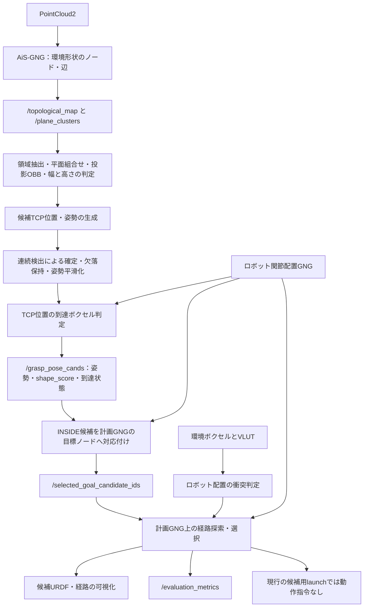
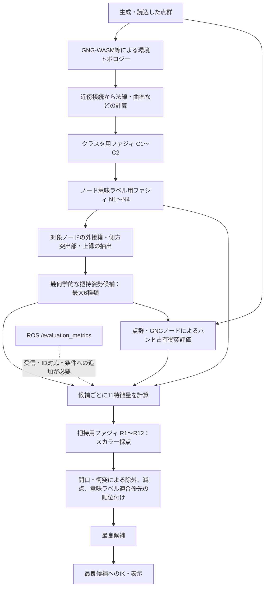
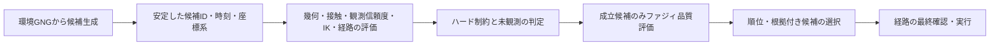

# 把持位置・姿勢推定とファジィルールの現状

確認日: 2026-09-13。対象: `grasp_new4`、確認時HEAD `566fb67f` と作業ツリーの実装。

本書は現行コードの調査資料。実装済み処理と今後の提案の区別を目的とし、動作コードの変更なし。
ROS設定については稼働中の `/top_grasp_surface_estimator` のパラメータ取得結果も確認済み。
HTML側のルールはソース内の初期値であり、ブラウザー上で編集・JSON読込された現在値の確認は対象外。

## 1. 結論とシステムの区別

現在、ROSの把持候補生成・目標選択と、HTMLのファジィ把持評価は別系統。
ROSの `/grasp_pose_cands` にHTMLのR1〜R12を適用して最終姿勢を選択する接続は、確認したlaunch経路にはない。

| 対象 | 現在の処理 | ファジィルールとの関係 |
| --- | --- | --- |
| ROS `top_grasp_surface_estimator_node` | 環境GNG・平面クラスタから候補TCP姿勢の幾何学的生成 | 下記R1〜R12の呼出しなし |
| ROS 目標選択・経路計画 | 到達領域判定、関節配置GNGへの対応付け、衝突・経路評価 | HTMLのファジィ採点とは独立 |
| `ToPo-FUZZY_Manipulation_v1.html` | GNGから少数の候補生成、特徴量計算、ファジィ採点、最良候補へのIK | 初期値は把持用11特徴量・12ルール |
| HTMLのトポロジー前処理 | GNG辺の接続評価、ノードの意味ラベル推定 | 別のクラスタ用2ルール・ラベル用4ルール |
| `FUZZY_GRASP_RULE_CATALOG.md` | R001〜R145の候補集 | 将来案。現行の実行ルール一覧ではない |

ファジィ把持推定は、現状では「候補の位置・姿勢そのものを連続的に最適化する処理」ではなく、**先に作った候補へ点数を付ける処理**。

## 2. トポロジカルマップの二つの役割

| マップ | ノード・辺の意味 | 把持への用途 |
| --- | --- | --- |
| 環境形状GNG `/topological_map` | 点群を代表する3次元位置と、形状上の近傍接続 | 平面・領域・幅・高さなどの抽出、把持対象形状の表現 |
| ロボット関節配置GNG（ToPoDualArm系） | 学習済み関節配置、対応するTCP位置・姿勢、配置間の接続 | 到達可能領域、候補姿勢に近い関節配置、衝突回避経路の探索 |

`/ToPoDualArm/topological_map_static` は現在の候補生成ノードが参照する到達性マップ。
目標選択器は、到達性マップのIDをそのまま流用せず、計画用GNGのノードIDに対応付け。
環境形状GNGのノードIDとロボット関節配置GNGのノードIDは別物。

## 3. 全体フロー

### 3.1 ROSに実装されている候補生成・計画経路



現在の候補生成launchは `grasping_system/launch/top_grasp_pose_candidates.launch.py`。
ノード名は `/top_grasp_surface_estimator`、実行ファイル名は `top_grasp_surface_estimator_node`。
現在の作業ツリーでは、以前の `grasp_goal_planning.launch.py` は `grasp_joint_candidates.launch.py` に名称変更済み。
こちらが候補をロボットの目標配置・経路へつなぐ側で、`control_claim_enabled=false`、`publish_target_joint_states=false` を固定し、動作指令は出さない構成。
図は実装上の接続関係であり、全ノードが同時稼働中であることを確認した図ではない。

候補生成では、入力マップと平面クラスタの整合を確認後、領域のノード数、面の傾き、投影OBBの寸法、基準面からの突出などを評価。
候補TCPは領域の最大高さとスタンドオフから算出し、TCPのZ軸は上方向と反対、ヨー角は投影形状の軸に基づく構成。
候補の順序は基本的に表面高さの降順、同じ高さでは `footprint_fill_ratio` の降順。

`/grasp_pose_cands` の型は `gng_control_msgs/GraspCandidateArray`。
各候補の `shape_score` は `footprint_fill_ratio` であり、ファジィ推論の結果ではない。
`INSIDE` はTCP位置が到達ボクセルに入るという意味であり、姿勢まで含む厳密なIK成立・無衝突・把持成功の保証ではない。

目標ノード選択は、同じ到達ボクセル内の計画GNGノードに対し、TCP位置距離、必要に応じた方向差、可操作性の条件数によるコストを使用。
方向差はTCP Z軸とノード方向の内積の絶対値に基づくため、完全な3自由度の姿勢誤差ではない。
この選択器はHTMLのルールスコアを参照していない。

### 3.2 HTMLのファジィ把持推定経路



点線は追加指標を入力にできる仕組みであり、既定12ルールにROS指標が組み込まれているという意味ではない。
HTMLの最良候補からROS目標選択器に順位を返す経路は、この図には存在しない。

候補は持ち手ループ、持ち手側方ピンチ、物体全体の側方X/Y、上縁、上部胴体ピンチの最大6種類。
持ち手・上縁候補は該当領域が得られた場合のみ。一般的な6次元姿勢空間の網羅的探索ではない。
GNGの辺は主として前段の法線・曲率・領域分割に利用し、把持候補生成は主としてノード位置とラベルから得た外接箱に基づく構成。

## 4. 把持用ファジィへの全入力特徴量

初期値では次の11個がすべて有効。ファジィ評価時の値域は0〜1。
以下で `clamp` は0〜1への制限を表す。

| キー | 意味 | 現在の取得方法・注意点 |
| --- | --- | --- |
| `aperture_fit` | 開口適合度 | 必要幅＝候補幅＋クリアランス×2。最大開口を超える場合は0、収まる場合は0.92〜1の範囲。広い連続評価ではなく、成立判定に近い特徴量 |
| `contact_depth` | 接触奥行き適合度 | `clamp(候補の外接箱由来の奥行き / GUI指定の接触奥行き)`。実接触面積・接触力の測定値ではない |
| `handle_likeness` | 持ち手らしさ | 候補種別ごとの固定値。ループ1、持ち手側方0.86、胴体側方X/Y 0.35、上縁0.25、上部胴体0.20。学習分類器の確信度ではない |
| `topological_density` | GNG支持量 | `clamp(候補外接箱内のGNGノード数 / max(8, 全GNGノード数×0.08))`。体積当たりの点群密度ではない。ノードなし時は0.4 |
| `topology_safe` | safeラベルの支持率 | 候補近傍GNGノード中の `safe` の割合 |
| `topology_unknown` | unknownラベルの支持率 | 候補近傍GNGノード中の `unknown` の割合。「未観測の空間」の割合ではない |
| `topology_wall` | wallラベルの割合 | 候補近傍GNGノード中の `wall` の割合 |
| `topology_default` | 未分類ラベルの割合 | 候補近傍GNGノード中の `default` の割合 |
| `height_fit` | 高さ適合度 | GUIの許容高さ内は1。範囲外では近い境界からの距離を0.08 mで割った量で線形減少、下限0 |
| `approach_preference` | アプローチ選好 | 自動選択または指定方向・種別との一致で1。不一致は基本0.45 |
| `collision_free` | 衝突の少なさ | ハンド占有形状に入る点群・GNGノードの重み付き比率から `clamp(1−18×衝突比率)`。実物理の接触安定性や完全なURDFメッシュ衝突の保証ではない |

意味ラベル比率の集計範囲は候補外接箱を0.018 m拡張した領域。内部ノードが4個未満なら、最近傍の最大14ノードを追加。
ラベル情報がない場合は `safe=0, unknown=0, wall=0, default=1`、支持値0.45、意味ラベル適合判定は通過扱い。

補助量:

- 意味ラベル支持値＝`clamp(safe + 0.82×unknown + 0.30×default − 0.85×wall)`。
- 意味ラベル適合判定＝`safe + 0.85×unknown >= 0.18` かつ `wall < 0.55`。
- 不適合の場合の意味ラベル減点＝`18×(1−支持値)`。

## 5. メンバシップ関数

### 5.1 把持用11特徴量に共通の初期値

| 言語ラベル | 形状 | パラメータ |
| --- | --- | --- |
| Low | 台形 | `[0.00, 0.00, 0.22, 0.42]` |
| Medium | 三角形 | `[0.25, 0.50, 0.75]` |
| High | 台形 | `[0.58, 0.78, 1.00, 1.00]` |

追加定義:

| 特徴量・ラベル | 形状 | パラメータ | 既定12ルールでの参照 |
| --- | --- | --- | --- |
| `handle_likeness.Handle` | Gaussian | 中心1.00、標準偏差0.16 | なし |
| `topological_density.Dense` | RBF | 中心0.92、半径0.18 | なし |
| `collision_free.Clean` | 台形 | `[0.82, 0.94, 1.00, 1.00]` | なし |

### 5.2 計算式と実装上の境界

- 三角形 `[a,b,c]`: `x<=a` または `x>=c` で0、頂点bで1、両側は線形。
- 台形 `[a,b,c,d]`: **現在のコードでは最初に `x<=a` または `x>=d` で0**。残りのb〜cは1、両側は線形。
- Gaussian: `exp(−0.5×((x−中心)/標準偏差)^2)`。
- RBF: `exp(−((x−中心)/半径)^2)`。

したがって、初期値の肩型台形は **Low(0)=0、High(1)=0、Clean(1)=0**。
通常意図する肩型の端点値と異なる。0/1を返す特徴量が多いため、影響は小さくない。詳細は第10節。

## 6. 把持用ルール全12件

全件が初期状態で有効。下表の条件はすべてAND結合。初期ルールにOR・NOTなし。
`H=High`、`M=Medium`、`L=Low`。

| ID | IF条件 | THEN | 重み |
| --- | --- | --- | ---: |
| R1 | `handle_likeness=H` AND `aperture_fit=H` AND `contact_depth=H` AND `topological_density=H` AND `topology_safe=H` AND `collision_free=H` | VeryHigh | 1.00 |
| R2 | `topology_unknown=H` AND `aperture_fit=H` AND `contact_depth=M` AND `collision_free=H` | High | 0.88 |
| R3 | `aperture_fit=H` AND `contact_depth=H` AND `topological_density=H` AND `height_fit=H` AND `topology_safe=M` AND `collision_free=H` | High | 0.86 |
| R4 | `aperture_fit=H` AND `contact_depth=M` AND `height_fit=H` AND `topology_wall=L` | Medium | 0.70 |
| R5 | `aperture_fit=L` | Reject | 1.00 |
| R6 | `contact_depth=L` | Low | 0.85 |
| R7 | `topological_density=L` | Low | 0.68 |
| R8 | `height_fit=L` | Reject | 0.85 |
| R9 | `approach_preference=H` AND `aperture_fit=H` AND `collision_free=M` | High | 0.58 |
| R10 | `topology_wall=H` | Reject | 1.00 |
| R11 | `collision_free=L` | Reject | 1.00 |
| R12 | `topology_default=H` AND `topology_safe=L` AND `topology_unknown=L` | Low | 0.72 |

出力は連続的な出力メンバシップ関数ではなく、次の代表値。

| 出力ラベル | Reject | Low | Medium | High | VeryHigh |
| --- | ---: | ---: | ---: | ---: | ---: |
| スコア代表値 | 5 | 28 | 55 | 78 | 96 |

### 6.1 合成規則と最終順位

初期設定は `and=min`、`or=max`、`implication=mamdani_min`、`aggregation=max`、`defuzz=weighted_average`、`fallback=classic`。

1. 条件の所属度を計算。
2. 各ルールの条件適合度＝条件所属度の最小値。
3. 発火度＝`min(条件適合度, ルール重み)`。把持用の既定動作は重みの乗算ではない。
4. 同じ出力ラベルを持つルールを最大発火度で集約。
5. `ファジィスコア＝Σ(ラベル発火度×出力代表値) / Σ(ラベル発火度)`。
6. すべて非発火なら、下記の固定加重和へフォールバック。
7. 開口不成立、または有効化された衝突ハード判定に抵触する候補を除外。
8. 残りの候補について `最終スコア＝clamp(ファジィスコア−意味ラベル減点−0.20×衝突減点, 0, 100)`。
9. **意味ラベル適合判定の通過を最優先**し、次に最終スコアの降順。最良候補へIK。

したがって、一般的な出力集合の面積重心によるMamdani推論とは異なり、代表値の加重平均による実装。
また `Reject` は代表値5の出力ラベルであり、ルールが発火するだけで候補を必ず除外するものではない。
除外の保証は別途のハード判定に依存。

非発火時の固定加重和:

```text
100 × (
  0.18 × aperture_fit + 0.14 × contact_depth
  + 0.13 × handle_likeness + 0.11 × topological_density
  + 0.15 × 意味ラベル支持値 + 0.11 × collision_free
  + 0.08 × height_fit + 0.05 × approach_preference
  + 0.05 × (1 − topology_wall)
)
```

編集可能なその他の演算方式は、ANDのproduct/Lukasiewicz、ORの確率和/有界和、含意のLarsen product/Gödel、出力集約の有界和/確率和、最大所属ラベルの代表値選択、非発火時0など。
AND/OR混在条件は記述順の逐次計算であり、括弧付き論理木や通常のAND優先順位ではない。

## 7. 前段のファジィルール一覧

ここはHTMLの環境トポロジーに意味を付ける処理。ROSの平面クラスタ処理と同一のルールベースではない。

### 7.1 クラスタ接続用：3入力・2ルール

| 入力 | 計算 | 台形メンバシップ関数 |
| --- | --- | --- |
| `normal_similarity` | 隣接ノード法線の類似度。現行式は `clamp(abs(法線内積)+1)` | Low `[0,0,.45,.65]`、High `[.62,.82,1,1]` |
| `curvature_similarity` | `1−clamp(abs(曲率差)/.45)` | Low `[0,0,.35,.55]`、High `[.50,.75,1,1]` |
| `edge_length_fit` | `1−clamp(辺長/max(.001, 最大辺長×.45))` | Short `[.55,.75,1,1]`、Long `[0,0,.35,.55]` |

| ID | IF条件 | THEN | 重み |
| --- | --- | --- | ---: |
| C1 | `normal_similarity=High` AND `curvature_similarity=High` AND `edge_length_fit=Short` | Connect（1） | 1.00 |
| C2 | `normal_similarity=Low` | Reject（0） | 1.00 |

初期ANDはmin。こちらの汎用評価器では条件適合度に重みを乗算し、同じ出力をmax集約、出力代表値を加重平均。
接続スコアをGUI指定値（初期0.68）と比較し、採用辺により連結領域を構成。
`normal_similarity` の現行式は有限な内積に対して常に1となるため、正常な類似度評価になっていない。

### 7.2 ノード意味ラベル用：5入力・4ルール

| 入力 | 計算 | 台形メンバシップ関数 |
| --- | --- | --- |
| `normal_up` | `clamp(法線Z成分)` | Low `[0,0,.35,.55]`、High `[.70,.88,1,1]` |
| `normal_horizontal` | `clamp(sqrt(法線X成分²+法線Y成分²))` | Low `[0,0,.35,.55]`、High `[.62,.82,1,1]` |
| `curvature_high` | `clamp(曲率/.55)` | Low `[0,0,.18,.38]`、High `[.38,.62,1,1]` |
| `region_size` | `clamp(領域ノード数/max(6, 最大領域ノード数))` | Small `[0,0,.20,.42]`、Large `[.35,.60,1,1]` |
| `neighbor_normal_similarity` | 隣接ノードとの法線内積の絶対値の平均 | Low `[0,0,.45,.65]`、High `[.60,.82,1,1]` |

| ID | IF条件 | THEN：ラベル（代表値） | 重み |
| --- | --- | --- | ---: |
| N1 | `normal_up=High` AND `curvature_high=Low` | SafeArea：safe（100） | 1.00 |
| N2 | `normal_horizontal=High` AND `curvature_high=Low` AND `region_size=Large` AND `neighbor_normal_similarity=High` | Wall：wall（65） | 1.00 |
| N3 | `curvature_high=High` | UnknownObject：unknown（30） | 1.00 |
| N4 | `region_size=Small` | Default：default（0） | 0.45 |

汎用評価器で得た最大発火度の出力ラベルをノードに付与。非発火ならDefault。
N4の名前は「otherwise default」だが、実際は無条件elseではなく、領域サイズSmallの条件付きルール。

## 8. ROS評価指標をHTMLに入力する仕組みと限界

HTMLには `/evaluation_metrics` の非文字列指標を `evaluation.<metric_id>` として追加する仕組みがある。
ただし、指標受信、候補IDとの対応、該当指標を参照するルールの追加が必要。既定R1〜R12からの参照はない。

シリアライザーの固定指標定義:

| 指標 | 内容・現在の注意点 |
| --- | --- |
| `position_manipulability` | 位置可操作性 |
| `rotation_manipulability` | 回転可操作性 |
| `joint_limit_margin_min` | 関節限界余裕。現行生成処理ではmeanと同じノードスコアを代入 |
| `joint_limit_margin_mean` | 関節限界余裕。独立した平均値計算ではない |
| `self_collision_margin` | 自己衝突余裕。現行生成処理ではNaN |
| `environment_collision_margin` | 環境衝突余裕。現行生成処理ではNaN |
| `gripper_width` | グリッパ幅。現行生成処理ではNaN |
| `grasp_region_score` | 把持領域スコア。現行生成処理ではNaN |
| `estimated_energy` | 推定経路コスト系の指標 |
| `estimated_duration` | 推定所要時間 |
| `path_position_manipulability` | 経路上の位置可操作性の配列 |
| `path_rotation_manipulability` | 経路上の回転可操作性の配列 |

加えて `candidate.metric_names` に基づく動的指標定義が可能。
送信サンプルは経路成立候補が対象で、`scope_id` は `goal_node_id`。
HTML側は候補の `goalNodeId` / `goal_node_id` / `candidateId` / `candidate_id` と照合するが、HTMLの既定幾何候補にはこの対応IDが付いていない。

数値配列は有限値の平均、真偽値は0/1へ変換。通常は受信サンプル間のmin-max正規化。
全サンプルが同値なら0〜1内の生値を採用し、それ以外は0.5。対応値が見つからない場合は0。
したがって、未取得値と「実測で悪い値」の混同、候補集合の変化によるスコア基準の変化に注意が必要。

## 9. 稼働中ROSノードの主要設定

`ros2 param dump /top_grasp_surface_estimator` による確認値。

| 設定 | 値 |
| --- | --- |
| 入力 | `/topological_map`、`/plane_clusters` |
| 出力 | `/grasp_pose_cands`、補助ノード表示 `/grasp_pose_cands/nodes` |
| 候補フレーム / TCP | `world` / `L_tcp` |
| `enable_candidate_frame_passthrough` | true |
| 到達判定マップ / ボクセル幅 | `/ToPoDualArm/topological_map_static` / 0.05 m |
| `max_surface_tilt_deg` | 90度 |
| `minimum_region_nodes` / `maximum_candidates` | 4 / 20 |
| `grasp_size_x` / `grasp_size_y` | 0.15 m / 0.15 m |
| `minimum_protrusion_distance` | 0.005 m |
| `enable_reference_plane_attachment` / `enable_plane_combinations` | true / true |
| `enable_nonplane_attachment` / `enable_approach_check` | false / false |
| `tcp_standoff` | 0 m |
| 確定までの更新回数 / 欠落許容更新回数 | 5 / 5 |
| 位置EMA係数 / 姿勢EMA係数 | 0.35 / 0.35 |

現在は面傾き90度までが対象なので、「水平面だけを検出する設定」とは言えない。
またフレームのpassthroughは座標数値の正しい変換を保証するものではなく、入力座標をworldとして扱える前提の確認が必要。

## 10. 検証結果と相談したい改善点

### 10.1 数値再現した不具合候補：優先度高

HTMLから `defaultFuzzyModel`、`mfEval`、推論関数を抽出し、Node.jsで評価した結果:

```text
初期入力数 = 11、初期把持ルール数 = 12
Low(0) = 0
High(1) = 0
High(0.99) = 1
法線内積 0 / 0.5 / 1 に対する normal_similarity = 1 / 1 / 1
```

良好側の特徴量を1、wall/unknown/defaultを0とするテスト候補では、正の発火出力が一つもなく、固定加重和の100点へフォールバック。
「100点だからファジィルールが高評価した」とは解釈できない。

1. **肩型メンバシップ関数の端点処理の修正と回帰テスト**。0/1でのLow/High、Reject発火、全ルール非発火を検証対象とする提案。
2. **クラスタ法線類似度の式の修正**。現在の定数1と端点問題の組合せでは、既定C1/C2が非発火となり、通常の正の接続判定値で辺を採用できない。

本調査では問題の指摘・再現まで。コード修正は未実施。

### 10.2 ルール設計上の相談事項

- **物理的成立条件と好みの点数の分離**。衝突、到達不能、開口不足を明示的な除外・保留とし、好みの点数で相殺しない構成。
- **safeの意味の整理**。N1は上向き低曲率の床・机をsafeとする一方、把持評価ではsafe支持を加点。把持可能面・設置支持面・障害物の意味を分離する余地。
- **持ち手らしさ・接触奥行きの実測化**。候補種別の固定値や外接箱寸法から、局所形状、対向接触面、接触法線などの根拠を持つ量への置換。
- **密度と観測信頼度の分離**。GNGノード数だけでなく、元点群の支持数、時間的安定性、ノイズ除去後の占有確信度の追加を検討。
- **未観測と低評価の分離**。指標に有効性を持たせ、NaN・未取得・ID未対応を0点の特徴量として処理しない方針。
- **正規化基準の固定**。候補集合ごとのmin-maxだけに依存せず、幅[m]、距離[m]、角度[deg]などの基準から再現性のある評価への整理。
- **発火・非発火の可視化**。最終スコアとともに、採用ルール、寄与、除外理由、フォールバック使用の表示・記録。
- **IK・経路結果を候補比較に含めるかの決定**。現行HTMLは採点後の最良候補へIKする順序であり、全候補のIK成立を確認してから順位付けする構成ではない。

### 10.3 ROSへの統合案：未実装



助言をいただく際の主な論点は、①品質評価に必要な特徴量、②その物理単位と正規化、③言語ラベル境界、④必須条件と選好の区別、⑤把持成功データに基づく調整方法。
候補生成・特徴量定義の妥当性と、ルール自体の妥当性を分けた検証が必要。

## 11. 実装参照

- [HTML本体](../../ToPo-FUZZY_Manipulation_v1.html): `featureDensity`、`candidateSemanticFeatures`、`FUZZY_FEATURES`、`defaultFuzzyModel`、`mfEval`、`evaluateFuzzyRules`、`estimate`、`defaultClusterModel`、`defaultNodeLabelModel`、`v321EvaluationFeatureValue`。
- [ROS候補生成launch](../../grasping_system/launch/top_grasp_pose_candidates.launch.py)
- [候補形状推定](../../grasping_system/include/candidate/top_grasp_surface_estimator.hpp)
- [候補生成ノード](../../grasping_system/src/top_grasp_surface_estimator_node.cpp)
- [候補配信・到達判定](../../grasping_system/include/candidate/grasp_candidate_publisher.hpp)
- [候補メッセージ](../../MSG/gng_control_msgs/msg/GraspCandidate.msg)
- [把持関節候補launch](../launch/grasp_joint_candidates.launch.py)
- [計画GNG目標選択](../launch/topological_map_goal_selector_node.py)
- [経路計画](../src/nodes/planning/topological_map_avoidance_node.cpp)
- [評価値生成](../src/core/planning/topological_map_avoidance_helpers.hpp)
- [評価指標変換](../src/core/common/evaluation_metric_serialization.hpp)
- [ToPoDualArm設定](../config/ToPoDualArm.yaml)
- [将来のルール候補集](../../FUZZY_GRASP_RULE_CATALOG.md)
