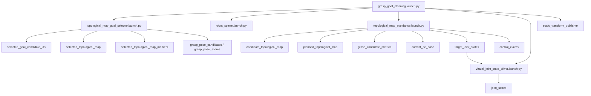
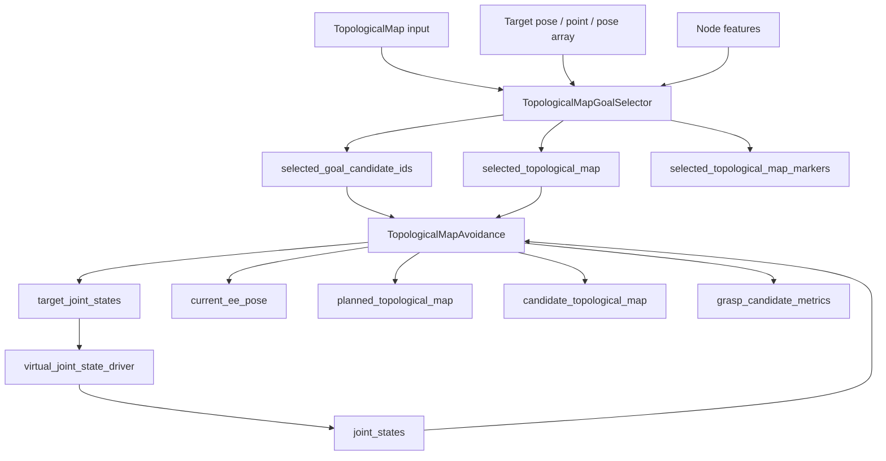

# gng_vlut_system Technical Specification

この文書は `gng_vlut_system` の把握に必要な変数、トピック、サービス、内部状態、データフローをまとめた技術仕様書です。

対象の中心は `grasp_goal_planning.launch.py` を起点とする把持候補選定・候補軌道生成・評価指標 publish の系統です。

## 1. システム概要

`grasp_goal_planning.launch.py` は次の 4 系統をまとめて起動します。

1. `topological_map_goal_selector.launch.py`
2. `robot_spawn.launch.py`
3. `topological_map_avoidance.launch.py`
4. `virtual_joint_state_driver.launch.py` ただし `enable_motion:=true` のときのみ

補助として、`publish_world_tf:=true` の場合に static TF を追加します。

## 2. 起動フロー

## 3. 変数一覧

### 3.1 `grasp_goal_planning.launch.py` の launch 引数

| 変数 | 型 | デフォルト | 用途 |
|---|---:|---|---|
| `params_file` | path | `config/ToPoDualArm2.yaml` | URDF と各種パラメータの参照元 |
| `topological_map_topic` | topic | `/ToPoDualArm/topological_map_static` | 目標候補選定の入力マップ |
| `output_topic` | topic | `/selected_topological_map` | 選定後マップ |
| `marker_topic` | topic | `/selected_topological_map_markers` | 選定後のマーカ |
| `goal_candidate_ids_topic` | topic | `/selected_goal_candidate_ids` | 把持候補として採択したノード ID 群 |
| `robot_name` | string | `ToPoDualArm` | namespace と topic 接頭辞 |
| `urdf_path` | path | 空 | ロボットモデル参照 |
| `enable_joint_state_publisher` | bool | `false` | `robot_spawn` での JointState Publisher 有無 |
| `enable_motion` | bool | `true` | 実際に target を駆動するか |
| `candidate_count` | int | `8` | 候補ノード数 |
| `non_collision_only` | bool | `true` | 衝突ノードを候補から除外 |
| `orientation_weight` | float | `0.0` | 向き一致度の重み |
| `target_pose_topic` | topic | 空 | 単一目標姿勢入力 |
| `target_point_topic` | topic | 空 | 単一目標位置入力 |
| `target_pose_array_topic` | topic | `/grasp_pose_candidates` | 目標姿勢配列入力 |
| `target_score_topic` | topic | `/grasp_pose_scores` | 目標姿勢のスコア配列 |
| `node_feature_topic` | topic | `/ToPoDualArm/topological_node_features` | ノード特徴量入力 |
| `manipulability_weight` | float | `0.25` | 可操作性ペナルティ重み |
| `joint_topic` | topic | `/ToPoDualArm/joint_states` | 現在姿勢入力 |
| `initial_joint_names_csv` | csv | 組み込み値 | 仮想関節初期化名 |
| `trajectory_topic` | topic | `/ToPoDualArm/planned_topological_map` | 確定経路の出力 |
| `candidate_trajectory_topic` | topic | `/ToPoDualArm/candidate_topological_map` | 候補経路の出力 |
| `candidate_metrics_topic` | topic | `/ToPoDualArm/grasp_candidate_metrics` | 候補評価指標の出力 |
| `publish_hz` | float | `20.0` | avoidance node の publish 周波数 |
| `avoid_collisions` | bool | `true` | 衝突ノードを避ける |
| `avoid_danger` | bool | `true` | danger ノードを避ける |
| `allow_danger_goal` | bool | `true` | 最終ゴールとして danger を許可 |
| `goal_rot_manip_weight` | float | `1.0` | ゴール姿勢の回転可操作性重み |
| `goal_joint_limit_weight` | float | `0.5` | ゴール姿勢の関節限界余裕重み |
| `strict_goal_collision_check` | bool | `false` | 目的地の衝突判定を厳格化 |
| `replan_on_path_collision` | bool | `false` | 進行中経路が危険なら再計画 |
| `allow_zero_initial_joint_state` | bool | `true` | 初期 joint_state が無いときゼロ初期値を使う |
| `publish_target_joint_states` | bool | `true` | target_joint_states の publish 有無 |
| `allow_safe_goal_fallback` | bool | `true` | 候補が無いとき安全ノードへ逃がすか |
| `virtual_joint_state_publish_hz` | float | `50.0` | 仮想関節追従の publish 周波数 |
| `virtual_joint_state_max_joint_velocity` | float | `0.6` | 仮想追従の最大関節速度 |
| `virtual_joint_state_position_tolerance` | float | `0.01` | 目標到達許容差 |
| `virtual_joint_state_use_wraparound` | bool | `true` | 角度 wrap-around 補正 |
| `publish_world_tf` | bool | `false` | world -> base_link static TF の publish |

### 3.2 `topological_map_goal_selector.launch.py` の引数

| 変数 | 型 | デフォルト | 用途 |
|---|---:|---|---|
| `topological_map_topic` | topic | `/ToPoDualArm/topological_map_static` | 元マップ入力 |
| `output_topic` | topic | `/selected_topological_map` | 選定後マップ |
| `marker_topic` | topic | `/selected_topological_map_markers` | 可視化用マーカ |
| `candidate_count` | int | `8` | 抽出ノード数 |
| `non_collision_only` | bool | `true` | 衝突ノードを除外 |
| `orientation_weight` | float | `0.25` | 姿勢整合重み |
| `target_pose_topic` | topic | 空 | 単一目標姿勢 |
| `target_point_topic` | topic | 空 | 単一目標位置 |
| `target_pose_array_topic` | topic | `/grasp_pose_candidates` | 候補姿勢群 |
| `target_score_topic` | topic | `/grasp_pose_scores` | 姿勢スコア群 |
| `goal_candidate_ids_topic` | topic | `/selected_goal_candidate_ids` | 選定ノード ID の出力 |
| `node_feature_topic` | topic | `/ToPoDualArm/topological_node_features` | manipulability 補正用特徴量 |
| `manipulability_weight` | float | `0.25` | 可操作性補正重み |
| `allow_untransformed_target` | bool | `true` | TF が無くても target を使うか |

### 3.3 `topological_map_avoidance.launch.py` の引数

| 変数 | 型 | デフォルト | 用途 |
|---|---:|---|---|
| `params_file` | path | `config/ToPoDualArm.yaml` | GNG/URDF 参照 |
| `urdf_path` | path | 空 | ロボットモデル |
| `gng_model_path` | path | 空 | GNG モデル直接指定 |
| `topological_map_topic` | topic | `/ToPoDualArm/topological_map_static` | 追跡対象マップ |
| `joint_topic` | topic | `/ToPoDualArm/joint_states` | 現在姿勢入力 |
| `trajectory_topic` | topic | `/ToPoDualArm/planned_topological_map` | 確定経路 |
| `candidate_trajectory_topic` | topic | `/ToPoDualArm/candidate_topological_map` | 候補経路 |
| `candidate_metrics_topic` | topic | `/ToPoDualArm/grasp_candidate_metrics` | 評価指標 |
| `trial_mode` | bool | `false` | trial 動作 |
| `trial_goal_interval_sec` | float | `4.0` | trial の目標切替周期 |
| `trial_safe_only` | bool | `true` | trial で safe のみ使う |
| `trial_return_home` | bool | `false` | home へ戻る試行 |
| `trial_auto_advance_goal` | bool | `false` | trial goal 自動進行 |
| `trial_seed` | int | `0` | trial の乱数シード |
| `avoid_danger` | bool | `true` | danger ノード回避 |
| `allow_danger_goal` | bool | `true` | danger を最終目標として許可 |
| `goal_rot_manip_weight` | float | `1.0` | ゴール評価の回転可操作性重み |
| `goal_joint_limit_weight` | float | `0.5` | ゴール評価の関節限界重み |
| `replan_on_path_collision` | bool | `true` | 進行中の危険経路で再計画 |
| `allow_zero_initial_joint_state` | bool | `true` | 初期 joint_state 無しのゼロ初期化 |
| `publish_target_joint_states` | bool | `true` | target_joint_states 出力 |
| `allow_safe_goal_fallback` | bool | `true` | safe ノード fallback の有無 |
| `goal_candidate_ids_topic` | topic | `/selected_goal_candidate_ids` | 候補 ID 入力 |
| `target_topic` | topic | 空 | target_joint_states 出力先 |
| `robot_base_frame` | frame | 空 | FK 基準フレーム |
| `control_claim_priority` | int | `10` | control claim 優先度 |
| `control_claim_mode` | int | `1` | control claim モード |
| `control_claim_enabled` | bool | `true` | claim publish 有効化 |
| `current_ee_pose_topic` | topic | `/ToPoDualArm/current_ee_pose` | 現在 EE pose 出力 |
| `metrics_max_joint_velocity` | float | `0.6` | 評価時間の見積もり用速度 |

### 3.4 `virtual_joint_state_driver.launch.py` の引数

| 変数 | 型 | デフォルト | 用途 |
|---|---:|---|---|
| `target_topic` | topic | `target_joint_states` | 目標関節角度入力 |
| `state_topic` | topic | `joint_states` | 現在状態入力 |
| `output_topic` | topic | `joint_states` | 出力 joint_states |
| `publish_hz` | float | `50.0` | 更新周期 |
| `max_joint_velocity` | float | `0.6` | 追従速度 |
| `position_tolerance` | float | `0.01` | 到達判定閾値 |
| `use_wraparound` | bool | `true` | wraparound 補正 |
| `hold_when_no_target` | bool | `true` | target 無しで維持するか |
| `ignore_state_after_first_target` | bool | `false` | 初回 target 後の state 上書き抑制 |
| `initial_joint_names_csv` | csv | 空 | 初期 joint 名列 |

## 4. 主要トピック

| トピック | 型 | 役割 |
|---|---|---|
| `/ToPoDualArm/topological_map_static` | `ais_gng_msgs/TopologicalMap` | 元の GNG マップ |
| `/selected_topological_map` | `ais_gng_msgs/TopologicalMap` | target に応じて選ばれたマップ |
| `/selected_goal_candidate_ids` | `std_msgs/Int32MultiArray` | goal 候補 ID の集合 |
| `/grasp_pose_candidates` | `geometry_msgs/PoseArray` | 候補姿勢群 |
| `/grasp_pose_scores` | `std_msgs/Float32MultiArray` | 候補姿勢スコア |
| `/ToPoDualArm/planned_topological_map` | `ais_gng_msgs/TopologicalMap` | 確定した経路 |
| `/ToPoDualArm/candidate_topological_map` | `ais_gng_msgs/TopologicalMap` | 候補経路。現在 EE pose を先頭ノードに含める |
| `/ToPoDualArm/grasp_candidate_metrics` | `gng_control_msgs/GraspCandidateMetricArray` | 候補評価指標 |
| `/ToPoDualArm/current_ee_pose` | `geometry_msgs/PoseStamped` | 現在 EE pose |
| `target_joint_states` | `sensor_msgs/JointState` | 目標関節値 |
| `joint_states` | `sensor_msgs/JointState` | 仮想 or 実機の現在関節値 |
| `/ToPoDualArm/control_claims` | `gng_control_msgs/JointControlClaim` | control claim |

## 5. サービス

| サービス | 用途 |
|---|---|
| `request_trajectory_update` | 軌道再計画を要求する |
| `request_trial_goal_advance` | trial モードで次の goal coordinate へ進める |

## 6. データフロー

## 7. no-motion モード

`enable_motion:=false` のときは次の扱いになります。

- `virtual_joint_state_driver.launch.py` を起動しない
- `publish_target_joint_states:=false`
- `control_claim_enabled:=false`
- `allow_safe_goal_fallback:=false`

このモードでは、候補ノード群・候補軌道・評価指標の生成は維持しつつ、実際の関節更新を止める。

## 8. viewer 側に委ねる見た目

候補ロボットプレビューの見た目は ToPoFuzzy Viewer 側で制御する。
ROS 側はプレビューの送信有無だけを制御し、見た目の指定は送らない。

## 9. 変更時に更新すべき項目

1. launch 引数の追加・削除
2. topic 名の変更
3. service 名の変更
4. message field の増減
5. no-motion / fallback / trial 分岐の追加
6. publish 周期や既定値の変更
