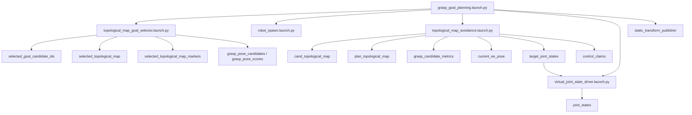
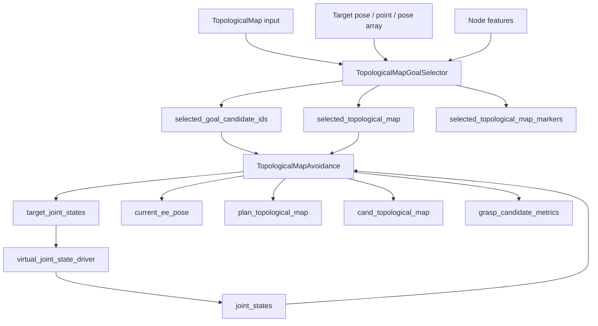
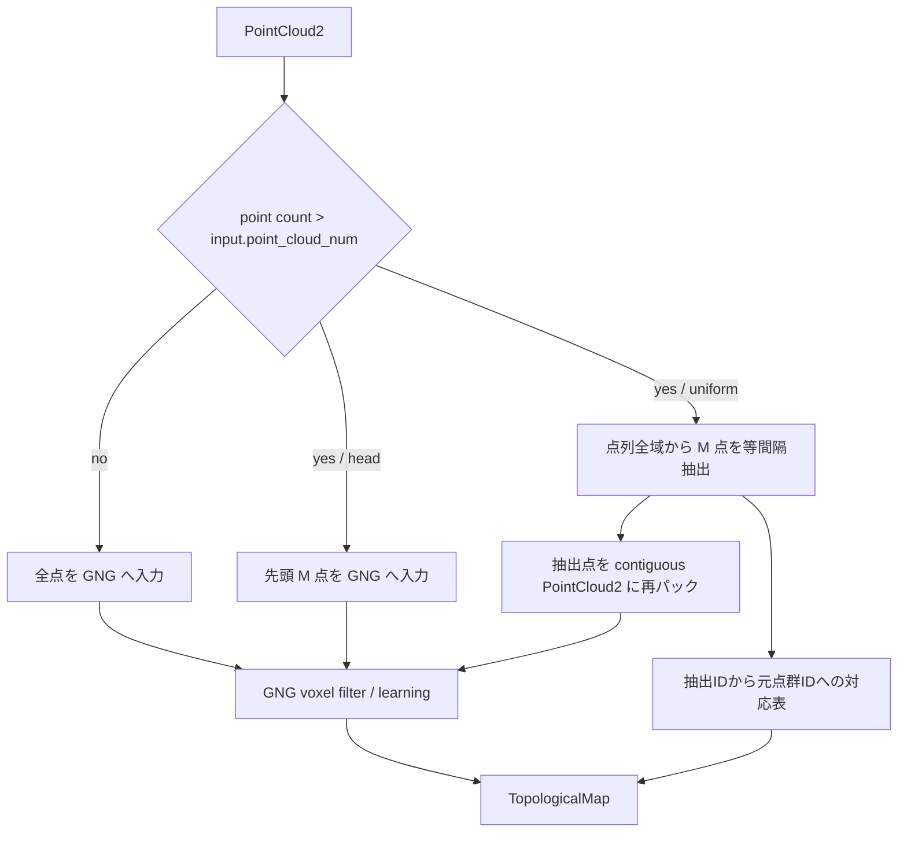
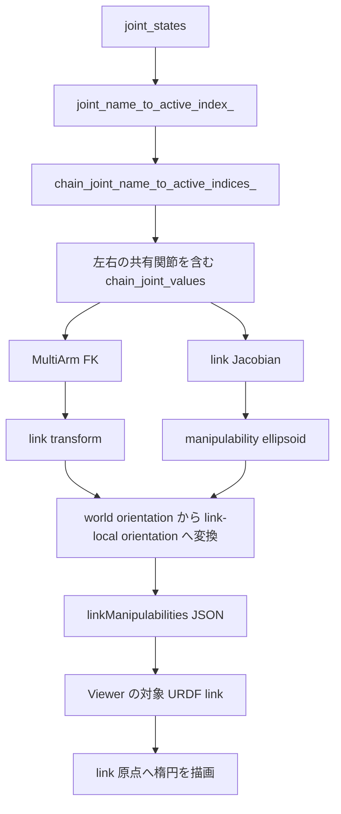
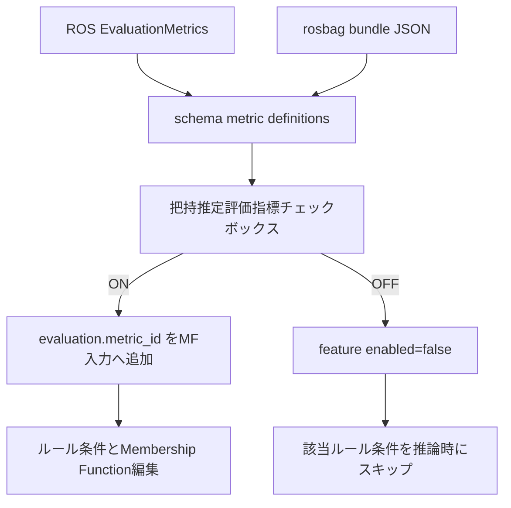
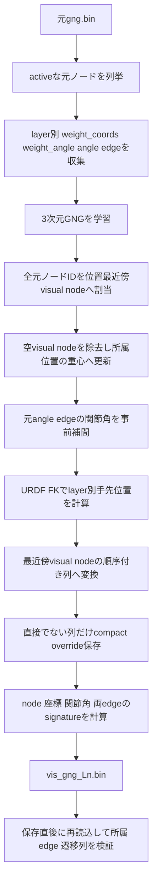
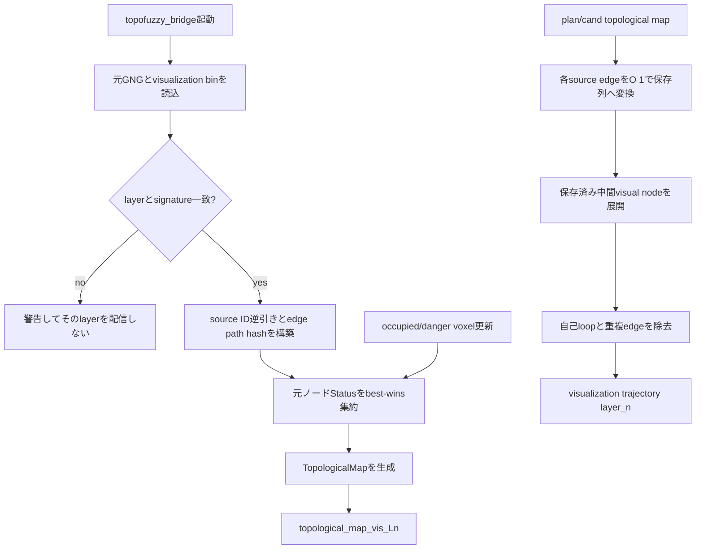

# gng_vlut_system Technical Specification

この文書は `gng_vlut_system` の把握に必要な変数、トピック、サービス、内部状態、データフローをまとめた技術仕様書です。

対象の中心は `grasp_goal_planning.launch.py` を起点とする把持候補選定・候補軌道生成・評価指標 publish の系統です。

## 1. システム概要

`grasp_goal_planning.launch.py` は次の 4 系統をまとめて起動します。

1. `topological_map_goal_selector.launch.py`
2. `robot_spawn.launch.py`
3. `topological_map_avoidance.launch.py`
4. `virtual_joint_state_driver.launch.py` ただし `enable_motion:=true` のときのみ

補助として、`publish_world_tf:=true` の場合に static TF を追加します。

## 2. 起動フロー



## 3. 変数一覧

### 3.1 `grasp_goal_planning.launch.py` の launch 引数

| 変数 | 型 | デフォルト | 用途 |
|---|---:|---|---|
| `params_file` | path | `config/ToPoDualArm2.yaml` | URDF と各種パラメータの参照元 |
| `topological_map_topic` | topic | `/ToPoDualArm/topological_map_static` | 目標候補選定の入力マップ |
| `output_topic` | topic | `/selected_topological_map` | 選定後マップ |
| `marker_topic` | topic | `/selected_topological_map_markers` | 選定後のマーカ |
| `goal_candidate_ids_topic` | topic | `/selected_goal_candidate_ids` | 把持候補として採択したノード ID 群 |
| `robot_name` | string | `ToPoDualArm` | namespace と topic 接頭辞 |
| `urdf_path` | path | 空 | ロボットモデル参照 |
| `enable_joint_state_publisher` | bool | `false` | `robot_spawn` での JointState Publisher 有無 |
| `enable_motion` | bool | `true` | 実際に target を駆動するか |
| `candidate_count` | int | `8` | 候補ノード数 |
| `non_collision_only` | bool | `true` | 衝突ノードを候補から除外 |
| `orientation_weight` | float | `0.0` | 向き一致度の重み |
| `target_pose_topic` | topic | 空 | 単一目標姿勢入力 |
| `target_point_topic` | topic | 空 | 単一目標位置入力 |
| `target_pose_array_topic` | topic | `/grasp_pose_candidates` | 目標姿勢配列入力 |
| `target_score_topic` | topic | `/grasp_pose_scores` | 目標姿勢のスコア配列 |
| `node_feature_topic` | topic | `/ToPoDualArm/topological_node_features` | ノード特徴量入力 |
| `manipulability_weight` | float | `0.25` | 可操作性ペナルティ重み |
| `joint_topic` | topic | `/ToPoDualArm/joint_states` | 現在姿勢入力 |
| `initial_joint_names_csv` | csv | 組み込み値 | 仮想関節初期化名 |
| `trajectory_topic` | topic | `/ToPoDualArm/plan_topological_map` | 確定経路の出力 |
| `candidate_trajectory_topic` | topic | `/ToPoDualArm/cand_topological_map` | 候補経路の出力 |
| `candidate_metrics_topic` | topic | `/ToPoDualArm/grasp_candidate_metrics` | 候補評価指標の出力 |
| `publish_hz` | float | `20.0` | avoidance node の publish 周波数 |
| `avoid_collisions` | bool | `true` | 衝突ノードを避ける |
| `avoid_danger` | bool | `true` | danger ノードを避ける |
| `allow_danger_goal` | bool | `true` | 最終ゴールとして danger を許可 |
| `goal_rot_manip_weight` | float | `1.0` | ゴール姿勢の回転可操作性重み |
| `goal_joint_limit_weight` | float | `0.5` | ゴール姿勢の関節限界余裕重み |
| `strict_goal_collision_check` | bool | `false` | 目的地の衝突判定を厳格化 |
| `replan_on_path_collision` | bool | `false` | 進行中経路が危険なら再計画 |
| `allow_zero_initial_joint_state` | bool | `true` | 初期 joint_state が無いときゼロ初期値を使う |
| `publish_target_joint_states` | bool | `true` | target_joint_states の publish 有無 |
| `allow_safe_goal_fallback` | bool | `true` | 候補が無いとき安全ノードへ逃がすか |
| `virtual_joint_state_publish_hz` | float | `50.0` | 仮想関節追従の publish 周波数 |
| `virtual_joint_state_max_joint_velocity` | float | `0.6` | 仮想追従の最大関節速度 |
| `virtual_joint_state_position_tolerance` | float | `0.01` | 目標到達許容差 |
| `virtual_joint_state_use_wraparound` | bool | `true` | 角度 wrap-around 補正 |
| `publish_world_tf` | bool | `false` | world -> base_link static TF の publish |

### 3.2 `topological_map_goal_selector.launch.py` の引数

| 変数 | 型 | デフォルト | 用途 |
|---|---:|---|---|
| `topological_map_topic` | topic | `/ToPoDualArm/topological_map_static` | 元マップ入力 |
| `output_topic` | topic | `/selected_topological_map` | 選定後マップ |
| `marker_topic` | topic | `/selected_topological_map_markers` | 可視化用マーカ |
| `candidate_count` | int | `8` | 抽出ノード数 |
| `non_collision_only` | bool | `true` | 衝突ノードを除外 |
| `orientation_weight` | float | `0.25` | 姿勢整合重み |
| `target_pose_topic` | topic | 空 | 単一目標姿勢 |
| `target_point_topic` | topic | 空 | 単一目標位置 |
| `target_pose_array_topic` | topic | `/grasp_pose_candidates` | 候補姿勢群 |
| `target_score_topic` | topic | `/grasp_pose_scores` | 姿勢スコア群 |
| `goal_candidate_ids_topic` | topic | `/selected_goal_candidate_ids` | 選定ノード ID の出力 |
| `node_feature_topic` | topic | `/ToPoDualArm/topological_node_features` | manipulability 補正用特徴量 |
| `manipulability_weight` | float | `0.25` | 可操作性補正重み |
| `allow_untransformed_target` | bool | `true` | TF が無くても target を使うか |

### 3.3 `topological_map_avoidance.launch.py` の引数

| 変数 | 型 | デフォルト | 用途 |
|---|---:|---|---|
| `params_file` | path | `config/ToPoDualArm.yaml` | GNG/URDF 参照 |
| `urdf_path` | path | 空 | ロボットモデル |
| `gng_model_path` | path | 空 | GNG モデル直接指定 |
| `topological_map_topic` | topic | `/ToPoDualArm/topological_map_static` | 追跡対象マップ |
| `joint_topic` | topic | `/ToPoDualArm/joint_states` | 現在姿勢入力 |
| `trajectory_topic` | topic | `/ToPoDualArm/plan_topological_map` | 確定経路 |
| `candidate_trajectory_topic` | topic | `/ToPoDualArm/cand_topological_map` | 候補経路 |
| `candidate_metrics_topic` | topic | `/ToPoDualArm/grasp_candidate_metrics` | 評価指標 |
| `trial_mode` | bool | `false` | trial 動作 |
| `trial_goal_interval_sec` | float | `4.0` | trial の目標切替周期 |
| `trial_safe_only` | bool | `true` | trial で safe のみ使う |
| `trial_return_home` | bool | `false` | home へ戻る試行 |
| `trial_auto_advance_goal` | bool | `false` | trial goal 自動進行 |
| `trial_seed` | int | `0` | trial の乱数シード |
| `avoid_danger` | bool | `true` | danger ノード回避 |
| `allow_danger_goal` | bool | `true` | danger を最終目標として許可 |
| `goal_rot_manip_weight` | float | `1.0` | ゴール評価の回転可操作性重み |
| `goal_joint_limit_weight` | float | `0.5` | ゴール評価の関節限界重み |
| `replan_on_path_collision` | bool | `true` | 進行中の危険経路で再計画 |
| `allow_zero_initial_joint_state` | bool | `true` | 初期 joint_state 無しのゼロ初期化 |
| `publish_target_joint_states` | bool | `true` | target_joint_states 出力 |
| `allow_safe_goal_fallback` | bool | `true` | safe ノード fallback の有無 |
| `goal_candidate_ids_topic` | topic | `/selected_goal_candidate_ids` | 候補 ID 入力 |
| `target_topic` | topic | 空 | target_joint_states 出力先 |
| `robot_base_frame` | frame | 空 | FK 基準フレーム |
| `control_claim_priority` | int | `10` | control claim 優先度 |
| `control_claim_mode` | int | `1` | control claim モード |
| `control_claim_enabled` | bool | `true` | claim publish 有効化 |
| `current_ee_pose_topic` | topic | `/ToPoDualArm/current_ee_pose` | 現在 EE pose 出力 |
| `metrics_max_joint_velocity` | float | `0.6` | 評価時間の見積もり用速度 |

### 3.4 `virtual_joint_state_driver.launch.py` の引数

| 変数 | 型 | デフォルト | 用途 |
|---|---:|---|---|
| `target_topic` | topic | `target_joint_states` | 目標関節角度入力 |
| `state_topic` | topic | `joint_states` | 現在状態入力 |
| `output_topic` | topic | `joint_states` | 出力 joint_states |
| `publish_hz` | float | `50.0` | 更新周期 |
| `max_joint_velocity` | float | `0.6` | 追従速度 |
| `position_tolerance` | float | `0.01` | 到達判定閾値 |
| `use_wraparound` | bool | `true` | wraparound 補正 |
| `ignore_state_after_first_target` | bool | `false` | 初回 target 後の state 上書き抑制 |
| `initial_joint_names_csv` | csv | 空 | 初期 joint 名列 |

## 4. 主要トピック

| トピック | 型 | 役割 |
|---|---|---|
| `/ToPoDualArm/topological_map_static` | `ais_gng_msgs/TopologicalMap` | 元の GNG マップ |
| `/selected_topological_map` | `ais_gng_msgs/TopologicalMap` | target に応じて選ばれたマップ |
| `/selected_goal_candidate_ids` | `std_msgs/Int32MultiArray` | goal 候補 ID の集合 |
| `/grasp_pose_candidates` | `geometry_msgs/PoseArray` | 候補姿勢群 |
| `/grasp_pose_scores` | `std_msgs/Float32MultiArray` | 候補姿勢スコア |
| `/ToPoDualArm/plan_topological_map` | `ais_gng_msgs/TopologicalMap` | 確定した経路。現在 EE pose を先頭ノードに含める |
| `/ToPoDualArm/cand_topological_map` | `ais_gng_msgs/TopologicalMap` | 候補経路。現在 EE pose を先頭ノードに含め、各goal候補ごとに現在姿勢近傍のstart候補から最良pathを生成する |
| `/ToPoDualArm/grasp_candidate_metrics` | `gng_control_msgs/GraspCandidateMetricArray` | 候補評価指標 |
| `/ToPoDualArm/current_ee_pose` | `geometry_msgs/PoseStamped` | 現在 EE pose |
| `target_joint_states` | `sensor_msgs/JointState` | 目標関節値 |
| `joint_states` | `sensor_msgs/JointState` | 仮想 or 実機の現在関節値 |
| `/ToPoDualArm/control_claims` | `gng_control_msgs/JointControlClaim` | control claim |

## 5. サービス

| サービス | 用途 |
|---|---|
| `request_trajectory_update` | 軌道再計画を要求する |
| `request_trial_goal_advance` | trial モードで次の goal coordinate へ進める |

## 6. データフロー



## 7. no-motion モード

`enable_motion:=false` のときは次の扱いになります。

- `virtual_joint_state_driver.launch.py` を起動しない
- `publish_target_joint_states:=false`
- `control_claim_enabled:=false`
- `allow_safe_goal_fallback:=false`

このモードでは、候補ノード群・候補軌道・評価指標の生成は維持しつつ、実際の関節更新を止める。

## 8. viewer 側に委ねる見た目

候補ロボットプレビューの見た目は ToPoFuzzy Viewer 側で制御する。
ROS 側はプレビューの送信有無だけを制御し、見た目の指定は送らない。

### 8.1 URDF プレビューの初期ロード

- `stream.robot.description` のトップレベル `robot.urdf` にだけ URDF 本文を格納する。
- `robot.instances[]` はトップレベルの URDF を共有し、各候補の関節値・FK結果・可操作性だけを保持する。
- `stream.robot.pose` は先に受信した description の URDF を Viewer 側で維持するため、URDF 本文を再送しない。
- ToPoFuzzy Viewer は同一 URL のメッシュを1回だけ読み込み・解析し、候補間では geometry を共有する。候補固有の透過度や色が干渉しないよう、Object3D 階層と material は候補ごとに複製する。
- メッシュ到着後の外観反映は到着したオブジェクトだけに行い、タイマーによるロボット全体の反復走査は行わない。
- Viewer のメッシュ配信は package 解決結果とファイル内容をキャッシュする。ファイル内容は更新時刻とサイズが変わった場合に読み直す。
- メッシュHTTP応答は `Cache-Control: no-store` とし、ページリロード時はFrontendのgeometryとブラウザ内のSTL応答を破棄して再取得する。backend内部のファイルキャッシュは維持する。

## 9. AiS-GNG 入力点群の選択

### 9.1 パラメータ

| 変数 | 型 | デフォルト | 用途 |
|---|---:|---|---|
| `input.point_cloud_num` | int | `20000` | GNG に渡す1フレーム当たりの最大点数 |
| `input.sampling_mode` | string | `head` | 上限超過時の選択方式。`head` または `uniform` |

`graspnet.yaml` は `input.point_cloud_num=100000`、`input.sampling_mode=uniform` を使用する。

### 9.2 選択方式

- `head`: 従来どおり点列の先頭から最大 `input.point_cloud_num` 点を使用する。
- `uniform`: 点数上限を超えた場合、点列全体を同数の区間に分け、各区間の中央に相当する点を選ぶ。
- 入力点数が上限以下なら、どちらの方式でも全点をそのまま使用する。

`uniform` の選択元インデックスは、入力点数を `N`、選択点数を `M`、選択順を `i` として次式で求める。

```text
source_index(i) = floor(((2 * i + 1) * N) / (2 * M))
```

### 9.3 データフロー



`uniform` では XYZ 以外の point field も点単位でコピーする。GNG 内部の `inpcl_ids` は publish 前に元点群のインデックスへ戻すため、semantic label の参照関係を維持する。`ds.transformed=false` の downsampling 出力は、抽出時には再パック後の点群を参照する。

## 10. リンク別可操作性の Viewer 表示

`robot_viewer_bridge_node` は、受信した `joint_states` を表示用 URDF と可操作性計算用の内部チェーンへ反映する。
マルチアームでは `waist_joint` のような共有関節が各腕の内部チェーンに存在するため、1 つの関節名を複数の内部 DOF 添字へ対応させる。

| 変数 | 型 | 用途 |
|---|---|---|
| `joint_name_to_active_index_` | `unordered_map<string, size_t>` | 受信 JointState の関節名から表示用値への対応 |
| `chain_joint_name_to_active_indices_` | `unordered_map<string, vector<size_t>>` | 関節名から全内部チェーン DOF 添字への対応 |
| `chain_joint_values` | `vector<double>` | 左右各腕と共有関節を含む内部 FK/Jacobian 入力 |
| `linkManipulabilities` | JSON array | リンク名、評価値、リンク相対楕円姿勢 |
| `manipCenter` | vec3 | リンク別データではリンク原点 `[0, 0, 0]` |
| `manipOrientation` | quaternion | 対象リンク相対の並進可操作性楕円姿勢 |
| `rotationalManipCenter` | vec3 | リンク別データではリンク原点 `[0, 0, 0]` |
| `rotationalManipOrientation` | quaternion | 対象リンク相対の回転可操作性楕円姿勢 |



Viewer のリンク別楕円は対象 URDF リンクの子として描画する。
そのため中心は FK 由来の別座標を再配置せず、選択リンクの原点と常に一致する。
手動関節表示ではリンクへの追従を維持するが、Jacobian と楕円スケールはブラウザ側で再計算せず、最後に受信した ROS 評価値を使用する。

## 11. Viewer の把持推定評価指標選択

`ToPo-FUZZY_Manipulation_v1.html` は、ROS topic または rosbag bundle JSON から受信した
`EvaluationMetrics` schema を把持推定ファジィルールエディタへ反映する。

| 項目 | 仕様 |
|---|---|
| 指標名 | `metric_id` を内部識別子、`label` を表示名として使用 |
| 入力特徴量名 | `evaluation.<metric_id>` |
| 初期状態 | schema の `enabled` を使用 |
| 対応型 | float、int、bool、float array |
| 非対応型 | string。名前は表示するがチェックボックスは無効 |
| float array | 有効要素の平均をスカラー値として使用 |
| 正規化 | 同じ指標の受信sample範囲を0〜1へ正規化 |
| 除外項目 | `selected`。ROS側の選択結果であり、HTML側の評価入力には含めない |
| sample対象 | 現在姿勢から候補経路を生成できた`feasible=true`の候補だけ |
| 未使用型配列 | `sample_int_values`、`sample_bool_values`、`sample_string_values`は空配列 |
| sample型 | `sample_metric_ids[i]`とschemaの`metric_ids/value_types`から解決。sampleごとの型配列は持たない |
| スカラー値 | `sample_metric_scalar_values[i]`が`sample_metric_ids[i]`のスカラー値 |
| 配列境界 | `sample_metric_array_offsets[i:i+2]`が評価指標slot `i`の配列範囲 |
| 配列値 | `sample_metric_array_values`へ全配列型評価値を連結 |
| 除外済み旧指標 | `combined_score`は構成要素と重複するため内部状態・候補metric・評価出力から削除 |

可操作性の `manipulability_condition_number`、`min_singular_value`、`manipulability_singular_values` は
可操作性楕円体などの基礎データから派生できるため、`/evaluation_metrics` の固定schemaには含めない。
診断用の`/grasp_candidate_metrics`では互換性のため既存フィールドを維持する。

`feasible=false`の候補は`/evaluation_metrics`へsampleを生成せず、`feasible`自体も評価指標にしない。
診断用の`/grasp_candidate_metrics`には到達不能候補を含む全候補を維持する。

ライブROSでは「ROS2 ブリッジの起動」ボタンでrosbridgeへ接続し、`/evaluation_metrics`を購読する。
受信した指標定義は「3. 把持推定評価指標」へ追加し、有効な指標は既定のMembership Functionとともに
「4. 言語ラベル / Membership Function」の入力候補へ追加する。切断後にボタンを再度押した場合は
WebSocketへ再接続して購読を張り直す。rosbridge接続だけでは評価値は生成されないため、
`/evaluation_metrics`のPublisherが別途動作している必要がある。
rosbridgeコンテナはgng_cpuと同じ`ros_ws_volume`と`ros_ws_build_volume`を
`/ros2_ws/install`と`/ros2_ws/build`へmountし、
workspaceの`setup.bash`をsourceしてから起動する。これにより`gng_control_msgs`などの
workspace内カスタムメッセージをWebSocketへ変換できる。

チェックONでは既定の `Low`、`Medium`、`High` Membership Functionを生成し、
MF入力候補とルール条件候補へ追加する。チェックOFFでは特徴量の定義と編集値を保持したまま
`enabled=false` とし、MF入力候補から除外してファジィ推論でもその条件をスキップする。



## 12. 変更時に更新すべき項目

1. launch 引数の追加・削除
2. topic 名の変更
3. service 名の変更
4. message field の追加・削除
5. no-motion / fallback / trial 分岐の追加
6. publish 周期や既定値の変更
7. 評価指標の意味づけや可視化ルールの変更

## 13. 可視化専用3次元GNG

### 13.1 目的とデータ所有

姿勢GNGのノードをそのまま描くと、異なる関節姿勢が同じ手先位置付近に重なり、
状態色が混ざる。可視化専用GNGは、姿勢GNGの各coord layerにある
`weight_coords[layer]`だけを3次元サンプルとして別のGNGを事前学習し、描画点数を減らす。

coord layerは選択したGNG profileのEEF順に分離して学習・配信し、左右腕の手先位置を
同じlayerへ混在させない。現行`ToPoDualArm.yaml`は`gng.profile_names: left_arm`なので、
現在の`ToPoDualArm10000`はcoord layer 1個で、layer 0は`L_tcp`に対応する。右腕または
双腕を対象にする場合は対象profileを選択して元GNGを学習し、各layerの可視化binを生成する。

可視化GNGは関節姿勢を新規生成しない。各可視化ノードの`source_node_ids`が
元姿勢GNGのノードを参照し、`weight_angle`、可操作性、衝突状態などは元GNGだけが保持する。
したがって、関節角配列を可視化binへ重複保存しない。

| データ | 所有元 | 用途 |
|---|---|---|
| `VisualizationGngNode::position` | 可視化GNG | 所属する元手先位置の重心 |
| `VisualizationGngNode::source_node_ids` | 可視化GNG | 元姿勢GNGへの対応表 |
| `weight_angle` / `weight_coords` | 元姿勢GNG | 姿勢と手先位置 |
| `Status` | 元姿勢GNG | 動的なsafe / danger / colliding判定 |
| 可視化GNGエッジ | 事前計算 | angle-space edgeのFK補間列を可視化ノード間へ写像した遷移可能性 |
| `transition_paths` | 可視化GNG | 直接接続では表せない元angle edgeごとの順序付き可視化ノード列 |

### 13.2 学習変数

| 変数 | 既定値 | 意味 |
|---|---:|---|
| `target_nodes` | 500 | 可視化GNGの目標ノード数。元ノード数以下へ制限 |
| `iterations` | 200000 | 3次元サンプルの学習反復数 |
| `insertion_interval` | 200 | 誤差最大ノード間へ新ノードを追加する間隔 |
| `max_edge_age` | 200 | 使用されないエッジを削除する年齢上限 |
| `winner_learning_rate` | 0.05 | 最近傍ノードの学習率 |
| `neighbor_learning_rate` | 0.005 | 最近傍ノードに接続する隣接ノードの学習率 |
| `split_error_scale` | 0.5 | ノード追加時の誤差縮小率 |
| `error_decay` | 0.0005 | 反復ごとの誤差減衰率 |
| `seed` | 42 | 決定論的サンプリング用乱数seed |
| `coord_layer` | layerごと | 使用した`weight_coords`の添字 |
| `source_signature` | 自動計算 | 元ノードID、座標、関節角、coord/angle edgeのFNV-1a照合値 |
| `max_joint_step` | 0.05 rad | 元angle edgeをFK補間するときの1区間あたり最大関節差 |
| `max_samples_per_edge` | 256 | 元angle edge 1本あたりの補間サンプル上限 |

学習後は、全元ノードを`weight_coords[layer]`の3次元距離だけで最近傍可視化ノードへ
割り当てる。未所属の可視化ノードは除去し、残った各可視化ノードの位置を所属する
元ノードの`weight_coords[layer]`の重心へ置き直す。遠い元ノードを空ノードへ強制割当
しない。各元ノードIDはちょうど1回だけ`source_node_ids`へ格納される。
その後、元angle-space edgeの両端にある`weight_angle`を線形補間し、各補間姿勢を
URDFのFKで`weight_coords[layer]`と同じ手先位置へ変換する。補間位置に最も近い
可視化ノードを3次元位置だけで選び、連続する同一IDを除去する。両端は必ず
`source_node_ids`の所属先とし、生成した順序付き列の隣接関係を静的可視化edgeに使う。
直接の所属先2点だけで表せる元edgeは経路表へ保存せず、3点以上になるedgeだけを
`transition_paths`へ保存する。
3次元GNGが学習中に作るedgeはノード配置の学習にだけ使い、binへは保存しない。

```bash
ros2 run gng_vlut_system visualization_gng_trainer \
  --input /ros2_ws/src/gng_vlut_system/gng_results/ToPoDualArm3/gng.bin \
  --target-nodes 500 --iterations 200000 --seed 42 \
  --interpolation-joint-step 0.05 \
  --ros-args \
  --params-file /ros2_ws/src/gng_vlut_system/config/ToPoDualArm.yaml
```

`--output-prefix`省略時は、入力binと同じディレクトリへ
`vis_gng_L<layer>.bin`を生成する。ToPoDualArm3の現モデルは
coord layerが1つで、941元ノードから475可視化ノード、2,904遷移エッジを生成する。
ToPoDualArm10000は10,801元ノードから500可視化ノード、3,251遷移エッジを生成する。
どちらも1連結成分、孤立ノード0である。

941ノード版を残したまま、同じ`ToPoDualArm.yaml`から約10,000元ノード版を作る場合は、
別の実験IDと学習規模だけをlaunch引数で指定する。

```bash
ros2 launch gng_vlut_system offline_urdf_trainer_dual.launch.py \
  params_file:=/ros2_ws/src/gng_vlut_system/config/ToPoDualArm.yaml \
  experiment_id:=ToPoDualArm10000 \
  max_node_num:=11000 \
  max_iterations:=2200000 \
  refine_iterations:=600000
```

`lambda=200`では約201反復ごとに標準ノード追加を試みる。TCP範囲外および自己衝突
ノードを途中で除去するため、一時上限を11,000にしてrefinementで空き枠を補充し、
保存時の有効ノード数を約10,000へ合わせる。厳密な10,000は保証しない。出力先は
`gng_results/ToPoDualArm10000/`で、既存の`ToPoDualArm3/`は変更しない。
現環境での生成結果は10,801有効元ノードである。

### 13.3 bin形式 version 2

固定長整数とfloatはnative binary表現で保存する。現在の対象環境は
x86_64 little-endianであり、異なるendian間の互換性はversion 2では保証しない。

| 順序 | 型 | 内容 |
|---:|---|---|
| 1 | `char[8]` | magic `VIZGNG2\0` |
| 2 | `uint32` | format version |
| 3 | `uint32` | coord layer |
| 4 | `uint64` | source signature |
| 5 | `uint32` | node count |
| 6 | `uint32` | edge count |
| 7 | `uint32` | transition override count |
| 8 | nodeごと `float32[3]` | 3次元位置 |
| 9 | nodeごと `uint32` | 対応する元ノードID数 |
| 10 | nodeごと `int32[]` | 元ノードID列 |
| 11 | edgeごと `uint32[2]` | 可視化ノードindexの組 |
| 12 | overrideごと `int32[2]` | 昇順の元angle edge両端ID |
| 13 | overrideごと `uint16` | 中間可視化ノード数 |
| 14 | overrideごと `uint16[]` | 順序付き中間可視化ノードID |

読み込み時はmagic、version、配列上限、エッジindex、末尾余剰データを検証する。
経路両端の可視化ノードIDは`source_node_ids`から復元できるため重複保存しない。
さらにブリッジが`source_signature`を現在の元GNGのノードID、座標、関節角、
coord-space edge、angle-space edgeと照合し、古い組み合わせは配信しない。
signature schemaは4である。version 1との読み込み互換性は持たないため、元GNGごとに
`visualization_gng_trainer`で再生成する。

### 13.4 ROSパラメータとトピック

| パラメータ | 既定値 | 意味 |
|---|---|---|
| `visualization_gng.enabled` | `false` | 可視化GNGの読み込みと配信 |
| `visualization_gng.path_prefix` | 空 | 空なら元`gng.bin`と同じ場所の`vis_gng`をファイル接頭辞に使う |
| `visualization_gng.topic_prefix` | `topological_map_vis` | `_L<layer>`を付けるtopic接頭辞 |
| `visualization_gng.trajectory_input_topic` | `plan_topological_map` | 元GNG IDで表された実行軌道入力 |
| `visualization_gng.trajectory_topic_prefix` | `plan_topological_map_vis` | 可視化ノード軌道の出力接頭辞 |
| `visualization_gng.candidate_trajectory_input_topic` | `cand_topological_map` | 元GNG IDで表された候補軌道入力 |
| `visualization_gng.candidate_trajectory_topic_prefix` | `cand_topological_map_vis` | 可視化候補軌道の出力接頭辞 |

`ToPoDualArm.yaml`では有効化済みで、現在の出力は
`/ToPoDualArm/topological_map_vis_L0`、型は
`ais_gng_msgs/msg/TopologicalMap`である。既存の
`/ToPoDualArm/topological_map_static`とlayer topicは変更しない。

bridgeは可視化binを読み込むとき、各`source_node_ids`から密な
`source_node_id -> visual_node_id`逆引き配列を`O(n)`で1回だけ構築する。
さらに保存対象になった元edgeから`transition_paths`へのhash表を構築する。
元軌道topicを受信した後は各元ノードと元edgeを`O(1)`で引き、保存済み列を向きに
合わせて連結する。入力edge数を`L`、展開後の可視化ノード数を`K`とすると変換は
`O(L + K)`であり、FKと最近傍探索は実行しない。

ToPoDualArmの追加出力は次のとおりで、いずれも
`ais_gng_msgs/msg/TopologicalMap`である。

| 入力 | layer 0出力 |
|---|---|
| `/ToPoDualArm/plan_topological_map` | `/ToPoDualArm/plan_topological_map_vis_L0` |
| `/ToPoDualArm/cand_topological_map` | `/ToPoDualArm/cand_topological_map_vis_L0` |

複数の元ノードが同じ可視化ノードへ対応する場合は1ノードへ統合し、自己loopと
重複edgeを除去する。ID `65535`の現在姿勢仮想ノードは入力と可視化graphのframeが
一致するときだけ位置を保持して出力する。空入力は空の可視化軌道として配信する。
保存済みのangle edge補間列に中間ノードがあれば、入力元軌道より多いノードとedgeを
出力できる。現在の`TopologicalMap`は同じ可視化ノードへの再訪を1ノードへ統合するため、
描画用のedge集合は保持するが、厳密な時間順序は保持しない。

候補軌道の各元目標ノードは`ais_gng_msgs/msg/TopologicalNode.is_goal=true`で明示する。
可視化候補軌道では目標を集約ノードへ置換せず、入力と可視化graphのframeが一致する
場合に元ノードの座標、法線、状態labelを保持した仮想終端として追加する。仮想目標IDは
`65534`から降順に割り当てる。Viewerはedgeの入出次数から目標を推測せず、`is_goal`だけで
紫色表示を決める。候補軌道上の集約ノードは、対応する入力経路のlabelを
collision、danger、safeの順に保守的に保持し、静的graphのbest-wins集約で上書きしない。
Viewerでは`plan_topological_map`と`cand_topological_map`を軌道レイヤーとして扱い、
safeノードとedgeをシアン`#25c3eb`で初期表示する。dangerの黄、collisionの赤、
候補目標の紫は変更しない。旧既定の緑色を保持している軌道レイヤーだけシアンへ移行し、
ユーザーが色設定で変更した値は維持する。

bridgeは最新の実行軌道と候補軌道を保持する。起動直後に静的可視化graphのキャッシュが
完成する前に軌道を受信しても破棄せず、キャッシュ完成後に再変換して配信する。
`source_node_id -> visual_node_id`逆引き配列は元ノード数ではなく最大元ノードIDから確保し、
欠番を含む疎なIDを切り捨てない。

状態は配信時に対応元ノードからbest-winsで集約する。1個でも使用可能ならsafe、
safeがなくdangerだけ存在するならdanger、それ以外はcollidingとする。

### 13.5 フロー





## 14. 姿勢VLUTのリンク収録範囲

`offline_urdf_trainer`は各GNGノードの`weight_angle`からURDF FKを行い、profileの
rootからEEFまでのリンクと、EEFを取り付けた親リンクから分岐する終端部品を
`vlut_resolution`でボクセル化する。TCPがグリッパ本体の子で、指がTCPの兄弟リンクに
なるURDFでも、左右指をVLUT対象から落とさない。

直列KinematicChainに含まれない分岐リンクの姿勢は、URDF joint treeを親から補完する。
GNG対象外の関節は既定値0を使い、mimic jointは参照関節値、倍率、offsetから復元する。
profileの`voxel_exclude`はこの自動収録後にも適用する。

`ToPoDualArm10000`の`left_arm` profileでは`L_link1`を設定どおり除外し、
`L_link2`から`L_link7`、`L_gripper_base`、`L_finger_left`、`L_finger_right`を収録する。
`L_shoulder_mount`と`L_tcp`はcollision geometryを持たないため関係レコードを生成しない。
