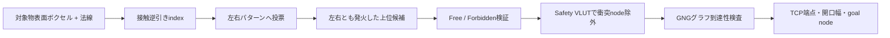

# 把持接触発火パターン逆引きの実装計画

## 1. 文書の位置付け

- 状態: **直接ボクセル照合POCを実装済み / 接触逆引きindexは未実装**
- 対象: `grasping_system`、`gng_vlut_system`、既存のアームGNG/VLUT
- 目的: 対象物表面で観測された接触候補ボクセルの発火から、対応するTCP端点、グリッパ開口幅、アームGNGノードをリアルタイムに逆引きする。
- 非目的: 力閉包の厳密証明、動力学を含む把持安定性判定、IK/FCL/軌道計画の置換。

本方式は、対象物形状全体とグリッパ体積を全姿勢について総当たりする方式ではない。オフラインで各アーム姿勢の接触位置をワークスペースへ投影し、実行時には観測された正の接触証拠から候補パターンへ投票する。正の証拠で候補を絞った後だけ、非発火条件、ロボット本体衝突、GNGグラフ到達性を検査する。

現行POCの`grasp_voxel_matcher_node`は、逆引きindex構築前の計測・接続確認として、最大アンカー数、
姿勢数、更新周期を制限した直接照合を行う。物体候補抽出、3領域ゲート、候補Pose publishのtopic契約を
先に固定し、実点群で直接照合が性能上限を超えた場合に本書のcontact posting indexへ置き換える。

## 2. 解決する問題

平行グリッパの把持候補には、少なくとも次の関係が必要である。

1. 閉じ方向の正側と負側に、対象物表面の接触候補が存在する。
2. 両接触面の法線が、許容角内で概ね対向する。
3. 指、グリッパ基部、進入時の本体掃引領域に環境占有が存在しない。
4. 対応するアーム姿勢が自己干渉せず、現在姿勢からGNGグラフ上で到達できる。
5. 点群で観測されなかった場所を、確認済みの空き領域と誤認しない。

出力は単なる「把持可能ボクセル」ではなく、次の多対多関係とする。

```text
対象物の接触発火パターン
  -> 把持パターンID
  -> TCP端点ボクセル / TCP姿勢
  -> グリッパ開口幅bin
  -> アームGNGノードID
```

## 3. 基本方針

### 3.1 疎な3値パターン

環境ボクセルの観測状態を3値で扱う。

```cpp
enum class ObservationState : std::uint8_t {
  kUnknown = 0,
  kObservedFree = 1,
  kOccupied = 2,
};
```

各把持パターンは、TCPまたは世界座標で次の領域を持つ。

| 領域 | 期待状態 | 用途 |
|---|---|---|
| `positive_contact` | 対象物占有 | 閉じ方向の正側接触証拠 |
| `negative_contact` | 対象物占有 | 閉じ方向の負側接触証拠 |
| `required_free` | 観測Freeを推奨 | 指の進入余裕と信頼度加点 |
| `body_forbidden` | 占有禁止 | 指・基部の衝突棄却 |
| `approach_forbidden` | 占有禁止 | プリグラスプからの本体掃引衝突棄却 |
| その他 | don't care | 判定に使わない |

`Unknown`は`ObservedFree`として扱わない。`body_forbidden`または`approach_forbidden`が`Occupied`なら棄却し、`Unknown`なら設定により減点または安全側棄却とする。

### 3.2 正の証拠で検索し、非発火条件は後段で検証する

非発火ボクセルは空間中に大量に存在するため、検索キーには使わない。左右接触の占有と法線binをキーにして候補パターンを発火させ、候補数を限定してから空き・禁止領域を調べる。



## 4. データモデル

### 4.1 パターン本体

```cpp
using PatternId = std::uint32_t;
using NodeId = std::uint16_t;

struct ContactSample {
  long voxel_id{0};
  std::uint8_t normal_bin{0};
};

struct GraspContactPattern {
  PatternId id{0};
  NodeId arm_node_id{0};
  std::uint8_t arm_profile_id{0};
  std::uint8_t gripper_width_bin{0};

  long endpoint_voxel_id{0};
  geometry_msgs::msg::Pose tcp_pose_in_world{};

  std::vector<ContactSample> positive_contacts;
  std::vector<ContactSample> negative_contacts;
  std::vector<long> required_free_voxels;
  std::vector<long> body_forbidden_voxels;
  std::vector<long> approach_forbidden_voxels;

  float static_quality{0.0F};
};
```

`PatternId`は原則として次の組を一意に識別する。

```text
(arm profile, GNG node, gripper width bin, grasp variant)
```

同じGNGノードに複数の開口幅または接触深さを持たせるため、`PatternId`と`NodeId`を同一視しない。

### 4.2 接触逆引きキー

```cpp
enum class ContactSide : std::uint8_t {
  kPositive = 0,
  kNegative = 1,
};

struct ContactLookupKey {
  long voxel_id{0};
  std::uint8_t normal_bin{0};
  ContactSide side{ContactSide::kPositive};
};
```

初期実装では`unordered_map<ContactLookupKey, vector<PatternId>>`を使う。プロファイル後、必要なら構築後不変のCSR形式へ変換する。

```cpp
struct ContactPostingIndex {
  std::vector<std::uint32_t> offsets;
  std::vector<PatternId> pattern_ids;
};
```

### 4.3 法線bin

初期値は26方向とする。接触法線は符号を保持し、正側接触と負側接触を別キーにする。角度許容は検索時に隣接binも発火させるか、構築時に許容binへ重複登録する。

- 初期許容角: 30度
- 接触帯の位置許容: 10 mm解像度で±1 voxel
- 法線が不安定な点は検索キーにせず、体積支持の補助証拠だけにする。

## 5. オフライン構築

### 5.1 入力

1. 自己干渉判定済みアームGNGノードと代表関節角。
2. 各ノードのFKによるTCP姿勢。
3. `grip_V`、`grip_minV`、指およびグリッパ基部のボクセル形状。
4. 閉じ軸、進入軸、開口幅の上下限。
5. 共通の世界ボクセルindexing schema。

ToPoDualArmの初期値は次とする。

| 項目 | 初期値 |
|---|---:|
| 接触検索解像度 | 0.01 m |
| 詳細禁止領域解像度 | 0.005 m、または10 mmへ保守的集約 |
| 開口幅bin | 10 mm刻みを基準に実機上下限へ合わせる |
| 接触帯厚さ | 1 voxel |
| プリグラスプ距離 | 0.10〜0.15 m、設定化 |

### 5.2 パターン生成

各アームGNGノードと開口幅binについて次を行う。

1. 代表関節角からTCP姿勢を計算する。
2. 自己干渉ノード、関節制限違反ノードを除外する。
3. 開口幅に対応する左右指接触面をTCP座標で生成する。
4. 左右接触面を1 voxel厚の接触帯として離散化する。
5. 接触帯をTCP姿勢で世界座標へ投影する。
6. 開姿勢の指と基部を`body_forbidden`へ投影する。
7. `body_forbidden`を進入軸に沿って掃引し`approach_forbidden`を作る。
8. 接触サンプルを`(voxel, normal bin, side)`逆引きindexへ登録する。
9. 重複関係をソートして除去し、パターンとindexを保存する。

```text
for q in safe_gng_nodes:
  T_tcp = FK(q)
  for width in width_bins:
    p = make_pattern(q, width, T_tcp)
    patterns.push_back(p)
    for c in p.positive_contacts:
      positive_index[c].push_back(p.id)
    for c in p.negative_contacts:
      negative_index[c].push_back(p.id)
```

### 5.3 保存形式

初期実装はデバッグ可能なヘッダー付きバイナリとする。最低限、次を保存する。

- magic、format version、endianness
- robot/profile名
- GNGモデル識別子またはhash
- URDF・グリッパ定義のhash
- voxel sizeとindex shift/schema
- 法線bin定義
- 開口幅bin一覧
- 全パターン
- 接触posting index

GNG、URDF、グリッパ形状、indexing schemaのいずれかが変わった場合は再生成する。既存`RigidGraspVlut`の`voxel -> node IDs`構造と構築ロジックは参考にするが、ペイロード占有との意味混同を避けるため、別型・別ファイルとして実装する。

## 6. 実行時処理

### 6.1 観測グリッド更新

入力点群を共通世界座標へ変換し、対象物占有`target_occupied`と全環境占有`all_occupied`を分ける。

- `Occupied`: 点が入ったボクセル。
- `ObservedFree`: センサ原点から観測点までのrayが通過したボクセル。
- `Unknown`: いずれでもないボクセル。

POC第1段階では`ObservedFree`を使わず、`Occupied`と`Unknown`だけでもよい。この場合、禁止領域の占有は棄却できるが、「空きが確認された」ことによる加点は行わない。

### 6.2 接触候補抽出

対象物クラスタの表面ボクセルについて、位置と外向き法線を得る。次を除外または低重みとする。

- 近傍点数が不足する法線。
- 法線分散または`rho`が大きすぎる点。
- 対象物クラスタの内部ボクセル。
- `safe`/`wall`背景に属し、対象クラスタへ含まれないボクセル。

### 6.3 発火と投票

固定長配列を事前確保し、コールバック中のmap生成を避ける。

```cpp
struct PatternVotes {
  std::uint16_t positive{0};
  std::uint16_t negative{0};
  float normal_score{0.0F};
};
```

各表面ボクセルから正側・負側indexを引き、該当パターンへ投票する。毎周期全配列をクリアせず、初回発火した`PatternId`だけを`activated_patterns`へ記録し、処理後にその範囲だけリセットする。

### 6.4 第1ゲート: 両側接触

初期ゲートは次とする。

```text
positive_votes >= min_positive_votes
negative_votes >= min_negative_votes
opposing_normal_score >= min_opposing_normal_score
```

初期値:

- `min_positive_votes = 2`
- `min_negative_votes = 2`
- 対向法線許容角 = 30度

点群密度に依存するため、固定ボクセル数に加えて接触帯の発火率も記録する。

### 6.5 第2ゲート: 非発火・空き条件

第1ゲートを通過した上位候補だけに対して次を確認する。

```text
body_forbidden_hits == 0
approach_forbidden_hits == 0
required_free_ratio >= threshold  // Freeを構築した場合
```

禁止領域の最初の占有を検出した時点で評価を打ち切る。`Unknown`の扱いは次から選択可能にする。

- `allow`: 棄却せず信頼度だけ下げる。
- `reject`: 安全側に棄却する。
- `limit`: Unknown率が閾値を超えた場合だけ棄却する。

POC初期値は`limit`とし、Unknown率を評価ログへ残す。

### 6.6 第3ゲート: Safety VLUTと到達性

1. 既存Safety VLUTで`is_colliding`またはdanger状態のGNGノードを除外する。
2. 現在ノードから候補ノードまでGNGグラフ上で到達可能か調べる。
3. 到達コスト、可操作性、関節移動量を付加する。
4. 上位5〜20件だけ既存の占有評価、IK/FCL、詳細軌道検証へ渡す。

## 7. スコアリング

ゲート条件と順位スコアを分離する。禁止領域占有や片側接触欠落は加重和で相殺せず、必ずゲートで不合格とする。

```text
contact_score =
    0.35 * positive_activation_ratio
  + 0.35 * negative_activation_ratio
  + 0.20 * opposing_normal_score
  + 0.10 * observed_free_ratio

final_score =
    contact_score
  + static_quality_weight * static_quality
  - unknown_penalty
  - normalized_traversal_cost
```

最初から単一総合スコアだけを保存せず、各成分を評価ログ・Viewerへ出せる形で保持する。

## 8. ROSとパッケージの責務

### 8.1 `grasping_system`

純粋なデータ構造、構築、発火、評価を置く。

実装候補:

```text
grasping_system/include/candidate/grasp_contact_pattern.hpp
grasping_system/include/candidate/grasp_contact_index.hpp
grasping_system/include/candidate/grasp_contact_matcher.hpp
grasping_system/include/candidate/grasp_contact_pattern_builder.hpp
```

これらはROS nodeなしでも単体テスト可能にする。

### 8.2 `gng_vlut_system`

次を接続するruntime nodeを置く。

- アームGNGモデルと現在ノード。
- Safety VLUTによる動的衝突状態。
- 対象物表面ボクセル・法線。
- GNGグラフ到達性と候補経路。
- 候補Pose、goal node、評価指標のpublish。

node名の候補は`grasp_contact_lookup_node`とする。topic/message契約は既存候補生成経路を確認してから確定し、独自messageを追加する前に既存`TopologicalMap`、`PoseArray`、評価metric形式で表現できるか確認する。

### 8.3 既存実装との関係

- `GraspPoseOccupancyEvaluator`: 発火後の上位候補に対する詳細領域検査として再利用する。
- `RigidGraspVlut`: 逆引きデータ構造の参考にするが、ペイロード占有レイヤーとして維持する。
- `Safety VLUT`: 候補GNGノードの動的環境衝突除外に使う。
- `grip_V` / `grip_minV` / `grip_baseV`: 接触帯、最小幅、禁止領域の構築元にする。

## 9. 実装フェーズ

### Phase 0: 計測用POC

1. 既存GNGノード100〜1,000件と開口幅binから接触パターンをメモリ上で生成する。
2. 保存形式やROS nodeを作る前に、合成対象物ボクセルを使って発火候補を確認する。
3. パターン数、posting長、関連数、構築時間、検索時間を計測する。

完了条件:

- 左右接触を置いた合成入力から、期待するGNGノード・端点が上位に出る。
- 片側接触だけでは候補がゲートを通らない。
- 禁止領域占有で候補が棄却される。

### Phase 1: 独立ライブラリ

1. データ型とin-memory builderを実装する。
2. 法線bin、接触帯膨張、開口幅binを実装する。
3. posting indexと固定長投票器を実装する。
4. 3値グリッドをcallbackまたはinterfaceで注入可能にする。
5. 単体テストとmicro benchmarkを追加する。

### Phase 2: オフライン生成と永続化

1. GNGモデル、URDF、グリッパ定義からパターンファイルを生成するCLIを追加する。
2. schema/hash検証付きloaderを追加する。
3. 左右アームを別profileとして生成・読込できるようにする。

### Phase 3: ROS runtime統合

1. 対象物クラスタと表面法線入力へ接続する。
2. Safety VLUTと現在GNGノードへ接続する。
3. 候補TCP、goal node、開口幅、発火内訳をpublishする。
4. 上位候補を既存の詳細占有評価と経路計画へ渡す。

### Phase 4: 実点群評価と最適化

1. rosbagで候補再現性、誤発火、欠落率を測る。
2. 法線bin数、接触帯厚さ、投票閾値を調整する。
3. `unordered_map`実装をプロファイルし、必要な場合だけCSR、flat hash、bitsetへ移行する。
4. Free raycastの有無による精度・時間差を評価する。

## 10. テスト計画

### 10.1 単体テスト

- 正側だけ、負側だけ、両側発火。
- 法線bin一致、許容角内、許容角外。
- 接触帯の±1 voxel位置誤差。
- `Occupied`、`ObservedFree`、`Unknown`の区別。
- `body_forbidden`と`approach_forbidden`の早期棄却。
- 同じ端点に複数GNGノードが対応する多対多関係。
- 左右アームで同一world voxel IDが存在する場合のprofile分離。
- GNG/URDF/schema hash不一致ファイルの読込拒否。

### 10.2 結合テスト

- 合成箱・円柱・不定形クラスタから妥当な開口幅が選ばれる。
- 環境障害物を追加するとSafety VLUTによって該当候補が消える。
- 現在ノードから切断された候補は到達可能候補として出ない。
- 同じrosbag入力で候補順位が決定的に再現する。

### 10.3 性能テスト

初期性能目標:

| 項目 | 目標 |
|---|---:|
| GNGノード数 | 1,000以上 |
| 開口幅bin | 4〜8 |
| 対象表面ボクセル | 500〜2,000 |
| 接触投票 | 2 ms以下 |
| 上位候補の禁止領域検査 | 5 ms以下 |
| Safety VLUT・到達性を含むlookup | 15 ms以下 |
| 知覚系を含む候補更新 | 10〜30 Hz |

各段階を別タイマーで記録し、合計だけで性能を評価しない。

## 11. メモリ見積り

例として、GNGノード1,000、開口幅6 bin、左右接触帯各20 voxelとする。

```text
pattern数             = 6,000
接触posting関連数     = 6,000 * 40 = 240,000
PatternId 4 byte換算  = 約0.96 MB + index overhead
```

禁止領域は逆引きせず、パターンごとの圧縮済みvoxel列として上位候補だけ参照する。禁止領域が平均1,000 voxelなら未圧縮で約24 MB、差分符号化またはlocal offset化で削減可能である。初期POCでは圧縮より検証容易性を優先する。

## 12. リスクと対策

| リスク | 対策 |
|---|---|
| 未観測をFreeと誤認 | 3値グリッドを使い、Unknownを別扱いする |
| 点群疎密で投票数が変動 | 絶対数と接触帯発火率を併用する |
| 法線符号・ノイズ | 対象物中心から外向きに符号整合し、低信頼法線を除外する |
| posting listが長大化 | 法線bin、接触side、arm profileでキーを分離する |
| 離散化で真の接触を落とす | 接触帯を±1 voxel膨張し、隣接normal binも許容する |
| 単純投票だけで偽陽性 | 左右必須ゲート、禁止領域、Safety VLUT、詳細評価を順に適用する |
| GNG更新後にmapが陳腐化 | GNG/URDF/gripper/schema hashを保存して再生成を強制する |
| 動的環境をオフラインmapへ焼き込む | mapにはロボット姿勢と接触幾何だけを保存し、環境衝突はruntime Safety VLUTで評価する |

## 13. 初期実装で採用しないもの

- ワークスペース全体の密な3D畳み込み。
- FFTによる全姿勢テンプレートマッチング。
- Octreeや階層グリッドを前提とした実装。
- 全パターンの非発火条件を毎周期走査する処理。
- 未観測ボクセルを暗黙に空きとする二値占有。
- 接触、衝突、到達性を単一スコアだけで相殺する判定。

階層グリッドは、実測で候補発火数または禁止領域照会が性能目標を超えた場合に限り、20 mm、40 mmの粗い棄却層として追加する。

## 14. 実装開始時に確定する項目

1. 対象物クラスタを供給する既存topicとframe。
2. GNGノードから代表関節角・TCP姿勢を得るAPI。
3. 左右指の接触面生成方法と、開口幅binに対応するURDF関節値。
4. 進入軸のグリッパごとの定義。
5. `Unknown`の初期運用方針と許容率。
6. 候補結果を既存messageへ載せるか、新規messageを作るか。
7. パターンファイルをGNGモデルと同梱する配置規約。

上記が確定するまでは、純粋ライブラリと合成入力によるPhase 0/1を先行可能とする。
