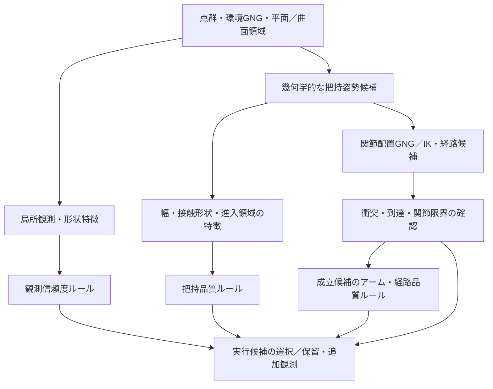
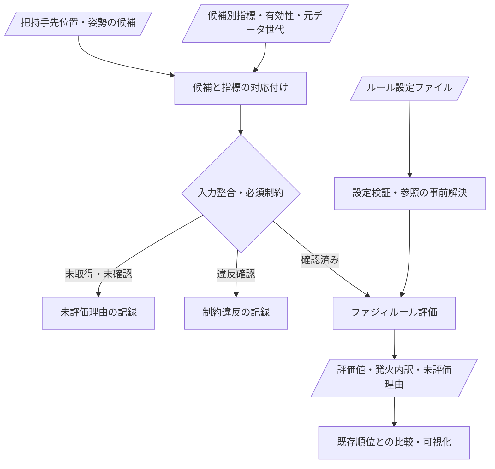
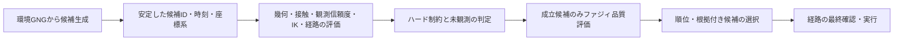

# 把持ファジールール統合設計書

統合日: 2026-09-14

**設計案の正本。汎用ROS把持IF-THENエンジンは未接続。候補ルール・所属関数の数値境界・新規topicは採用済み仕様ではない。**

入力・制約・集合、実装雛形、145件の拡張ルール、ROS入力・派生指標候補を本書へ集約。今後の設計変更は本書を更新し、旧ファイルに本文を追加しない。
所属度・形状スコア・仮説信頼度・把持成功確率を区別し、未計算値を仮の式や0で埋めない。

## 読み方と管理範囲

| 確認したい内容 | 参照先 |
| --- | --- |
| 初期に何を評価するか、入力・制約・所属関数 | [第1章：入力設計](#inputs) |
| どう実装するか、候補ID・欠損・JSON・検証 | [第2章：実装契約](#engine) |
| 将来のIF-THEN候補を探す | [第3章：R001〜R145](#rule-catalog) |
| ルールに必要なtopic・metric・物体仮説 | [第4章：拡張入力カタログ](#topic-metrics) |
| HTML試作からの改善論点 | [第5章：改善案・相談事項](#open-design) |
| 現在のROS処理とHTML既定12ルール | [現行実装の調査資料](../FUZZY_GRASP_CURRENT_OVERVIEW.md) |
| 現行メッセージのfieldと無効値・出力手順 | [評価メッセージ仕様](../../../grasping_system/docs/fuzzy_evaluation_metrics.md) |

前半の第1・2章が初期の設計検討、後半の第3・4章が拡張候補の参照集。145件を一括実装する計画ではない。
第1章の入力の意味・有効性と第2章の実装契約を、候補集の読み方の基準とする。第3・4章は元資料の提案を保持しており、ルールの競合・物性仮説・採用境界の決定は別途必要。
ファジー入力の関節余裕・推定エネルギー・推定時間は現行NaN。関連ルールが記載されていても発火可能な実装とは扱わない。

作業順は [TASK_LIST.md](../TASK_LIST.md)、方針未確定の作業項目は [TASK_CANDIDATES.md](../TASK_CANDIDATES.md)、実施事実は [progress.md](../progress.md)、保留は [pending.md](../pending.md)、不採用判断は [reject.md](../reject.md) を参照。本書の候補や段階案を、実施決定・保留・不採用へ自動変換しない。

## 統合元

| 旧資料 | 本文の移管先 |
| --- | --- |
| `designs/fuzzy_grasp_input_design.md` | 第1章 |
| `designs/fuzzy_rule_engine_design.md` | 第2章 |
| workspace直下の`FUZZY_GRASP_RULE_CATALOG.md` | 第3章 |
| workspace直下の`FUZZY_GRASP_TOPIC_METRIC_CATALOG.md` | 第4章 |
| `FUZZY_GRASP_CURRENT_OVERVIEW.md`の改善提案・統合案 | 第5章。実装説明・数値再現結果は元資料に維持 |

旧4ファイルは移管先への案内だけを残す。過去のスライド・進捗・リリース記録はその時点の資料として保持。

<a id="inputs"></a>

## 1. 入力・制約・ファジー集合

元資料の確認日: 2026-09-14。確認時HEAD: `dac0356f`。統合時に全指標を再測定したものではない。

目的は、今後ROS側へ導入するIF–THENルールの入力仕様の整理。実装済みのルールや確定仕様の説明ではなく、相談・設計用の案。
現行実装の詳細は[把持推定の現状](../FUZZY_GRASP_CURRENT_OVERVIEW.md)を参照。
本書の取得状況はソース上の確認結果であり、実行中のトピック受信・設定有効化の確認ではない。
曲面推定関連は作業ツリー上の変更も含むため、今後の変更に応じた再確認が必要。

### 1.1 評価の構成

| 評価 | 問い | 評価単位 |
| --- | --- | --- |
| 観測・形状の信頼度 | 把持に必要な形状をどこまで信用できるか | 物体・領域の情報を候補接触部位と進入領域へ集約 |
| 把持品質 | この手先位置・姿勢でつかみやすいか | 把持候補ごと |
| アーム・経路品質 | その把持を無理なく実現できるか | 把持候補に対応する関節配置・経路ごと |
| ハード制約・未確認判定 | 実行可能か、追加確認が必要か | 上記候補の組合せごと |

同じ物体でも把持部位によって観測状態・つかみやすさが異なる。同じ手先姿勢でも複数のアーム姿勢が対応し得るため、物体ごとの単一スコアへの集約は避ける案。
形状信頼度、把持品質、実現品質を別々に保持し、最終選択時に組合せ。
いずれの所属度・品質点も、そのまま把持成功確率を意味するものではない。



図は今後の構成案。現行ROS候補選択にこのルールベースが接続済みという意味ではない。

### 1.2 取得状況の凡例

- **A：出力あり** — 現行コードに出力経路あり。ルール入力への接続、有効値・単位の確認は別途必要。
- **B：加工・連携が必要** — 元情報・内部状態あり。候補単位の集計、対応付け、追加計算または出力の整備が必要。
- **C：追加実装が必要** — 確認した経路では目的の指標が未算出。フィールドのみ存在してNaNのものも含む。

各行の言語ラベルは案。メンバシップ関数の数値境界は未決定。

### 1.3 観測・形状の信頼度への入力

| 入力 | 単位・定義案 | 状況・取得元 | 言語ラベル案 | 注意点 |
| --- | --- | --- | --- | --- |
| 局所GNG支持数 | 候補領域内のノード数［個］ | A：候補summaryの`node_count` | 少・中・多 | ノード配置設定や対象寸法に依存。点群密度・確率との同一視は不可 |
| 元点群支持数・支持密度 | 接触候補部位に対応する点数［個］、必要なら観測表面積当たりの点数 | B：GNGノードの`inpcl_ids`、条件付きの`winner_point_count` | 弱・中・強 | 同一フレームの対応確認と重複点除去が必要。累積統計と当該フレーム点数の混在回避 |
| 面・曲面の当てはめ残差 | 接触領域を説明するモデルからの位置残差RMS［m］ | B：曲面パッチの`plane_rms`、`position_rms`等あり。候補部位への対応付けが必要 | 小・中・大 | 平面残差が大きくても曲面として妥当な場合あり。採用モデルの残差で評価 |
| 局所曲面推定品質 | 位置支持・条件・残差に基づく既存品質指標［無次元］ | B：パッチの`confidence`あり。候補への集約が必要 | 低・中・高 | 既存コメント上も確率ではない。残差・支持数との重複加点に注意 |
| 検出の時間的安定性 | 観測された更新数／有効な観測機会数、連続欠落回数 | B：`CandidateTrack`に検出・欠落状態あり。窓内履歴・出力の整備が必要 | 不安定・中・安定 | 同じ入力の再処理を独立観測として数えない。ID変更への対処も必要 |
| 形状・位置の時間変動 | 寸法変動、移動補償後の位置・法線変動［m、deg］ | B：候補の姿勢・寸法と追跡情報から履歴統計の追加が必要 | 小・中・大 | 実物体の運動とノイズの区別。EMA後の安定だけを証拠にしない |
| 遮蔽・視野端の局所証拠 | 候補周辺の境界証拠の割合［0〜1］ | B：`boundary_evidence`等の出力処理あり。設定・候補への集計が必要 | 少・中・多 | 遮蔽／自由空間／視野端は独立ビット。証拠なしは「不明」であって安全ではない |
| 接触部・進入領域の未観測率 | 評価対象領域のうち観測根拠がない割合［0〜1］ | C：深度視線・自由空間観測などから領域単位の算出が必要 | 小・中・大 | 境界証拠だけで体積全体の未観測率を代用しない |

物体全体の未観測率だけで判定せず、指が触れる面と指・アームが通過する領域の観測状態を優先する案。

### 1.4 把持品質への入力

| 入力 | 単位・定義案 | 状況・取得元 | 言語ラベル案 | 注意点 |
| --- | --- | --- | --- | --- |
| 候補領域の寸法 | `extent_x/y`、`target_extent_x/y`［m］ | A：候補summaryに出力 | 小・適切・大 | 投影外形の寸法。実際の指の閉じ方向に対する必要幅とは区別 |
| 投影外形の面積比 | `extent_x × extent_y / (grasp_size_x × grasp_size_y)`［無次元］ | A：`footprint_fill_ratio`、`shape_score` | 小・中・大 | **観測の充足率・形状信頼度・接触面積ではない**。大きいほど良いとは限らない |
| 開口余裕 | ハンド最大開口−閉じ方向の必要幅−必要クリアランス［m］ | B：外形とハンド仕様から算出の整備が必要 | 小・適切・十分 | 現在の`grasp_size_x/y`を物理的最大開口と無条件に同一視しない |
| 周辺面からの突出 | `minimum_neighbor_plane_distance`［m］ | A：有効時に候補summaryへ出力、無効時null | 小・中・大 | 指が入る隙間や障害物までの最短距離そのものではない |
| 候補高さ | `surface_height`［m］ | A：候補summaryに出力 | 低・適切・高 | 基準座標系を固定。単に高い候補を高品質としない |
| 接触可能な奥行き・面積 | 指形状に沿った有効接触長［m］・面積［m²］ | C：候補にハンド形状を配置して推定する処理が必要 | 不足・適切・十分 | 外接箱の奥行きだけでは接触を保証しない |
| 対向接触面の適合 | 閉じ方向と両側接触法線の適合度［0〜1またはdeg］ | B：GNG・曲面の位置／法線を元に接触対の抽出と計算が必要 | 低・中・高 | 対向法線のみで摩擦・力閉包の成立を保証しない |
| 持ち手形状の適合 | 指の挿入空間、局所くびれ等から得る適合度 | C：形状に基づく特徴量の定義・算出が必要 | 低・中・高 | 候補種別の固定値を「認識の確信度」にしない |
| 重心に対する把持位置 | 重心からの距離［m］、必要なら重力モーメント［N·m］ | C：質量・重心・重力方向等の情報が必要 | 小・適切・大 | 部分点群の中心を実重心と見なさない。未取得時は無効扱い |
| 摩擦・変形しやすさ | 材質、摩擦係数、剛性など | C：物体モデル、触覚、把持後観測等が必要 | 滑りやすい／滑りにくい等 | 点群形状だけから確定しない。初期導入の必須入力にはしない案 |

### 1.5 アーム・経路品質への入力

| 入力 | 単位・定義案 | 状況・取得元 | 言語ラベル案 | 注意点 |
| --- | --- | --- | --- | --- |
| TCP目標位置誤差 | 所望の把持位置と実現TCP位置の距離［m］ | B：候補姿勢とGNGノード姿勢から算出可能 | 小・中・大 | 到達ボクセル内であっても誤差の評価が必要 |
| TCP目標姿勢誤差 | 所望姿勢と実現姿勢の回転差［deg］ | B：両姿勢から評価値の整備が必要 | 小・中・大 | 現行のZ軸方向差だけとは別。ハンドの対称性に応じた許容姿勢の定義が必要 |
| 位置・回転可操作性 | `position_manipulability`、`rotation_manipulability` | A：候補評価メッセージに出力 | 低・中・高 | スケール・単位はヤコビアン定義とロボットに依存。別ロボットで共通境界を流用しない |
| 特異姿勢への近さ | 条件数［無次元］、必要なら最小特異値 | A：詳細候補評価に`manipulability_condition_number`等あり | 近い・中・遠い | 汎用`evaluation_metrics`の固定項目とは別。配信経路の接続が必要 |
| 関節限界余裕 | `joint_limit_margin_min/mean`［定義未確定］ | C：現行NaN。暫定値の代入停止 | 小・中・大 | 測定対象・尺度・用途の確定後に個別実装 |
| 現在姿勢からの移動量 | 各関節の変化量を可動範囲等で尺度合わせした量 | B：関節状態と候補関節配置から算出可能 | 小・中・大 | 回転関節と直動関節の単位混在に注意 |
| 自己・環境衝突余裕 | ロボット形状と他形状との最短距離［m］ | C：`self_collision_margin`、`environment_collision_margin`は現行NaN | 小・適切・十分 | 無衝突という判定と、距離余裕の測定は別 |
| 経路上の可操作性 | `path_position_manipulability`、`path_rotation_manipulability`の配列 | A：配列出力あり。B：最小値等への集約 | 低・中・高 | 平均だけでは経路途中の特異姿勢を隠す。最小値や下位分位を検討 |
| 経路移動コスト | `estimated_energy`［定義未確定］ | C：現行NaN。暫定式なし | 小・中・大 | 実消費エネルギーと幾何学的な移動コストを混同しない定義が必要 |
| 推定所要時間 | `estimated_duration`［s］ | C：現行NaN。暫定式なし | 短・中・長 | 時間推定モデルと妥当性確認方法の確定後に個別実装 |

既存の`gripper_width`、`grasp_region_score`も現在の評価生成処理ではNaN。フィールドの存在だけを理由に取得済みとしない。

### 1.6 ファジィ入力と分離する制約・有効性

| 判定 | 使用情報 | 扱いの案 |
| --- | --- | --- |
| 座標・時刻の整合 | frame、stamp、TF、入力世代 | 不整合なら評価保留。値を0に置換しない |
| TCP位置の到達領域 | `GraspCandidate.state` | INSIDEは後段評価へ、UNKNOWNは保留等。OUTSIDEは現行到達マップ外という情報であり、数学的な到達不能の証明ではない |
| 姿勢を含む実現可能性 | 関節配置／IK、目標位置・姿勢誤差 | 必要精度を満たさなければ除外または再探索 |
| ハンドの開口限界 | 必要幅、物理的開口範囲 | 範囲外は除外。成立範囲内の余裕をファジィ評価 |
| 関節限界 | 関節位置と各限界 | 範囲外は除外。範囲内の余裕をファジィ評価 |
| 衝突 | 自己・環境衝突、進入経路・経路補間の確認 | 禁止衝突は除外。許容する対象との意図的接触は別定義 |
| 経路成立 | `feasible`、探索結果 | 現在の候補経路が不成立なら除外・再探索。すべての経路の不存在とは区別 |
| 必須領域の未観測 | 指の挿入・進入領域の観測有効性 | 安全確認ができない場合は保留・追加観測の候補 |

禁止衝突や関節限界違反を、把持品質の高さで相殺しない方針。
制約判定の機能が無効、値が未計算、サンプルが古い場合に「成立」と扱わない仕組みが必要。

### 1.7 ファジィ集合の表現案

#### 1.7.1 入力の単位と所属度の区別

入力はm、deg、s、個数などの物理単位を保持可能。0〜1となるのは各言語ラベルへの所属度。
すべての入力を同じLow/Medium/Highの境界に押し込む必要はない。
正規化する場合は、候補集合ごとのmin-maxより、ハンド仕様・センサー精度・ロボット基準などの固定尺度を優先する案。

| 特徴量の性質 | 関数形の案 | 例 |
| --- | --- | --- |
| 小さいほど望ましい | 左肩型＋中間三角形＋右肩型 | 位置誤差、形状残差、時間 |
| 大きいほど望ましい範囲 | 左肩型＋中間三角形＋右肩型 | 観測支持、関節余裕 |
| 中間が適切 | 中央の三角形または台形と、両側の不足／過大集合 | 把持幅、用途に応じた接触位置 |
| カテゴリ・判定 | 真偽／列挙のまま、または独立した証拠集合 | 到達状態、遮蔽証拠 |
| 未取得・無効 | メンバシップ関数へ入力しない | NaN、未観測、候補ID未対応 |

肩型集合は境界で意図した所属度を保持する仕様とし、Low(最小値)=1、High(最大値)=1となる場合をテスト対象とする案。
既存HTMLの端点処理をそのまま移植しない。

#### 1.7.2 数値境界を決める手順

1. 評価対象部位・単位・測定方法の確定。
2. センサー誤差、ハンド寸法、関節限界などから成立限界の決定。
3. 正常・境界・不成立・未観測の例から「小／適切／大」の境界案を設定。
4. 境界付近で集合を重ね、0・1・境界値・未取得値の動作確認。
5. 記録データで候補順位・発火ルールを比較し、境界を調整。

現段階では数値境界を未確定とし、ハンド仕様やセンサー条件がないまま任意の値を確定しない。

### 1.8 代表ルール案

以下は未実装の設計例。全入力が取得済みという意味ではない。

| 評価 | IF | THEN |
| --- | --- | --- |
| 観測信頼度 | 元点群支持が強い AND 時間的に安定 AND 採用形状モデルの残差が小さい | 信頼度が高い |
| 観測信頼度 | 検出が不安定 OR 形状モデルの残差が大きい | 信頼度が低い |
| 把持品質 | 開口余裕が適切 AND 対向接触面の適合が高い AND 接触奥行きが十分 | 品質が高い |
| 把持品質 | 接触奥行きが不足 OR 対向接触面の適合が低い | 品質が低い |
| アーム品質 | 位置・回転可操作性が高い AND 関節限界余裕が大きい | 品質が高い |
| 経路品質 | 経路上の最小可操作性が低い | 品質が低い |
| 経路品質 | 障害物余裕が十分 AND 推定時間が短い | 品質が高い |
| 最終判断 | 把持品質が高い AND 観測信頼度が低い | 追加観測の優先度が高い |

少数ルールから始め、同じ根拠の重複加点を避ける案。例：ノード支持数・元点群支持数・曲面confidenceを独立した三つの確証として過大評価しない。
AND=min、OR=max、出力代表値の加重平均などは初期方式の候補であり、まだ確定ではない。
品質評価と「実行／保留」の行動選択は別層にし、全ルール非発火を自動高評価としない。

### 1.9 初期導入で優先する入力

最初から全項目を必須にせず、次の構成から始める案。

1. 観測側：元点群支持数、候補検出の安定性、局所形状モデルの残差。
2. 把持側：必要幅・開口余裕。接触面の評価が未実装の段階では「幾何学的適合」として扱い、完全な把持品質と呼ばない。
3. アーム側：TCP目標誤差、位置・回転可操作性、定義を確認した関節限界余裕。
4. 経路側：経路成立、経路上の最小可操作性、推定時間。
5. 拡張：対向接触面、接触奥行き、障害物距離、未観測率、必要に応じた物性。

### 1.10 入力と一緒に保持する情報

- 物体／領域ID、把持候補ID、計画GNGの目標ノードID、経路IDと、その対応関係。
- 観測時刻、座標系、元データの世代、評価対象部位。
- 入力値、単位、有効性、未取得・期限切れ等の理由。
- 使用したメンバシップ関数とルールの版、発火度、制約違反、非発火・保留理由。

現在の汎用評価メッセージは計画GNGの`goal_node_id`をscopeに使用。環境領域ID・把持候補IDとの安定した対応付けが必要。
経路不成立候補は汎用評価への変換時に除外されるため、不成立理由までルール／判断層へ渡す場合は配信設計の見直しが必要。

### 1.11 実装参照

ROS側の責務分割・設定形式・欠損値処理・テスト方針は [第2章](#engine) を参照。現行実装ではなく設計案。

- [候補形状・寸法・面積比](../../../grasping_system/include/candidate/top_grasp_surface_estimator.hpp)
- [候補追跡とsummary出力](../../../grasping_system/src/top_grasp_surface_estimator_node.cpp)
- [GNG側ノードメッセージ](../../../ais_gng_cpu/src/ais_gng_msgs/msg/TopologicalNode.msg)
- [元点群対応・境界証拠の出力処理](../../../ais_gng_cpu/src/ais_gng/src/ais_gng_component.cpp)
- [曲面モデルとパッチ品質の定義](../../../ais_gng_cpu/src/ais_gng/include/ais_gng/topological_plane/surface_model.hpp)
- [曲面パッチ情報のJSON化](../../../ais_gng_cpu/src/ais_gng/src/topological_plane/surface_model_visualization.cpp)
- [把持候補の到達状態](../../../MSG/gng_control_msgs/msg/GraspCandidate.msg)
- [アーム・経路指標の生成](../../src/core/planning/topological_map_avoidance_helpers.hpp)
- [汎用評価メッセージへの変換](../../src/core/common/evaluation_metric_serialization.hpp)
- [拡張ルール候補R001〜R145](#rule-catalog)

<a id="engine"></a>

## 2. ROSルールエンジンの実装契約

作成日: 2026-09-14

**状態: 未実装の設計案。新しいROSノード・トピック・設定ファイルはまだ追加していない。**
対象は把持候補の評価であり、候補生成や実機動作の実行ではない。
指標の意味・単位・候補は [第1章](#inputs) を参照。本章では実装の分担と入出力契約を扱う。

### 2.1 現在あるコード

| 場所 | 実装済みの内容 | ROS把持評価への接続 |
| --- | --- | --- |
| [HTML](../../../ToPo-FUZZY_Manipulation_v1.html) の `defaultFuzzyModel` | 入力集合・出力代表値・ルールの既定モデル | HTML内のみ |
| 同HTMLの `mfEval`、`tnorm`、`snorm`、`evaluateFuzzyRules` | 所属度、AND/OR、ルール発火、出力集約 | HTML内のみ |
| 同HTMLの `bindFuzzyEditor`、`renderFuzzyDebug` | JSON編集・保存と発火状況の表示 | ROSへルールを適用する機能とは別 |
| [評価メッセージ変換](../../src/core/common/evaluation_metric_serialization.hpp) | 指標定義・値・有効フラグの配信 | ルール評価自体はなし |
| [上方把持推定器](../../../grasping_system/src/top_grasp_surface_estimator_node.cpp) | 幾何候補、形状スコア、到達状態の配信 | 汎用IF-THENルールは未接続 |
| [経路候補選択](../../src/nodes/planning/topological_map_avoidance_node.cpp) | 既存の固定的な候補スコアリング | 汎用IF-THENルールは未接続 |
| [FuzzyClassifier](../../../FuzzyClassifier/src/cluster_relabel_node.cpp) | 台形所属度などによるクラスタ再分類 | 把持候補評価とは別用途。`COLCON_IGNORE`あり |

HTMLのルールをROSへそのまま読み込めるという意味ではない。既存の指標変換・ID対応・欠損処理の違いを吸収する必要あり。

### 2.2 構成案



初期段階では比較・可視化まで。既存候補の削除、順位変更、実機指令への接続は別途判断。
Effectivity Mapから得られる状態・指標はadapterへの入力であり、ルールエンジン内でGNG・VLUT・軌道を再計算しない。
観測信頼度・把持品質・アーム品質・経路品質は別の評価出力。経路未生成時に把持側の評価まで失敗させない。

### 2.3 責務と配置案

次のパスは今後の配置案であり、現時点でファイルを作成する指示ではない。

| 配置案 | 責務 |
| --- | --- |
| `grasping_system/include/evaluation/fuzzy_rule_types.hpp` | 指標、条件木、設定、評価結果のROS非依存型 |
| `grasping_system/include/evaluation/fuzzy_rule_engine.hpp` | 検証済み設定と指標値からの純粋な評価処理 |
| `grasping_system/src/evaluation/fuzzy_rule_config.cpp` | JSON読込、型・参照・境界の検証、設定の一括切替 |
| `grasping_system/src/evaluation/fuzzy_candidate_adapter.cpp` | ROSメッセージと評価入力の変換、世代・ID・単位の照合 |
| `grasping_system/test/test_fuzzy_rule_engine.cpp` | ROSを起動しない決定的な単体テスト |

別パッケージや独立ノードを最初から必須にしない。既存候補生成器・評価経路から共有ライブラリとして利用する案。
指標の計算処理、設定GUI、ロボット制御をエンジンへ取り込まない。

### 2.4 入力・出力契約案

#### 候補と指標の対応

- 候補キーは配信元の識別子・起動世代・`update_id`・候補`id`の組。`id`だけで異なる更新を結合しない。
- 候補は`header.frame_id`、観測時刻、`tcp_frame`を保持。再起動時の更新番号再利用を区別する起動世代の伝達方法は未確定。
- 指標は`metric_id`、値、単位、`is_valid`、無効理由、測定時刻、元データの世代を保持。
- 現行`EvaluationMetrics.sample_scope_ids`は計画GNGの`goal_node_id`。把持候補`id`と同じ数でも対応済みとは扱わない。
- 把持候補と計画ノード・経路は多対多。対応表がないアーム・経路指標は未評価とし、直近の別候補の値で代用しない。
- 配列指標を無条件に平均しない。集約方法と単位が決まった指標だけスカラー評価へ渡す。

#### 評価結果

| 項目 | 内容 |
| --- | --- |
| 候補キー・観測時刻 | 評価対象の特定 |
| 設定ID・改訂番号 | 再現に必要なルール設定の特定 |
| 評価出力ごとの状態 | `evaluated`、`not_evaluated`、`blocked` |
| 評価値 | 有効な出力だけに設定。未評価は内部でoptional、JSONではnull、既存ROS形式へ変換する場合は無効フラグを併用 |
| ルール別内訳 | 条件所属度、発火度、出力先、未評価理由 |
| 制約違反・欠損指標 | 品質スコアとは別の診断情報 |

`GraspCandidate.state`は既存の位置到達状態、`shape_score`は配信元固有の形状スコアとして維持。ファジィ評価値で上書きしない。
初期の結果保存先は診断用JSONを候補とする。恒常的なROS出力形式・トピック名は、ID対応と既存GUI経路を確認してから確定。候補矢印やreachabilityトピックの重複追加はしない。

### 2.5 ルール設定の雛形案

数値境界や評価式を勝手に埋めず、初期状態を無効な空モデルとする案。以下は設計例であり、現在のHTMLへそのままimportする形式ではない。

```json
{
  "schema_version": 1,
  "model_id": "grasp_candidate_rules",
  "revision": 1,
  "enable_evaluation": false,
  "methods": {
    "and": "min",
    "or": "max",
    "aggregation": "max",
    "defuzz": "weighted_average"
  },
  "missing_input_policy": "skip_rule",
  "no_activation_policy": "not_evaluated",
  "features": {},
  "outputs": {},
  "rules": []
}
```

初期演算方式は比較実装の提案であり、確定済みの現行ROS仕様ではない。
採用する場合は、AND=min、OR=max、NOT=1から所属度を引いた値、ルール発火度と重みの積、同一出力へのmax集約、出力代表値の発火度加重平均、と演算の意味を明示する。連続出力集合の重心計算とは区別する。

- `features`: `metric_id`、単位、言語ラベルと所属関数。最初は台形・三角形に絞る案。区間端点の所属度を明示。
- `outputs`: 評価軸ごとの出力ラベルと代表値。成功確率と同一視しない。
- `rules`: 一意な`id`、`enable_rule`、重み、条件木、出力軸・ラベル。条件木は`all`／`any`／`not`と、`metric_id`・`label`の葉で表現。AND/OR混在時の優先順位を曖昧にしない。
- 欠損入力があれば、その入力を参照するルール全体を未評価とする。条件を削って残りだけで発火させない。独立した有効ルールの評価は許容し、欠損を内訳に残す。
- 明示的に無効化した入力を有効ルールが参照する場合は設定不整合。GUIが勝手に条件を消す仕様にしない。
- 全ルール無効・全ルール未評価・発火なしは`not_evaluated`。固定加点や旧スコアへの暗黙のfallbackはなし。

### 2.6 検証・効率・安全側の扱い

- 設定読込時にID重複、未知指標・ラベル、単位不一致、非有限値、不正な区間順序、空の条件木、不正な重みを検出。有効化には使用指標・出力代表値の定義確定が必要。
- 入力値そのもののNaNや期限切れは所属度0に置換しない。必須制約の未確認は保留、違反確認は`blocked`。高いファジィ評価値で制約違反を覆さない。
- [暫定式の不採用方針](../reject.md)に従い、未計算の関節余裕・エネルギー・時間などへ仮の式を追加しない。
- 候補集合ごとのmin-max正規化を既定にしない。同じ物理入力の評価が、別候補の追加だけで変わらない設計。
- 設定の文字列参照を読込時に解決し、1候補内で同じ所属度を再利用。点群・グラフの探索はエンジン外。
- 設定切替は候補集合単位で一括適用。読込失敗時に半端な新設定へ移行しない。旧設定を維持する場合は使用中の版と失敗を明示。
- HTMLの概念・編集UIは参考にできるが、端点処理・欠損値の0置換・全ルール非発火時の加点・候補IDの混同は引き継がない。

### 2.7 実装時の確認項目

1. JSONの正常・不正ケースと設定の一括切替。
2. 台形の肩・三角形の頂点・重み0・重み1・AND/OR/NOTの組合せ。
3. NaN・無効フラグ・欠損・期限切れ・空モデル・全ルール非発火時の未評価。
4. 別候補・別更新・再起動前後のID混同防止。候補と計画ノードの対応がない場合の未評価。
5. 制約違反を高スコアで覆さないこと、経路指標未取得でも独立した把持評価が可能なこと。
6. 入力固定時の再現性、候補追加による他候補の評価不変性、候補数・ルール数別の処理時間。
7. 保存済み入力で既存順位と並列比較。候補選択への接続・実機動作はこの確認とは分離。

設計書作成は完了、実装・数値校正・実動作検証は未実施。上記は確認項目であり、作業順・実装開始の確定を意味しない。

<a id="rule-catalog"></a>

## 3. 拡張ルール候補 R001〜R145

対応する入力・指標は [第4章](#topic-metrics) を参照。R001〜R145は元資料の候補IDと本文を維持。採用済みルールではない。

### 目的

GNG、ボクセル、平面クラスタ、ハンドの包絡形状、IK、軌道および把持後の観測結果を用いた、把持候補評価と物体仮説更新のルール候補集。

本章のルールは網羅的な初期案であり、そのまま全件を単一のファジー推論器へ投入するものではない。実装時には重複ルールの統合、Membership Functionの定義、ハンド固有ルールへの分離および実機データによる検証が必要。

### ルール種別

| 記号 | 種別 | 用途 |
| --- | --- | --- |
| `[H]` | ハード制約 | 衝突、IK不成立、安全限界などによる確定的な除外 |
| `[F]` | ファジー評価 | 候補の順位付け、行動選好、品質評価 |
| `[B]` | 仮説更新 | 観測結果に基づく物体状態・物性・失敗原因の信頼度更新 |

ファジー集合への所属度と仮説の信頼度は別の値として扱う。例えば「重量物への所属度」はロボット能力に対する重さ、「質量推定信頼度」はその推定根拠の確かさを表す。

### 3.1 観測信頼性

| ID | 種別 | IF | THEN |
| --- | --- | --- | --- |
| R001 | `[F]` | 対象ボクセル観測密度が高い AND GNG支持密度が高い | 形状信頼度が高い |
| R002 | `[F]` | 対象ボクセル観測密度が低い AND GNG支持密度が低い | 形状信頼度が低い |
| R003 | `[F]` | 複数フレーム在席安定度が高い | 対象存在信頼度が高い |
| R004 | `[F]` | 単一フレームだけで観測 AND GNG連結支持が低い | 対象存在信頼度が低い |
| R005 | `[F]` | 観測形状のフレーム間変動が小さい | 形状安定度が高い |
| R006 | `[F]` | 観測形状のフレーム間変動が大きい AND 対象運動が観測されない | センサーノイズ可能性が高い |
| R007 | `[F]` | 対象の背面が未観測 | 包絡外占有信頼度が不明 |
| R008 | `[F]` | 掃引領域が深度画像で自由空間として観測 | 掃引空間信頼度が高い |
| R009 | `[H]` | 掃引領域が遮蔽 AND 未観測空間への進入量が大きい | 候補を保留 |
| R010 | `[F]` | GNGノード法線の局所ばらつきが小さい | 表面推定信頼度が高い |
| R011 | `[F]` | GNGノードが孤立 AND 点群支持が少ない | 局所形状信頼度が低い |
| R012 | `[F]` | GNG edge連結性が高い AND フレーム間連結性が安定 | 物体成分信頼度が高い |

### 3.2 Envelope familyの選択

| ID | 種別 | IF | THEN |
| --- | --- | --- | --- |
| R013 | `[F]` | 対象局所形状とenvelope familyの適合度が高い | envelope family選好度が高い |
| R014 | `[F]` | 複数envelope familyの適合度が同程度 | family判定曖昧度が高い |
| R015 | `[F]` | family判定曖昧度が高い AND 試行安全性が高い | 弱い把持試行の選好度が高い |
| R016 | `[F]` | family判定曖昧度が高い AND 試行安全性が低い | 候補選好度が低い |
| R017 | `[F]` | 対象形状が複数familyへ適合 | 姿勢許容範囲が広いfamilyの選好度が高い |
| R018 | `[F]` | 過去に同じ形状分類で成功したfamilyがある AND 現在形状との類似度が高い | そのfamilyの選好度が高い |
| R019 | `[F]` | familyの必要変形量が小さい | family実現容易度が高い |
| R020 | `[F]` | familyの必要変形量が大きい AND ハンド変形余裕が低い | family実現容易度が低い |

### 3.3 最小・最大包絡への適合

| ID | 種別 | IF | THEN |
| --- | --- | --- | --- |
| R021 | `[H]` | 対象局所形状が`min_envelope`内部だけに存在 | 対象を小さすぎると判定 |
| R022 | `[F]` | `min_envelope`外側の対象占有が十分 | 最小寸法適合度が高い |
| R023 | `[H]` | 許可領域以外で`max_envelope`からのはみ出しが大きい | 候補を棄却 |
| R024 | `[F]` | `max_envelope`からのはみ出しが小さい AND `min_envelope`外側の占有が十分 | 包絡適合度が高い |
| R025 | `[F]` | 対象占有が`min_envelope`境界付近 | 小さすぎる可能性が中程度 |
| R026 | `[F]` | 対象占有が`max_envelope`境界付近 | 大きすぎる可能性が中程度 |
| R027 | `[F]` | `min_envelope`と対象形状の余裕が大きい AND `max_envelope`と対象形状の余裕が大きい | サイズ適合余裕が高い |
| R028 | `[F]` | 包絡内占有率が低い | 把持支持信頼度が低い |
| R029 | `[F]` | 包絡内占有率が中程度 AND 包絡外はみ出しが低い | 把持適合度が中程度 |
| R030 | `[F]` | 包絡内占有率が高すぎる AND 変形余裕が低い | 過大圧縮危険度が高い |
| R031 | `[F]` | 包絡内占有率が高い AND ハンド順応性が高い | 包み込み支持度が高い |
| R032 | `[F]` | 対象形状が包絡中央から偏っている | 把持偏心度が高い |
| R033 | `[F]` | 把持偏心度が高い AND 対象質量推定が高い | 把持選好度が低い |
| R034 | `[F]` | 対象形状が包絡中央付近 | 把持姿勢安定度が高い |

### 3.4 対象物の延長と局所把持

| ID | 種別 | IF | THEN |
| --- | --- | --- | --- |
| R035 | `[F]` | 対象物が`allowed_continuation`方向へ延びる | 延長形状適合度が高い |
| R036 | `[H]` | 対象物が禁止方向へ大きく延びる | 候補を棄却 |
| R037 | `[F]` | 長尺方向と`allowed_continuation`方向の整合度が高い | 長尺物適合度が高い |
| R038 | `[F]` | 長尺方向と`allowed_continuation`方向の整合度が低い | 進入・閉鎖干渉危険度が高い |
| R039 | `[F]` | 把持局所部分の形状適合度が高い AND 物体全体は包絡外へ延びる AND 延長方向が許可 | 候補選好度が高い |
| R040 | `[F]` | 把持局所部分と物体重心の距離が大きい | 偏心荷重危険度が高い |

### 3.5 掃引体積・衝突

| ID | 種別 | IF | THEN |
| --- | --- | --- | --- |
| R041 | `[H]` | `forbidden_volume`内の環境占有が高い | 候補を棄却 |
| R042 | `[F]` | `forbidden_volume`境界付近の環境占有が高い | 作動空間余裕が低い |
| R043 | `[F]` | `forbidden_volume`周辺の自由空間が高い | 作動空間余裕が高い |
| R044 | `[H]` | ハンド基部の掃引体積に壁クラスタが侵入 | 候補を棄却 |
| R045 | `[H]` | 指の閉鎖掃引体積に対象外物体が侵入 | 候補を棄却 |
| R046 | `[F]` | 掃引体積内の占有が把持対象だけ AND 対象占有が接触許可領域内 | 作動適合度が高い |
| R047 | `[F]` | 衝突余裕が小さい AND 観測信頼度が低い | 候補選好度が非常に低い |
| R048 | `[F]` | 衝突余裕が大きい AND 未観測領域が少ない | 衝突安全信頼度が高い |

### 3.6 平面クラスタ・表面形状

| ID | 種別 | IF | THEN |
| --- | --- | --- | --- |
| R049 | `[F]` | 接触予定領域の平面クラスタ支持が高い | 接触面信頼度が高い |
| R050 | `[F]` | 平面クラスタ支持が低い AND ハンド順応性が高い | 候補を維持 |
| R051 | `[F]` | 平面クラスタ支持が低い AND ハンド順応性が低い | 接触適合度が低い |
| R052 | `[F]` | 局所曲率が高い AND envelope適合度が高い | 曲面把持適合度が高い |
| R053 | `[F]` | 局所曲率が高い AND envelope適合度が低い | 把持選好度が低い |
| R054 | `[F]` | 接触予定面の法線一貫性が高い | 表面安定度が高い |
| R055 | `[F]` | 接触予定面が小さな複数クラスタへ分断 | 接触不確実度が高い |
| R056 | `[F]` | 把持対象クラスタと床クラスタの分離度が低い | 取り出し困難度が高い |
| R057 | `[F]` | 把持対象クラスタと壁クラスタの分離度が低い | 進入困難度が高い |

### 3.7 6DoF姿勢領域

| ID | 種別 | IF | THEN |
| --- | --- | --- | --- |
| R058 | `[F]` | 有効6DoF姿勢領域の体積が大きい | 姿勢ロバスト性が高い |
| R059 | `[F]` | 有効6DoF姿勢領域が狭い | 位置決め感度が高い |
| R060 | `[F]` | 姿勢領域内部から境界までの余裕が大きい | 候補ロバスト性が高い |
| R061 | `[F]` | 候補姿勢が姿勢領域境界付近 | 候補ロバスト性が低い |
| R062 | `[F]` | 同一family内に多数の近接候補が存在 | 代表姿勢は領域中央を優先 |
| R063 | `[F]` | 複数の分離した姿勢領域が存在 | 各領域から少なくとも一つをIK評価へ送る |
| R064 | `[F]` | 姿勢スコア差が小さい | 姿勢領域の多様性を優先 |

### 3.8 IK・関節状態

| ID | 種別 | IF | THEN |
| --- | --- | --- | --- |
| R065 | `[H]` | IK解が存在しない | 候補を棄却 |
| R066 | `[F]` | IK解数が多い | 姿勢実現柔軟性が高い |
| R067 | `[F]` | 関節限界余裕が高い | IK品質が高い |
| R068 | `[F]` | 関節限界余裕が低い | IK品質が低い |
| R069 | `[F]` | 並進マニピュラビリティが高い AND 回転マニピュラビリティが高い | 操作余裕が高い |
| R070 | `[F]` | 把持方向の力発生能力が低い AND 対象質量推定が高い | 実行選好度が低い |
| R071 | `[H]` | 自己衝突が予測される | IK解を棄却 |
| R072 | `[H]` | 環境衝突が予測される | IK解を棄却 |
| R073 | `[F]` | 現在関節角度からの移動量が小さい | 到達容易度が高い |
| R074 | `[F]` | 現在姿勢に近い AND 把持後可動余裕が低い | 総合選好度が中程度以下 |
| R075 | `[F]` | 把持後の持ち上げ方向可動性が高い | タスク継続容易度が高い |

### 3.9 経路・進入

| ID | 種別 | IF | THEN |
| --- | --- | --- | --- |
| R076 | `[H]` | 現在姿勢から目標関節領域への経路が存在しない | 候補を棄却 |
| R077 | `[F]` | 接近経路の最小衝突余裕が大きい | 接近安全度が高い |
| R078 | `[F]` | 接近経路が狭い空間を長く通過 | 接近難易度が高い |
| R079 | `[F]` | 経路関節移動量が小さい AND 衝突余裕が高い | 経路選好度が高い |
| R080 | `[F]` | 推定所要時間が短い AND 推定エネルギーが低い | 実行効率が高い |
| R081 | `[F]` | 経路上の最小マニピュラビリティが低い | 経路品質が低い |
| R082 | `[F]` | 進入方向と離脱方向の両方に余裕が高い | タスク実行性が高い |

### 3.10 把持閉鎖時の仮説更新

| ID | 種別 | IF | THEN |
| --- | --- | --- | --- |
| R083 | `[B]` | ハンドが予測より早く停止 AND 接触力が高い | 対象寸法が大きい仮説を強める |
| R084 | `[B]` | ハンドが予測より大きく閉じる AND 接触力が低い | 対象が小さい仮説を強める |
| R085 | `[B]` | ハンドが予測より大きく閉じる AND 対象変形が観測される | 柔軟物体仮説を強める |
| R086 | `[B]` | 把持力増加に対する変位が大きい | コンプライアンス推定を高くする |
| R087 | `[B]` | 把持力増加に対する変位が小さい | 剛体仮説を強める |
| R088 | `[B]` | 閉鎖中に対象位置が大きく変化 | 対象可動性仮説を強める |
| R089 | `[B]` | 閉鎖中に対象が包絡中心へ移動 | 自己整列性仮説を強める |
| R090 | `[B]` | 閉鎖後の保持力が安定 AND 滑りが低い | 把持成立信頼度を高くする |

### 3.11 持ち上げ試行

| ID | 種別 | IF | THEN |
| --- | --- | --- | --- |
| R091 | `[F]` | 把持成立信頼度が高い AND 試行安全性が高い AND 可動性が不明 | 小変位持ち上げ試験を推奨 |
| R092 | `[B]` | 手先と対象物が一緒に動く | 可動物体仮説を強める |
| R093 | `[B]` | 手先は動く AND 対象物は動かない AND 滑りが高い | 把持失敗仮説を強める |
| R094 | `[B]` | 手先変位が小さい AND 手首力が高い AND 滑りが低い | 重量物・固定物・拘束物仮説を強める |
| R095 | `[B]` | 対象物が数mm動いた後に停止 | 引っ掛かり・接続物仮説を強める |
| R096 | `[B]` | 手首力と対象加速度の対応が安定 | 質量推定信頼度を高くする |
| R097 | `[B]` | 手首力が高い AND 対象加速度が低い AND ロボット力余裕が高い | 重量物仮説を強める |
| R098 | `[B]` | 手首力が高い AND 対象変位がほぼゼロ AND 複数方向の試行でも同様 | 固定物体仮説を強める |
| R099 | `[B]` | 一方向だけ対象変位が低い AND 別方向には動く | 方向拘束仮説を強める |
| R100 | `[B]` | 対象が持ち上がる AND 継続的な滑りが増加 | 摩擦不足仮説を強める |

### 3.12 滑り・把持失敗

| ID | 種別 | IF | THEN |
| --- | --- | --- | --- |
| R101 | `[B]` | ハンド内の対象相対変位が増加 | 滑り信頼度を高くする |
| R102 | `[B]` | 把持力増加により滑りが減少 | 摩擦不足仮説を強める |
| R103 | `[B]` | 把持力増加後も滑りが継続 | 接触形状不適合仮説を強める |
| R104 | `[F]` | 滑りが中程度 AND 把持力余裕が高い | 把持力再調整を推奨 |
| R105 | `[H]` | 滑りが高い AND 落下危険度が高い | 動作を停止して安全位置へ戻す |
| R106 | `[F]` | 過去に同一familyで滑りが反復 | そのfamilyの選好度が低い |
| R107 | `[F]` | envelope適合度が高い AND 滑りが反復 | 表面摩擦または荷重方向を再評価 |

### 3.13 重量物・固定物・障害物の識別

| ID | 種別 | IF | THEN |
| --- | --- | --- | --- |
| R108 | `[B]` | 安定把持が確認済み AND 複数方向で変位が低い AND 反力が高い | 固定物体可能性を高くする |
| R109 | `[B]` | 安定把持が確認済み AND 低加速度では移動可能 AND 高加速度で追従しにくい | 重量物可能性を高くする |
| R110 | `[B]` | 回転方向には動く AND 並進方向には動かない | 回転支持・ヒンジ接続仮説を強める |
| R111 | `[B]` | 特定距離まで自由に動く AND その後反力が急増 | ケーブル・機械的拘束仮説を強める |
| R112 | `[B]` | 把持対象と隣接GNG成分が同時に移動 | 同一物体または結合物体仮説を強める |
| R113 | `[B]` | 把持対象だけが移動 AND 隣接成分は静止 | 物体分離仮説を強める |
| R114 | `[F]` | 固定物体可能性が高い | 持ち上げ選好度が非常に低い |
| R115 | `[F]` | 重量物可能性が高い AND ロボット力余裕が低い | 単腕把持選好度が非常に低い |
| R116 | `[F]` | 重量物可能性が高い AND 両腕協調可能性が高い | 両腕把持選好度が高い |

### 3.14 物体仮説と次の行動

| ID | 種別 | IF | THEN |
| --- | --- | --- | --- |
| R117 | `[F]` | 可動性信頼度が高い AND 質量推定が低い | 通常持ち上げを推奨 |
| R118 | `[F]` | 可動性が不明 AND 試行安全性が高い | 探索動作を推奨 |
| R119 | `[F]` | 可動性が不明 AND 壊れやすさ可能性が高い | 探索力を低くする |
| R120 | `[F]` | 柔軟物体可能性が高い | 低把持力familyの選好度が高い |
| R121 | `[F]` | 剛体仮説が高い AND envelope適合余裕が低い | 過大接触力危険度が高い |
| R122 | `[F]` | 対象質量推定が高い AND 把持偏心度が高い | 再把持選好度が高い |
| R123 | `[F]` | 現在把持が安定 AND 後続軌道実行性が低い | 持ち替え選好度が高い |
| R124 | `[F]` | 仮説競合度が高い | 情報利得の高い低リスク行動を優先 |

### 3.15 成功・失敗履歴による洗練

| ID | 種別 | IF | THEN |
| --- | --- | --- | --- |
| R125 | `[B]` | 同じ形状・family・姿勢領域で成功が反復 | その条件の成功信頼度を高くする |
| R126 | `[B]` | 同じ条件で失敗が反復 AND 失敗原因信頼度が高い | 対応ルールの選好重みを下げる |
| R127 | `[B]` | 失敗原因が不明 | ルール重みを変更しない |
| R128 | `[B]` | センサー信頼度が低い | 学習更新量を小さくする |
| R129 | `[B]` | 成功・失敗サンプル数が少ない | Membership Functionを変更しない |
| R130 | `[B]` | 新しい経験が既存傾向と一致 | Membership Function境界を小さく更新 |
| R131 | `[B]` | 新しい経験が既存傾向と大きく矛盾 | 外れ値候補として保留 |
| R132 | `[B]` | 異なる物体分類でも同じ傾向が反復 | ハンド共通ルール候補として昇格 |
| R133 | `[B]` | 特定物体分類だけで傾向が反復 | 物体分類固有ルールとして保持 |
| R134 | `[B]` | 特定envelope familyだけで傾向が反復 | family固有ルールとして保持 |
| R135 | `[B]` | ルール変更後に安全性または成功率が低下 | 変更前のルールへ戻す |

### 3.16 総合選択

| ID | 種別 | IF | THEN |
| --- | --- | --- | --- |
| R136 | `[F]` | envelope適合度が高い AND 観測信頼度が高い AND 作動空間余裕が高い | 幾何学的把持品質が高い |
| R137 | `[F]` | IK品質が高い AND 経路品質が高い AND 把持後可動余裕が高い | 実行品質が高い |
| R138 | `[F]` | 幾何学的把持品質が高い AND 実行品質が高い AND 物体仮説リスクが低い | 総合把持選好度が非常に高い |
| R139 | `[F]` | 幾何学的把持品質が高い AND 実行品質が低い | 別IK枝または別姿勢領域を探索 |
| R140 | `[F]` | 幾何学的把持品質が低い AND 実行品質が高い | 別envelope familyを探索 |
| R141 | `[F]` | 総合把持選好度が同程度 | 姿勢領域が広い候補を優先 |
| R142 | `[F]` | 総合把持選好度が同程度 AND 姿勢領域も同程度 | 衝突余裕が大きい候補を優先 |
| R143 | `[F]` | 全候補の信頼度が低い | 把持を実行せず追加観測を要求 |
| R144 | `[F]` | 実行可能候補がない AND 視点変更可能性が高い | 視点変更を推奨 |
| R145 | `[F]` | 単腕候補がない AND 両腕協調可能性が高い | 両腕envelope familyを探索 |

### 推奨する推論器の分割

145件を一つのルールベースへ直接投入せず、次の責務へ分割する。

| 推論器 | 主な入力 | 主な出力 | 対応ルール |
| --- | --- | --- | --- |
| `observation_quality` | GNG、ボクセル、深度、時系列安定度 | 観測・形状信頼度 | R001〜R012 |
| `envelope_fit` | 包絡形状、局所対象占有、延長方向、掃引体積 | 幾何学的把持品質 | R013〜R064 |
| `execution_quality` | IK、関節余裕、衝突、経路、後続動作 | 実行品質 | R065〜R082 |
| `object_hypothesis` | 力、変位、滑り、加速度、履歴 | 物性・可動性・失敗原因仮説 | R083〜R135 |
| `action_preference` | 各品質、仮説、リスク | 次の候補・探索行動 | R136〜R145 |

### 実装時の基本方針

1. `[H]`をファジー評価より前段へ配置。
2. `[B]`を把持候補スコアから分離し、根拠付き仮説更新として記録。
3. `unknown`をゼロ値や低評価へ暗黙変換せず、未観測状態として保持。
4. 同一TCPセルの代表姿勢だけでなく、分離した6DoF姿勢領域ごとの候補を維持。
5. 平面クラスタ・法線を順応型ハンドの必須条件とせず、観測信頼度の補助根拠として利用。
6. 学習対象をルール重みとMembership Function境界へ限定し、安全制約を固定。
7. ルール更新前後の値、根拠サンプル、成功率およびロールバック履歴を保存。

<a id="topic-metrics"></a>

## 4. ROS入力・派生指標・物体仮説の候補

### 目的

[第3章のルール候補](#rule-catalog)のR001〜R145を実現するために必要なROS入力、派生評価指標、物体仮説および試行結果を整理する。

トピックを指標ごとに増やさず、次の4層へ分離する方針。

1. センサーおよび構造データの生入力
2. 候補・物体・軌道単位の派生評価指標
3. 根拠と信頼度を持つ物体仮説
4. 実行指令および試行結果

### ステータス表記

| 表記 | 意味 |
| --- | --- |
| 既存 | 元資料でPublisherまたは利用経路を確認。起動設定・有効値・実受信は別確認 |
| 条件付き | 実機ドライバやセンサー構成に依存 |
| 派生 | 既存入力から評価ノードで算出可能 |
| 新規候補 | 新しいtopicまたはmessage契約が必要 |

各表は拡張設計の棚卸し。統合時には `/grasp_pose_cands` の型、`/plane_clusters`、独立スコアtopicの廃止、未計算の評価指標を現行ソースと照合。その他の全topicの再調査・実受信確認は未実施。

### 推奨データフロー

```text
点群・深度・GNG・ボクセル・平面クラスタ
                    │
ハンド包絡graph ───┼─→ grasp_candidate_feature_evaluator
                    │             │
把持姿勢・IK・経路 ┘             ├─→ /evaluation_metrics
                                  │     scope=candidate
関節・力覚・対象追跡 ─→ interaction_estimator
                                  ├─→ /grasp_trial_events
                                  └─→ /object_hypotheses
                                              │
                                              └─→ fuzzy_action_selector
```

図のノード名・`scope=candidate`・新規topicは将来の論理構成案。初期の比較評価は第2章の診断JSON案とし、恒常出力の契約は未確定。
`/evaluation_metrics`を数値評価の共通搬送路として再利用する候補とし、個別metricごとのtopicは作らない。形状graph、姿勢集合、時系列イベントおよび根拠履歴は、構造を失うため`EvaluationMetrics`へflattenしない。

### 4.1 入力候補と既存出力経路

#### 4.1.1 認識・形状

| ステータス | Topic | Message | 主な内容 | 対応ルール |
| --- | --- | --- | --- | --- |
| 既存 | GNG入力点群topic | `sensor_msgs/msg/PointCloud2` | 対象・環境の観測点群 | R001〜R012 |
| 既存 | `/camera/camera/depth/image_rect_raw` | `sensor_msgs/msg/Image` | 深度と自由空間の観測 | R007〜R009、R047〜R048 |
| 既存 | `/camera/camera/depth/camera_info` | `sensor_msgs/msg/CameraInfo` | ボクセルの画像投影 | R007〜R009 |
| 既存 | `/topological_map`または設定済み環境GNG topic | `ais_gng_msgs/msg/TopologicalMap` | GNGノード、edge、法線、ラベル | R001〜R012、R049〜R057 |
| 既存 | `/topo_voxel_ids` | `voxel_msgs/msg/Voxel` | 対象候補ボクセルID、ラベル、解像度 | R001〜R009、R021〜R048 |
| 既存 | `/topo_voxel_ids/edge_inferred` | `voxel_msgs/msg/Voxel` | edge補間由来の占有 | R003〜R012 |
| 既存 | `/topo_voxel_ids/triangle_inferred` | `voxel_msgs/msg/Voxel` | triangle補間由来の占有 | R003〜R012 |
| 既存 | `/topo_voxel_ids/isolated` | `voxel_msgs/msg/Voxel` | 孤立候補セル | R004、R011 |
| 既存 | `/plane_clusters` | `ais_gng_msgs/msg/PlaneClusterArray` | 平面クラスタ、法線、広がり、平面度 | R010、R049〜R057 |

#### 4.1.2 ハンド包絡形状

`{side}`は`L`または`R`。ハンドが増える場合は、左右固定ではなく`hand_id`からtopic namespaceを解決する。

| ステータス | Topic | Message | 主な内容 | 対応ルール |
| --- | --- | --- | --- | --- |
| 既存 | `/ToPoDualArm/{side}_grip_V_topological_map` | `ais_gng_msgs/msg/TopologicalMap` | 最大把持領域 | R013〜R034 |
| 既存 | `/ToPoDualArm/{side}_grip_minV_topological_map` | `ais_gng_msgs/msg/TopologicalMap` | 小さすぎる対象を除く最小把持領域 | R021〜R027 |
| 既存 | `/ToPoDualArm/{side}_grip_baseV_topological_map` | `ais_gng_msgs/msg/TopologicalMap` | ハンド基部の禁止領域 | R041〜R048 |
| 既存 | `/ToPoDualArm/{side}_grip_sweptV_topological_map` | `ais_gng_msgs/msg/TopologicalMap` | ハンド作動中の掃引禁止領域 | R038、R041〜R048 |
| 新規候補 | `/grasp_family_profiles` | `grasping_msgs/msg/GraspFamilyProfileArray` | family ID、包絡graph topic、許可延長方向、変形範囲、目標ハンド状態 | R013〜R040 |

#### 4.1.3 把持候補

| ステータス | Topic | Message | 主な内容 | 対応ルール |
| --- | --- | --- | --- | --- |
| 既存 | `/grasp_pose_cands` | `gng_control_msgs/msg/GraspCandidateArray` | 候補ID、TCP姿勢、形状スコア、位置到達状態、更新世代 | R058〜R064 |
| 既存・方式依存 | `/grasp_pose_cand_cells` | `voxel_msgs/msg/Voxel` | ボクセル照合方式の代表化済みTCP候補セル | R058〜R064 |
| 統合済み | `/grasp_pose_cands`内の`candidates[].shape_score` | `GraspCandidateArray`内のfield | 旧`/grasp_pose_cand_scores`は廃止。ファジー総合スコアとは別 | R136〜R145 |
| 既存 | `/grasp_pose_cands/summary` | `std_msgs/msg/String` | 照合数、占有率、法線・平面根拠などのJSON | R021〜R057 |
| 新規候補 | `/grasp_pose_regions` | `grasping_msgs/msg/GraspPoseRegionArray` | family、連結領域、代表姿勢、許容6DoF幅、候補ID対応 | R058〜R064 |

`/grasp_pose_cands/summary`は診断表示には使用できるが、文字列JSONのため安定した機械入力には向かない。候補単位の追加数値には`/evaluation_metrics`の再利用、姿勢領域の構造には`GraspPoseRegionArray`を検討する。既存の`shape_score`や到達状態を別topicへ分離する意味ではない。

#### 4.1.4 IK・経路・関節

| ステータス | Topic | Message | 主な内容 | 対応ルール |
| --- | --- | --- | --- | --- |
| 既存 | `/ToPoDualArm/joint_states` | `sensor_msgs/msg/JointState` | 現在関節位置、速度、利用可能ならeffort | R065〜R075、R083〜R124 |
| 既存 | `/ToPoDualArm/grasp_candidate_metrics` | `gng_control_msgs/msg/GraspCandidateMetricArray` | 候補別IK、関節余裕、衝突余裕、経路品質 | R065〜R082 |
| 既存 | `/evaluation_metrics` | `gng_control_msgs/msg/EvaluationMetrics` | HTMLへ渡す動的な評価schemaと候補sample | R001〜R082、R136〜R145 |
| 既存 | `/ToPoDualArm/cand_topological_map` | `ais_gng_msgs/msg/TopologicalMap` | 候補経路graph | R076〜R082 |
| 既存 | `/ToPoDualArm/plan_topological_map` | `ais_gng_msgs/msg/TopologicalMap` | 選択済み経路graph | R076〜R082 |
| 既存 | `/ToPoDualArm/target_joint_states` | `sensor_msgs/msg/JointState` | 目標関節状態 | R073〜R082 |
| 既存 | `/ToPoDualArm/joint_commands` | `sensor_msgs/msg/JointState` | 実行用関節指令 | R083〜R124 |

#### 4.1.5 力覚・接触・対象追跡

この領域はハードウェア依存。標準topic名を固定せず、起動引数で実機topicをremapする。

| ステータス | 推奨論理topic | Message | 主な内容 | 対応ルール |
| --- | --- | --- | --- | --- |
| 条件付き | `/ToPoDualArm/{side}/wrench` | `geometry_msgs/msg/WrenchStamped` | 手首力・トルク | R083〜R124 |
| 条件付き | `/ToPoDualArm/{side}/hand_joint_states` | `sensor_msgs/msg/JointState` | ハンド位置、速度、effort | R083〜R107 |
| 新規候補 | `/ToPoDualArm/{side}/tactile_state` | `grasping_msgs/msg/TactileState` | 接触領域、圧力、滑り | R090、R093、R100〜R107 |
| 新規候補 | `/tracked_object_components` | `grasping_msgs/msg/TrackedObjectComponentArray` | 物体成分ID、姿勢、速度、対応GNGノード・ボクセル | R088〜R124 |
| 新規候補 | `/grasp_trial_events` | `grasping_msgs/msg/GraspTrialEventArray` | 指令、観測、停止理由、試行結果 | R083〜R135 |
| 新規候補 | `/object_hypotheses` | `grasping_msgs/msg/ObjectHypothesisArray` | 物体物性・可動性仮説、信頼度、根拠参照 | R083〜R135 |

### 4.2 `/evaluation_metrics`へ追加する候補指標

#### 4.2.1 共通仕様案

- 候補単位の`scope_type`: `candidate`
- 物体単位の`scope_type`: `object_component`
- 姿勢領域単位の`scope_type`: `grasp_pose_region`
- 経路単位の`scope_type`: `path`
- 正規化済み評価値の基本範囲: `[0, 1]`
- 距離の単位: `m`
- 角度の搬送単位案: `rad`。第1章の集合表示案`deg`とはadapterで明示変換し、metricごとに単位を固定
- 力の単位: `N`
- トルクの単位: `N m`
- 質量の単位: `kg`
- 値を生成できない場合: `sample_metric_valid=false`
- 未観測値を`0`として送信しない
- 低いほど良い生値は、`*_risk`または`*_occupancy_ratio`として方向を名前で明示
- 高いほど良い評価値は、`*_fit`、`*_margin`、`*_confidence`として統一

これらのscope名は候補案。現行の`sample_scope_ids`は計画GNGの`goal_node_id`であり、把持候補IDとの同一視は不可（第2章）。`[0,1]`表記は指標範囲案であり、所属度・確率との同一視や正規化式の確定を意味しない。

#### 4.2.2 観測品質指標

| metric ID | 範囲 | 算出元 | 意味 | 対応ルール |
| --- | --- | --- | --- | --- |
| `voxel_observation_density` | `[0,1]` | 対象ボクセル、点群支持数 | 対象局所領域の観測密度 | R001〜R002 |
| `gng_support_density` | `[0,1]` | GNGノード数、局所体積 | 対象形状を支持するGNG密度 | R001〜R002 |
| `temporal_presence_stability` | `[0,1]` | ボクセル・GNG時系列 | 複数フレームの在席安定度 | R003〜R006 |
| `shape_frame_consistency` | `[0,1]` | フレーム間局所形状差 | 観測形状の一貫性 | R005〜R006 |
| `unobserved_ratio` | `[0,1]` | 深度可視性 | 評価領域内の未観測割合 | R007〜R009 |
| `free_space_visibility` | `[0,1]` | 深度、CameraInfo、TF | 掃引領域が自由空間として確認された割合 | R008〜R009 |
| `normal_consistency` | `[0,1]` | GNGノード法線 | 局所法線の一貫性 | R010、R054 |
| `isolated_support_ratio` | `[0,1]` | 孤立セル、支持セル | 孤立した形状根拠の割合 | R004、R011 |
| `component_connectivity` | `[0,1]` | GNG edge、時系列 | 物体成分の連結安定度 | R012 |
| `observation_confidence` | `[0,1]` | 上記指標の統合 | 候補形状全体の観測信頼度 | R047〜R048、R136 |

#### 4.2.3 Envelope適合指標

| metric ID | 範囲 | 算出元 | 意味 | 対応ルール |
| --- | --- | --- | --- | --- |
| `envelope_fit` | `[0,1]` | 対象占有、family包絡 | familyへの総合適合度 | R013〜R020、R052〜R053 |
| `family_ambiguity` | `[0,1]` | family別適合度分布 | family選択の曖昧さ | R014〜R016 |
| `deformation_req` | `[0,1]` | family基準形状、対象形状 | 必要なハンド変形量 | R019〜R020 |
| `deformation_margin` | `[0,1]` | ハンド可動・変形範囲 | 必要変形に対する余裕 | R020、R030〜R031 |
| `min_envelope_excess` | `[0,1]` | `min_envelope`外側の占有 | 対象が小さすぎない根拠 | R021〜R027 |
| `max_envelope_overflow` | `[0,1]` | `max_envelope`外側の占有 | 許可領域以外へのはみ出し | R023〜R027 |
| `envelope_fill` | `[0,1]` | 包絡内対象占有 | 包絡が対象で支持される割合 | R028〜R031 |
| `fit_margin` | `[0,1]` | min・max包絡境界距離 | サイズ適合境界からの余裕 | R025〜R027 |
| `centering_fit` | `[0,1]` | 包絡中心、対象局所中心 | 包絡中央への整列度 | R032〜R034、R089 |
| `allowed_continuation_fit` | `[0,1]` | 対象延長、許可方向 | 長尺部分の許可方向への適合度 | R035〜R039 |
| `forbidden_direction_overflow` | `[0,1]` | 対象延長、禁止方向 | 禁止方向への延長量 | R036、R038 |
| `center_of_mass_offset` | `m` | 重心推定、TCP | 把持局所部分からの重心距離 | R040、R122 |

#### 4.2.4 掃引・衝突・分離指標

| metric ID | 範囲 | 算出元 | 意味 | 対応ルール |
| --- | --- | --- | --- | --- |
| `forbidden_occupancy_ratio` | `[0,1]` | 禁止graph、環境占有 | 禁止体積に入る環境占有割合 | R041、R044〜R046 |
| `swept_clearance` | `m` | 掃引graph、環境占有 | 作動掃引体積から環境までの余裕 | R042〜R048 |
| `base_clearance` | `m` | 基部graph、環境占有 | ハンド基部から環境までの余裕 | R042、R044 |
| `target_only_occupancy_ratio` | `[0,1]` | 対象ID付き占有 | 掃引・接触許可領域内で対象が占める割合 | R045〜R046 |
| `planar_support_ratio` | `[0,1]` | 平面クラスタ、GNG対応 | 接触予定領域の平面支持率 | R049〜R051 |
| `surface_curvature_fit` | `[0,1]` | GNG局所形状、family | familyに対する曲率適合度 | R052〜R053 |
| `surface_fragmentation` | `[0,1]` | 平面クラスタ分断数 | 接触予定面の分断度 | R055 |
| `object_separation` | `[0,1]` | GNG成分、環境占有 | 対象と周辺成分の分離度 | R056〜R057、R112〜R113 |
| `floor_separation` | `m` | 床クラスタ、対象成分 | 対象と床の局所距離 | R056 |
| `wall_separation` | `m` | 壁クラスタ、対象成分 | 対象と壁の局所距離 | R057 |

#### 4.2.5 6DoF姿勢領域指標

| metric ID | 範囲 | 算出元 | 意味 | 対応ルール |
| --- | --- | --- | --- | --- |
| `pose_region_volume` | 正値 | 姿勢集合クラスタ | 有効6DoF姿勢領域の大きさ | R058〜R059 |
| `pose_region_boundary_margin` | `[0,1]` | 候補と領域境界 | 候補が姿勢領域内部にある程度 | R060〜R061 |
| `pose_region_candidate_num` | 0以上 | 姿勢集合クラスタ | 同一領域内の候補数 | R062 |
| `pose_region_num` | 0以上 | 姿勢集合クラスタ | 分離した有効姿勢領域数 | R063 |
| `pose_region_diversity` | `[0,1]` | family、位置、姿勢差 | IKへ送る候補群の多様性 | R063〜R064 |

`pose_region_volume`は位置3軸と回転3軸の単位が異なるため、絶対的な6次元体積ではなく、familyごとに正規化した離散セル数または許容幅の積として扱う。

#### 4.2.6 IK・経路指標

次のfieldは既存`GraspCandidateMetric`または`/evaluation_metrics`に存在するが、値の算出有無は別。未計算項目の扱いは [現行評価メッセージ仕様](../../../grasping_system/docs/fuzzy_evaluation_metrics.md) を参照。

| metric ID | 状態 | 意味 | 対応ルール |
| --- | --- | --- | --- |
| `position_manipulability` | 既存 | 並進マニピュラビリティ | R069、R081 |
| `rotation_manipulability` | 既存 | 回転マニピュラビリティ | R069、R081 |
| `joint_limit_margin_min` | fieldのみ・現行NaN | 最小余裕の定義未確定、暫定値なし | R067〜R068 |
| `joint_limit_margin_mean` | fieldのみ・現行NaN | 平均余裕の定義未確定、暫定値なし | R067〜R068 |
| `self_collision_margin` | fieldのみ・現行NaN | 自己衝突余裕 | R071 |
| `environment_collision_margin` | fieldのみ・現行NaN | 環境衝突余裕 | R072、R077 |
| `gripper_width` | fieldのみ・現行NaN | 必要開口幅 | family固有ルール |
| `grasp_region_score` | fieldのみ・現行NaN | 把持領域品質 | R058〜R064 |
| `estimated_energy` | fieldのみ・現行NaN | 用途・定義未確定、暫定式なし | R080 |
| `estimated_duration` | fieldのみ・現行NaN | 時間推定モデル未確定、暫定式なし | R080 |
| `path_position_manipulability` | 既存 | 経路上の並進マニピュラビリティ列 | R081 |
| `path_rotation_manipulability` | 既存 | 経路上の回転マニピュラビリティ列 | R081 |

追加候補は次のとおり。

| metric ID | 範囲 | 算出元 | 意味 | 対応ルール |
| --- | --- | --- | --- | --- |
| `ik_solution_num` | 0以上 | IK solver | 候補姿勢に対応するIK解数 | R065〜R066 |
| `joint_motion_cost` | 正値 | 現在角、IK解 | 現在状態から目標状態までの関節移動量 | R073〜R074 |
| `force_capability_margin` | `[0,1]` | Jacobian、関節トルク余裕 | 把持・持ち上げ方向の力発生余裕 | R070、R097、R115 |
| `post_grasp_motion_margin` | `[0,1]` | 把持後IK、局所探索 | 持ち上げ・搬送方向の可動余裕 | R074〜R075 |
| `approach_clearance` | `m` | 進入経路、環境占有 | 接近経路の空間余裕 | R077〜R079 |
| `retreat_clearance` | `m` | 離脱経路、環境占有 | 把持後離脱経路の空間余裕 | R082 |
| `min_path_collision_margin` | `m` | 経路全体 | 経路上で最も小さい衝突余裕 | R077〜R079 |
| `min_path_position_manipulability` | 正値 | 経路評価 | 経路上で最も小さい並進マニピュラビリティ | R081 |
| `min_path_rotation_manipulability` | 正値 | 経路評価 | 経路上で最も小さい回転マニピュラビリティ | R081 |
| `path_narrow_passage_ratio` | `[0,1]` | 経路、局所自由空間 | 狭い空間を通る経路区間の割合 | R078 |
| `has_reachable_path` | bool | 経路探索 | 現在状態から候補領域へ到達可能 | R076 |

経路探索・IKの不成立や衝突確定は品質点と分離する。未計算・探索未完了を`false`で代用せず、現在の探索失敗と数学的な解の不存在を区別する（第1章）。

#### 4.2.7 把持試行の観測指標

| metric ID | 単位・範囲 | 算出元 | 意味 | 対応ルール |
| --- | --- | --- | --- | --- |
| `hand_position_error` | `rad`または`m` | 指令・実ハンド状態 | 予測した閉鎖位置との差 | R083〜R085 |
| `hand_effort` | driver依存 | ハンドJointState | ハンド駆動負荷 | R083〜R090 |
| `grasp_force` | `N` | 触覚・駆動負荷 | 対象へ加わる推定把持力 | R083〜R107 |
| `object_deformation` | `m` | 対象追跡、ハンド状態 | 把持力による対象変形量 | R085〜R087 |
| `object_centering_motion` | `m` | 対象追跡、包絡中心 | 閉鎖中の自己整列量 | R088〜R089 |
| `holding_force_stability` | `[0,1]` | 力覚時系列 | 閉鎖後保持力の安定度 | R090 |
| `slip_score` | `[0,1]` | 触覚、対象相対運動 | ハンド内での滑り程度 | R090、R093、R100〜R107 |
| `commanded_displacement` | `m` | 試行指令 | 探索動作の指令変位 | R091〜R100 |
| `end_effector_displacement` | `m` | FK、TF | 実際の手先変位 | R092〜R099 |
| `object_displacement` | `m` | 対象追跡 | 実際の対象変位 | R092〜R100 |
| `object_tracking_ratio` | `[0,1]` | 手先・対象変位 | 対象が手先へ追従する割合 | R092〜R100 |
| `wrist_force` | `N` | WrenchStamped | 手首合力 | R094〜R100、R108〜R111 |
| `wrist_torque` | `N m` | WrenchStamped | 手首合トルク | R094〜R100 |
| `object_acceleration` | `m/s^2` | 対象追跡 | 質量推定用の対象加速度 | R096〜R098、R109 |
| `force_motion_consistency` | `[0,1]` | 力、加速度、変位 | 質量推定モデルとの整合度 | R096〜R099 |
| `motion_direction_consistency` | `[0,1]` | 複数方向試行 | 方向ごとの可動性の一貫性 | R098〜R099、R108〜R111 |

### 4.3 物体仮説として保持する指標

物体仮説は候補姿勢ではなく`object_component_id`へ紐付ける案。元資料の`*_prob`は候補名であり、確率モデルは未確定。競合する状態と同時成立可能な属性の区別、排他性・網羅性の定義前に合計1の正規化を強制しない。

#### 4.3.1 競合する状態仮説

| hypothesis ID | 範囲 | 意味 | 対応ルール |
| --- | --- | --- | --- |
| `movable_prob` | `[0,1]` | 可動物体である確率 | R088、R092、R117〜R118 |
| `fixed_prob` | `[0,1]` | 環境へ固定されている確率 | R094、R098、R108、R114 |
| `obstructed_prob` | `[0,1]` | 周辺物体や構造へ拘束されている確率 | R094〜R095、R099、R111 |
| `grasp_failure_prob` | `[0,1]` | 対象を保持できていない確率 | R084、R093、R103 |
| `tracking_failure_prob` | `[0,1]` | 対象追跡の誤りである確率 | R006、R093〜R100 |

#### 4.3.2 同時成立可能な物性・状態

| hypothesis ID | 単位・範囲 | 意味 | 対応ルール |
| --- | --- | --- | --- |
| `mass_estimate_kg` | `kg` | 推定質量 | R033、R040、R096〜R097、R109、R115〜R117 |
| `mass_min_kg` | `kg` | 質量推定範囲の下端 | 同上 |
| `mass_max_kg` | `kg` | 質量推定範囲の上端 | 同上 |
| `mass_confidence` | `[0,1]` | 質量推定の信頼度 | R096〜R097 |
| `friction_estimate` | `[0,1]` | 接触面の相対的な摩擦推定 | R100〜R107 |
| `friction_confidence` | `[0,1]` | 摩擦推定の信頼度 | R100〜R107 |
| `compliance_estimate` | `[0,1]` | 対象の変形しやすさ | R085〜R087、R120〜R121 |
| `compliance_confidence` | `[0,1]` | コンプライアンス推定の信頼度 | R085〜R087 |
| `fragility_prob` | `[0,1]` | 低い力でも損傷する可能性 | R119 |
| `self_alignment_score` | `[0,1]` | 閉鎖時に包絡中央へ馴染む程度 | R089 |
| `direction_constraint_score` | `[0,1]` | 特定方向へ拘束される程度 | R099、R110〜R111 |
| `grasp_success_confidence` | `[0,1]` | 現在把持が成立している信頼度 | R090〜R109、R117 |

#### 4.3.3 仮説根拠として必要なメタデータ

各仮説値に次を関連付ける。

| field | 内容 |
| --- | --- |
| `object_component_id` | 仮説対象の物体成分ID |
| `hypothesis_revision` | 単調増加する仮説更新番号 |
| `source_event_ids` | 更新根拠となった試行イベントID |
| `source_stamps` | 根拠観測時刻 |
| `valid_until` | 再観測がない場合の有効期限 |
| `update_reason` | 人が確認できる更新理由 |
| `model_version` | 更新器およびパラメータの版 |

### 4.4 新規message候補の最小構造

#### 4.4.1 `GraspFamilyProfile`

```text
string hand_id
string family_id
string max_envelope_topic
string min_envelope_topic
string forbidden_volume_topic
string swept_volume_topic
geometry_msgs/Vector3[] allowed_continuation_dirs
sensor_msgs/JointState hand_goal_state
float32 deformation_margin
```

包絡本体は既存`TopologicalMap`を再利用し、profile messageへ巨大なgraphを重複格納しない。

#### 4.4.2 `GraspPoseRegion`

```text
string region_id
string family_id
int32 object_component_id
geometry_msgs/Pose representative_pose
geometry_msgs/Pose[] sampled_poses
float32[] position_tolerance
float32[] rotation_tolerance
float32 region_score
```

`GraspCandidateArray`との配列順序対応だけに依存せず、`region_id`と候補キーを明示的に対応させる（第2章）。

#### 4.4.3 `GraspTrialEvent`

```text
string event_id
string trial_id
string action_type
int32 object_component_id
string family_id
string pose_region_id
float32 commanded_displacement
float32 end_effector_displacement
float32 object_displacement
float32 wrist_force
float32 wrist_torque
float32 grasp_force
float32 slip_score
string stop_reason
bool is_safe_stop
```

高周波の生センサー列は格納せず、bag上の元topicと集約区間を参照できるようにする。

#### 4.4.4 `ObjectHypothesis`

```text
int32 object_component_id
uint32 hypothesis_revision
string[] hypothesis_ids
float32[] hypothesis_values
float32[] hypothesis_confidences
string[] source_event_ids
string update_reason
string model_version
```

質量範囲など単位付きの固定fieldと、拡張仮説用配列を併用するかは、実装開始時に確定する。HTMLへ表示する数値だけは`EvaluationMetrics`へ変換可能。

### 4.5 ルール群と必要入力の対応

| ルール範囲 | 必須入力 | 主な派生指標 | 追加topicの必要性 |
| --- | --- | --- | --- |
| R001〜R012 | 点群、深度、GNG、ボクセル履歴 | 観測密度、在席安定度、連結性、観測信頼度 | 既存入力を利用する候補。指標算出は別途必要 |
| R013〜R020 | ハンド包絡graph、family定義 | family適合度、曖昧度、変形余裕 | `grasp_family_profiles`を推奨 |
| R021〜R034 | min・max包絡、対象ボクセル | 包絡占有、はみ出し、fit余裕、偏心 | 既存入力を利用する候補。指標算出は別途必要 |
| R035〜R040 | 対象成分、許可延長方向、重心 | 延長方向適合度、重心offset | family profileと対象成分が必要 |
| R041〜R048 | 禁止・掃引graph、環境占有、深度 | 禁止占有率、掃引余裕、自由空間信頼度 | 既存topicで一部可能 |
| R049〜R057 | 平面クラスタ、GNG、対象成分 | 平面支持、曲率適合、対象分離 | 対象成分ID付与を推奨 |
| R058〜R064 | 6DoF候補集合、family | 姿勢領域、境界余裕、多様性 | `grasp_pose_regions`を推奨 |
| R065〜R082 | IK、関節状態、候補経路 | IK解数、関節余裕、経路余裕、実行品質 | 既存の関節・経路入力を再利用。未計算指標の追加が必要 |
| R083〜R090 | ハンド状態、力覚、対象追跡 | 閉鎖誤差、変形、自己整列、保持安定度 | 力覚・追跡topicが必要 |
| R091〜R100 | 試行指令、手先・対象変位、力覚 | 追従率、滑り、力と運動の整合度 | `grasp_trial_events`を推奨 |
| R101〜R107 | 触覚、把持力、対象相対運動 | 滑り、摩擦、接触形状不適合 | 触覚または代替推定が必要 |
| R108〜R124 | 複数方向試行、物体仮説 | 可動・固定・拘束・重量物仮説 | `object_hypotheses`が必要 |
| R125〜R135 | 試行履歴、ルール版、結果 | 成功率、失敗原因信頼度、更新量 | 永続ログが必要 |
| R136〜R145 | 全品質と仮説 | 総合選好、次行動 | 上記評価の集約で可能 |

### 4.6 段階導入の候補

元資料の段階案を保持。実施順・採用指標の確定や着手を意味しない。初期は第2章の比較評価までとし、次の各段階も定義・算出・入力契約の確認が前提。

#### Phase 1: 観測と包絡の候補評価

既存入力を利用する候補。指標の定義・算出と未観測判定の追加が必要。

```text
observation_confidence
envelope_fit
min_envelope_excess
max_envelope_overflow
envelope_fill
forbidden_occupancy_ratio
swept_clearance
planar_support_ratio
normal_consistency
```

対象ルールはR001〜R057とR136の一部。

#### Phase 2: 姿勢領域と実行可能性

```text
pose_region_boundary_margin
pose_region_diversity
ik_solution_num
joint_limit_margin_min
force_capability_margin
post_grasp_motion_margin
min_path_collision_margin
estimated_energy
estimated_duration
```

対象ルールはR058〜R082、R137〜R145。

#### Phase 3: 安全な把持試行と物体仮説

```text
grasp_force
slip_score
object_tracking_ratio
wrist_force
object_acceleration
movable_prob
fixed_prob
obstructed_prob
mass_estimate_kg
mass_confidence
compliance_estimate
```

対象ルールはR083〜R124。力覚、対象追跡、試行イベントおよび安全停止が揃ってから有効化する。

#### Phase 4: 制約付きのルール洗練

```text
trial_success_rate
failure_cause_confidence
rule_support_num
rule_update_confidence
```

対象ルールはR125〜R135。ルール構造と安全制約は固定し、重みとMembership Function境界だけを履歴付きで更新する。

### 4.7 実装上の注意

1. `/evaluation_metrics`の`sample_scope_ids`を候補ID、物体成分ID、姿勢領域IDと混同しないよう、`scope_type`ごとに名前空間を分離。
2. 現行`GraspCandidateArray`のID・`update_id`を活用し、配信元・起動世代を含む対応契約を整備。候補IDだけを永続的な物体IDと扱わない。
3. `/grasp_pose_cands/summary`のJSONは診断用とし、ファジー入力は型付きmetricへ移行。
4. GNGノードIDと配列添字を混同せず、平面クラスタの`node_indices`は入力map内の添字として解釈。
5. `JointState.effort`が空または推定値の場合、実力覚として扱わない。
6. 手首反力だけで重量物と固定物を確定せず、滑り、対象追従、複数方向試行およびロボット力余裕を併用。
7. 未観測、未実装、NaNを低評価の`0`へ変換しない。
8. `[H]`ルール用の安全値は学習対象外。
9. 高周波センサー値と集約metricの時刻区間を追跡可能にする。
10. 物体仮説更新は、更新前後の値、根拠イベント、更新理由、モデル版を保存。

<a id="open-design"></a>

## 5. HTML調査由来の改善案・相談事項

[現行実装調査の第10章](../FUZZY_GRASP_CURRENT_OVERVIEW.md#10-検証結果)に対応する未実装の改善案。数値再現結果は調査資料側に保持し、設計判断は本章で更新。

### 5.1 端点・法線類似度の改善案

1. **肩型メンバシップ関数の端点処理の修正と回帰テスト**。0/1でのLow/High、Reject発火、全ルール非発火を検証対象とする提案。
2. **クラスタ法線類似度の式の修正**。現在の定数1と端点問題の組合せでは、既定C1/C2が非発火となり、通常の正の接続判定値で辺を採用できない。

元調査では問題の指摘・再現まで。統合によるコード修正なし。

### 5.2 ルール設計上の相談事項

- **物理的成立条件と好みの点数の分離**。衝突、到達不能、開口不足を明示的な除外・保留とし、好みの点数で相殺しない構成。
- **safeの意味の整理**。N1は上向き低曲率の床・机をsafeとする一方、把持評価ではsafe支持を加点。把持可能面・設置支持面・障害物の意味を分離する余地。
- **持ち手らしさ・接触奥行きの実測化**。候補種別の固定値や外接箱寸法から、局所形状、対向接触面、接触法線などの根拠を持つ量への置換。
- **密度と観測信頼度の分離**。GNGノード数だけでなく、元点群の支持数、時間的安定性、ノイズ除去後の占有確信度の追加を検討。
- **未観測と低評価の分離**。指標に有効性を持たせ、NaN・未取得・ID未対応を0点の特徴量として処理しない方針。
- **正規化基準の固定**。候補集合ごとのmin-maxだけに依存せず、幅[m]、距離[m]、角度[deg]などの基準から再現性のある評価への整理。
- **発火・非発火の可視化**。最終スコアとともに、採用ルール、寄与、除外理由、フォールバック使用の表示・記録。
- **IK・経路結果を候補比較に含めるかの決定**。現行HTMLは採点後の最良候補へIKする順序であり、全候補のIK成立を確認してから順位付けする構成ではない。

### 5.3 ROSへの統合案：未実装



助言をいただく際の主な論点は、①品質評価に必要な特徴量、②その物理単位と正規化、③言語ラベル境界、④必須条件と選好の区別、⑤把持成功データに基づく調整方法。
候補生成・特徴量定義の妥当性と、ルール自体の妥当性を分けた検証が必要。

第5.3節は将来の接続像であり、実機指令への接続の承認や初期導入範囲ではない。初期の実装契約・比較検証範囲は第2章を参照。
