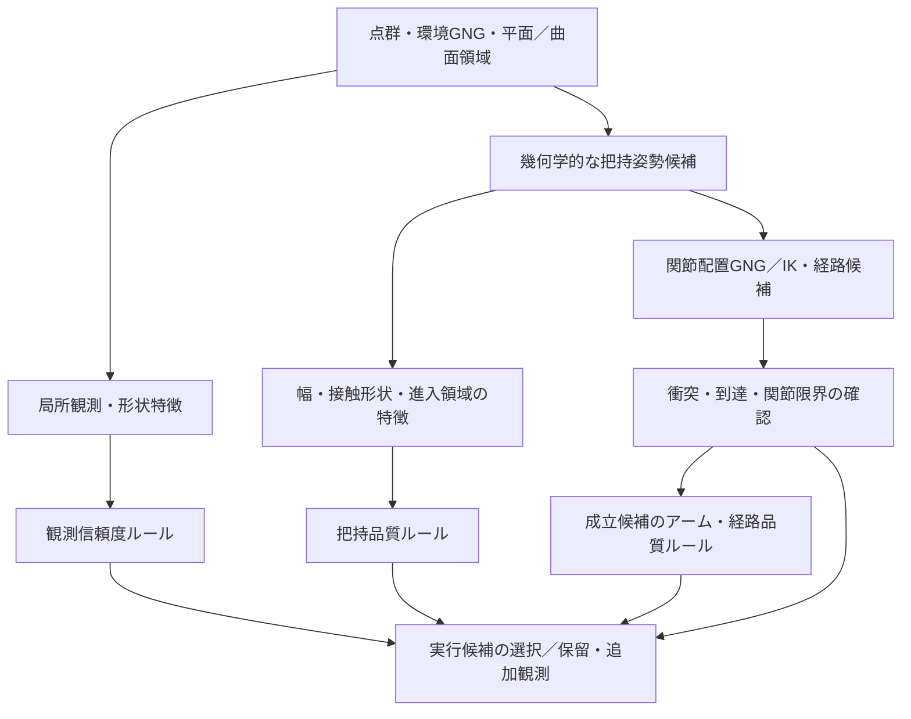

# ROS把持ファジィ評価：入力情報・制約・集合の設計案

確認日: 2026-09-14。確認時HEAD: `dac0356f`。

目的は、今後ROS側へ導入するIF–THENルールの入力仕様の整理。実装済みのルールや確定仕様の説明ではなく、相談・設計用の案。
現行実装の詳細は[把持推定の現状](../FUZZY_GRASP_CURRENT_OVERVIEW.md)を参照。
本書の取得状況はソース上の確認結果であり、実行中のトピック受信・設定有効化の確認ではない。
曲面推定関連は作業ツリー上の変更も含むため、今後の変更に応じた再確認が必要。

## 1. 評価の構成

| 評価 | 問い | 評価単位 |
| --- | --- | --- |
| 観測・形状の信頼度 | 把持に必要な形状をどこまで信用できるか | 物体・領域の情報を候補接触部位と進入領域へ集約 |
| 把持品質 | この手先位置・姿勢でつかみやすいか | 把持候補ごと |
| アーム・経路品質 | その把持を無理なく実現できるか | 把持候補に対応する関節配置・経路ごと |
| ハード制約・未確認判定 | 実行可能か、追加確認が必要か | 上記候補の組合せごと |

同じ物体でも把持部位によって観測状態・つかみやすさが異なる。同じ手先姿勢でも複数のアーム姿勢が対応し得るため、物体ごとの単一スコアへの集約は避ける案。
形状信頼度、把持品質、実現品質を別々に保持し、最終選択時に組合せ。
いずれの所属度・品質点も、そのまま把持成功確率を意味するものではない。

図は今後の構成案。現行ROS候補選択にこのルールベースが接続済みという意味ではない。

## 2. 取得状況の凡例

- **A：出力あり** — 現行コードに出力経路あり。ルール入力への接続、有効値・単位の確認は別途必要。
- **B：加工・連携が必要** — 元情報・内部状態あり。候補単位の集計、対応付け、追加計算または出力の整備が必要。
- **C：追加実装が必要** — 確認した経路では目的の指標が未算出。フィールドのみ存在してNaNのものも含む。

各行の言語ラベルは案。メンバシップ関数の数値境界は未決定。

## 3. 観測・形状の信頼度への入力

| 入力 | 単位・定義案 | 状況・取得元 | 言語ラベル案 | 注意点 |
| --- | --- | --- | --- | --- |
| 局所GNG支持数 | 候補領域内のノード数［個］ | A：候補summaryの`node_count` | 少・中・多 | ノード配置設定や対象寸法に依存。点群密度・確率との同一視は不可 |
| 元点群支持数・支持密度 | 接触候補部位に対応する点数［個］、必要なら観測表面積当たりの点数 | B：GNGノードの`inpcl_ids`、条件付きの`winner_point_count` | 弱・中・強 | 同一フレームの対応確認と重複点除去が必要。累積統計と当該フレーム点数の混在回避 |
| 面・曲面の当てはめ残差 | 接触領域を説明するモデルからの位置残差RMS［m］ | B：曲面パッチの`plane_rms`、`position_rms`等あり。候補部位への対応付けが必要 | 小・中・大 | 平面残差が大きくても曲面として妥当な場合あり。採用モデルの残差で評価 |
| 局所曲面推定品質 | 位置支持・条件・残差に基づく既存品質指標［無次元］ | B：パッチの`confidence`あり。候補への集約が必要 | 低・中・高 | 既存コメント上も確率ではない。残差・支持数との重複加点に注意 |
| 検出の時間的安定性 | 観測された更新数／有効な観測機会数、連続欠落回数 | B：`CandidateTrack`に検出・欠落状態あり。窓内履歴・出力の整備が必要 | 不安定・中・安定 | 同じ入力の再処理を独立観測として数えない。ID変更への対処も必要 |
| 形状・位置の時間変動 | 寸法変動、移動補償後の位置・法線変動［m、deg］ | B：候補の姿勢・寸法と追跡情報から履歴統計の追加が必要 | 小・中・大 | 実物体の運動とノイズの区別。EMA後の安定だけを証拠にしない |
| 遮蔽・視野端の局所証拠 | 候補周辺の境界証拠の割合［0〜1］ | B：`boundary_evidence`等の出力処理あり。設定・候補への集計が必要 | 少・中・多 | 遮蔽／自由空間／視野端は独立ビット。証拠なしは「不明」であって安全ではない |
| 接触部・進入領域の未観測率 | 評価対象領域のうち観測根拠がない割合［0〜1］ | C：深度視線・自由空間観測などから領域単位の算出が必要 | 小・中・大 | 境界証拠だけで体積全体の未観測率を代用しない |

物体全体の未観測率だけで判定せず、指が触れる面と指・アームが通過する領域の観測状態を優先する案。

## 4. 把持品質への入力

| 入力 | 単位・定義案 | 状況・取得元 | 言語ラベル案 | 注意点 |
| --- | --- | --- | --- | --- |
| 候補領域の寸法 | `extent_x/y`、`target_extent_x/y`［m］ | A：候補summaryに出力 | 小・適切・大 | 投影外形の寸法。実際の指の閉じ方向に対する必要幅とは区別 |
| 投影外形の面積比 | `extent_x × extent_y / (grasp_size_x × grasp_size_y)`［無次元］ | A：`footprint_fill_ratio`、`shape_score` | 小・中・大 | **観測の充足率・形状信頼度・接触面積ではない**。大きいほど良いとは限らない |
| 開口余裕 | ハンド最大開口−閉じ方向の必要幅−必要クリアランス［m］ | B：外形とハンド仕様から算出の整備が必要 | 小・適切・十分 | 現在の`grasp_size_x/y`を物理的最大開口と無条件に同一視しない |
| 周辺面からの突出 | `minimum_neighbor_plane_distance`［m］ | A：有効時に候補summaryへ出力、無効時null | 小・中・大 | 指が入る隙間や障害物までの最短距離そのものではない |
| 候補高さ | `surface_height`［m］ | A：候補summaryに出力 | 低・適切・高 | 基準座標系を固定。単に高い候補を高品質としない |
| 接触可能な奥行き・面積 | 指形状に沿った有効接触長［m］・面積［m²］ | C：候補にハンド形状を配置して推定する処理が必要 | 不足・適切・十分 | 外接箱の奥行きだけでは接触を保証しない |
| 対向接触面の適合 | 閉じ方向と両側接触法線の適合度［0〜1またはdeg］ | B：GNG・曲面の位置／法線を元に接触対の抽出と計算が必要 | 低・中・高 | 対向法線のみで摩擦・力閉包の成立を保証しない |
| 持ち手形状の適合 | 指の挿入空間、局所くびれ等から得る適合度 | C：形状に基づく特徴量の定義・算出が必要 | 低・中・高 | 候補種別の固定値を「認識の確信度」にしない |
| 重心に対する把持位置 | 重心からの距離［m］、必要なら重力モーメント［N·m］ | C：質量・重心・重力方向等の情報が必要 | 小・適切・大 | 部分点群の中心を実重心と見なさない。未取得時は無効扱い |
| 摩擦・変形しやすさ | 材質、摩擦係数、剛性など | C：物体モデル、触覚、把持後観測等が必要 | 滑りやすい／滑りにくい等 | 点群形状だけから確定しない。初期導入の必須入力にはしない案 |

## 5. アーム・経路品質への入力

| 入力 | 単位・定義案 | 状況・取得元 | 言語ラベル案 | 注意点 |
| --- | --- | --- | --- | --- |
| TCP目標位置誤差 | 所望の把持位置と実現TCP位置の距離［m］ | B：候補姿勢とGNGノード姿勢から算出可能 | 小・中・大 | 到達ボクセル内であっても誤差の評価が必要 |
| TCP目標姿勢誤差 | 所望姿勢と実現姿勢の回転差［deg］ | B：両姿勢から評価値の整備が必要 | 小・中・大 | 現行のZ軸方向差だけとは別。ハンドの対称性に応じた許容姿勢の定義が必要 |
| 位置・回転可操作性 | `position_manipulability`、`rotation_manipulability` | A：候補評価メッセージに出力 | 低・中・高 | スケール・単位はヤコビアン定義とロボットに依存。別ロボットで共通境界を流用しない |
| 特異姿勢への近さ | 条件数［無次元］、必要なら最小特異値 | A：詳細候補評価に`manipulability_condition_number`等あり | 近い・中・遠い | 汎用`evaluation_metrics`の固定項目とは別。配信経路の接続が必要 |
| 関節限界余裕 | `joint_limit_margin_min/mean`［定義未確定］ | C：現行NaN。暫定値の代入停止 | 小・中・大 | 測定対象・尺度・用途の確定後に個別実装 |
| 現在姿勢からの移動量 | 各関節の変化量を可動範囲等で尺度合わせした量 | B：関節状態と候補関節配置から算出可能 | 小・中・大 | 回転関節と直動関節の単位混在に注意 |
| 自己・環境衝突余裕 | ロボット形状と他形状との最短距離［m］ | C：`self_collision_margin`、`environment_collision_margin`は現行NaN | 小・適切・十分 | 無衝突という判定と、距離余裕の測定は別 |
| 経路上の可操作性 | `path_position_manipulability`、`path_rotation_manipulability`の配列 | A：配列出力あり。B：最小値等への集約 | 低・中・高 | 平均だけでは経路途中の特異姿勢を隠す。最小値や下位分位を検討 |
| 経路移動コスト | `estimated_energy`［定義未確定］ | C：現行NaN。暫定式なし | 小・中・大 | 実消費エネルギーと幾何学的な移動コストを混同しない定義が必要 |
| 推定所要時間 | `estimated_duration`［s］ | C：現行NaN。暫定式なし | 短・中・長 | 時間推定モデルと妥当性確認方法の確定後に個別実装 |

既存の`gripper_width`、`grasp_region_score`も現在の評価生成処理ではNaN。フィールドの存在だけを理由に取得済みとしない。

## 6. ファジィ入力と分離する制約・有効性

| 判定 | 使用情報 | 扱いの案 |
| --- | --- | --- |
| 座標・時刻の整合 | frame、stamp、TF、入力世代 | 不整合なら評価保留。値を0に置換しない |
| TCP位置の到達領域 | `GraspCandidate.state` | INSIDEは後段評価へ、UNKNOWNは保留等。OUTSIDEは現行到達マップ外という情報であり、数学的な到達不能の証明ではない |
| 姿勢を含む実現可能性 | 関節配置／IK、目標位置・姿勢誤差 | 必要精度を満たさなければ除外または再探索 |
| ハンドの開口限界 | 必要幅、物理的開口範囲 | 範囲外は除外。成立範囲内の余裕をファジィ評価 |
| 関節限界 | 関節位置と各限界 | 範囲外は除外。範囲内の余裕をファジィ評価 |
| 衝突 | 自己・環境衝突、進入経路・経路補間の確認 | 禁止衝突は除外。許容する対象との意図的接触は別定義 |
| 経路成立 | `feasible`、探索結果 | 現在の候補経路が不成立なら除外・再探索。すべての経路の不存在とは区別 |
| 必須領域の未観測 | 指の挿入・進入領域の観測有効性 | 安全確認ができない場合は保留・追加観測の候補 |

禁止衝突や関節限界違反を、把持品質の高さで相殺しない方針。
制約判定の機能が無効、値が未計算、サンプルが古い場合に「成立」と扱わない仕組みが必要。

## 7. ファジィ集合の表現案

### 7.1 入力の単位と所属度の区別

入力はm、deg、s、個数などの物理単位を保持可能。0〜1となるのは各言語ラベルへの所属度。
すべての入力を同じLow/Medium/Highの境界に押し込む必要はない。
正規化する場合は、候補集合ごとのmin-maxより、ハンド仕様・センサー精度・ロボット基準などの固定尺度を優先する案。

| 特徴量の性質 | 関数形の案 | 例 |
| --- | --- | --- |
| 小さいほど望ましい | 左肩型＋中間三角形＋右肩型 | 位置誤差、形状残差、時間 |
| 大きいほど望ましい範囲 | 左肩型＋中間三角形＋右肩型 | 観測支持、関節余裕 |
| 中間が適切 | 中央の三角形または台形と、両側の不足／過大集合 | 把持幅、用途に応じた接触位置 |
| カテゴリ・判定 | 真偽／列挙のまま、または独立した証拠集合 | 到達状態、遮蔽証拠 |
| 未取得・無効 | メンバシップ関数へ入力しない | NaN、未観測、候補ID未対応 |

肩型集合は境界で意図した所属度を保持する仕様とし、Low(最小値)=1、High(最大値)=1となる場合をテスト対象とする案。
既存HTMLの端点処理をそのまま移植しない。

### 7.2 数値境界を決める手順

1. 評価対象部位・単位・測定方法の確定。
2. センサー誤差、ハンド寸法、関節限界などから成立限界の決定。
3. 正常・境界・不成立・未観測の例から「小／適切／大」の境界案を設定。
4. 境界付近で集合を重ね、0・1・境界値・未取得値の動作確認。
5. 記録データで候補順位・発火ルールを比較し、境界を調整。

現段階では数値境界を未確定とし、ハンド仕様やセンサー条件がないまま任意の値を確定しない。

## 8. 代表ルール案

以下は未実装の設計例。全入力が取得済みという意味ではない。

| 評価 | IF | THEN |
| --- | --- | --- |
| 観測信頼度 | 元点群支持が強い AND 時間的に安定 AND 採用形状モデルの残差が小さい | 信頼度が高い |
| 観測信頼度 | 検出が不安定 OR 形状モデルの残差が大きい | 信頼度が低い |
| 把持品質 | 開口余裕が適切 AND 対向接触面の適合が高い AND 接触奥行きが十分 | 品質が高い |
| 把持品質 | 接触奥行きが不足 OR 対向接触面の適合が低い | 品質が低い |
| アーム品質 | 位置・回転可操作性が高い AND 関節限界余裕が大きい | 品質が高い |
| 経路品質 | 経路上の最小可操作性が低い | 品質が低い |
| 経路品質 | 障害物余裕が十分 AND 推定時間が短い | 品質が高い |
| 最終判断 | 把持品質が高い AND 観測信頼度が低い | 追加観測の優先度が高い |

少数ルールから始め、同じ根拠の重複加点を避ける案。例：ノード支持数・元点群支持数・曲面confidenceを独立した三つの確証として過大評価しない。
AND=min、OR=max、出力代表値の加重平均などは初期方式の候補であり、まだ確定ではない。
品質評価と「実行／保留」の行動選択は別層にし、全ルール非発火を自動高評価としない。

## 9. 初期導入で優先する入力

最初から全項目を必須にせず、次の構成から始める案。

1. 観測側：元点群支持数、候補検出の安定性、局所形状モデルの残差。
2. 把持側：必要幅・開口余裕。接触面の評価が未実装の段階では「幾何学的適合」として扱い、完全な把持品質と呼ばない。
3. アーム側：TCP目標誤差、位置・回転可操作性、定義を確認した関節限界余裕。
4. 経路側：経路成立、経路上の最小可操作性、推定時間。
5. 拡張：対向接触面、接触奥行き、障害物距離、未観測率、必要に応じた物性。

## 10. 入力と一緒に保持する情報

- 物体／領域ID、把持候補ID、計画GNGの目標ノードID、経路IDと、その対応関係。
- 観測時刻、座標系、元データの世代、評価対象部位。
- 入力値、単位、有効性、未取得・期限切れ等の理由。
- 使用したメンバシップ関数とルールの版、発火度、制約違反、非発火・保留理由。

現在の汎用評価メッセージは計画GNGの`goal_node_id`をscopeに使用。環境領域ID・把持候補IDとの安定した対応付けが必要。
経路不成立候補は汎用評価への変換時に除外されるため、不成立理由までルール／判断層へ渡す場合は配信設計の見直しが必要。

## 11. 実装参照

- [候補形状・寸法・面積比](../../../grasping_system/include/candidate/top_grasp_surface_estimator.hpp)
- [候補追跡とsummary出力](../../../grasping_system/src/top_grasp_surface_estimator_node.cpp)
- [GNG側ノードメッセージ](../../../ais_gng_cpu/src/ais_gng_msgs/msg/TopologicalNode.msg)
- [元点群対応・境界証拠の出力処理](../../../ais_gng_cpu/src/ais_gng/src/ais_gng_component.cpp)
- [曲面モデルとパッチ品質の定義](../../../ais_gng_cpu/src/ais_gng/include/ais_gng/topological_plane/surface_model.hpp)
- [曲面パッチ情報のJSON化](../../../ais_gng_cpu/src/ais_gng/src/topological_plane/surface_model_visualization.cpp)
- [把持候補の到達状態](../../../MSG/gng_control_msgs/msg/GraspCandidate.msg)
- [アーム・経路指標の生成](../../src/core/planning/topological_map_avoidance_helpers.hpp)
- [汎用評価メッセージへの変換](../../src/core/common/evaluation_metric_serialization.hpp)
- [既存の将来ルール候補集](../../../FUZZY_GRASP_RULE_CATALOG.md)
