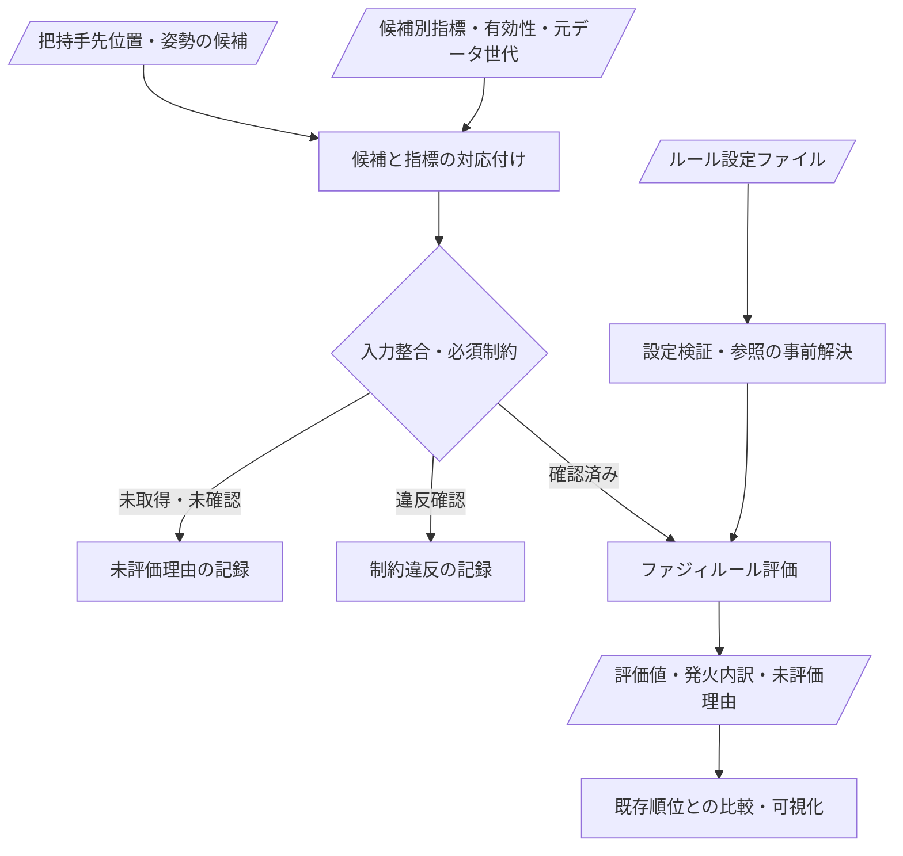

# ROS把持ファジィルールエンジンの実装雛形設計

作成日: 2026-09-14

**状態: 未実装の設計案。新しいROSノード・トピック・設定ファイルはまだ追加していない。**
対象は把持候補の評価であり、候補生成や実機動作の実行ではない。
指標の意味・単位・候補は [入力情報の設計案](fuzzy_grasp_input_design.md) を正本とし、本書では実装の分担と入出力契約を扱う。

## 1. 現在あるコード

| 場所 | 実装済みの内容 | ROS把持評価への接続 |
| --- | --- | --- |
| [HTML](../../../ToPo-FUZZY_Manipulation_v1.html) の `defaultFuzzyModel` | 入力集合・出力代表値・ルールの既定モデル | HTML内のみ |
| 同HTMLの `mfEval`、`tnorm`、`snorm`、`evaluateFuzzyRules` | 所属度、AND/OR、ルール発火、出力集約 | HTML内のみ |
| 同HTMLの `bindFuzzyEditor`、`renderFuzzyDebug` | JSON編集・保存と発火状況の表示 | ROSへルールを適用する機能とは別 |
| [評価メッセージ変換](../../src/core/common/evaluation_metric_serialization.hpp) | 指標定義・値・有効フラグの配信 | ルール評価自体はなし |
| [上方把持推定器](../../../grasping_system/src/top_grasp_surface_estimator_node.cpp) | 幾何候補、形状スコア、到達状態の配信 | 汎用IF-THENルールは未接続 |
| [経路候補選択](../../src/nodes/planning/topological_map_avoidance_node.cpp) | 既存の固定的な候補スコアリング | 汎用IF-THENルールは未接続 |
| [FuzzyClassifier](../../../FuzzyClassifier/src/cluster_relabel_node.cpp) | 台形所属度などによるクラスタ再分類 | 把持候補評価とは別用途。`COLCON_IGNORE`あり |

HTMLのルールをROSへそのまま読み込めるという意味ではない。既存の指標変換・ID対応・欠損処理の違いを吸収する必要あり。

## 2. 構成案



初期段階では比較・可視化まで。既存候補の削除、順位変更、実機指令への接続は別途判断。
Effectivity Mapから得られる状態・指標はadapterへの入力であり、ルールエンジン内でGNG・VLUT・軌道を再計算しない。
観測信頼度・把持品質・アーム品質・経路品質は別の評価出力。経路未生成時に把持側の評価まで失敗させない。

## 3. 責務と配置案

次のパスは今後の配置案であり、現時点でファイルを作成する指示ではない。

| 配置案 | 責務 |
| --- | --- |
| `grasping_system/include/evaluation/fuzzy_rule_types.hpp` | 指標、条件木、設定、評価結果のROS非依存型 |
| `grasping_system/include/evaluation/fuzzy_rule_engine.hpp` | 検証済み設定と指標値からの純粋な評価処理 |
| `grasping_system/src/evaluation/fuzzy_rule_config.cpp` | JSON読込、型・参照・境界の検証、設定の一括切替 |
| `grasping_system/src/evaluation/fuzzy_candidate_adapter.cpp` | ROSメッセージと評価入力の変換、世代・ID・単位の照合 |
| `grasping_system/test/test_fuzzy_rule_engine.cpp` | ROSを起動しない決定的な単体テスト |

別パッケージや独立ノードを最初から必須にしない。既存候補生成器・評価経路から共有ライブラリとして利用する案。
指標の計算処理、設定GUI、ロボット制御をエンジンへ取り込まない。

## 4. 入力・出力契約案

### 候補と指標の対応

- 候補キーは配信元の識別子・起動世代・`update_id`・候補`id`の組。`id`だけで異なる更新を結合しない。
- 候補は`header.frame_id`、観測時刻、`tcp_frame`を保持。再起動時の更新番号再利用を区別する起動世代の伝達方法は未確定。
- 指標は`metric_id`、値、単位、`is_valid`、無効理由、測定時刻、元データの世代を保持。
- 現行`EvaluationMetrics.sample_scope_ids`は計画GNGの`goal_node_id`。把持候補`id`と同じ数でも対応済みとは扱わない。
- 把持候補と計画ノード・経路は多対多。対応表がないアーム・経路指標は未評価とし、直近の別候補の値で代用しない。
- 配列指標を無条件に平均しない。集約方法と単位が決まった指標だけスカラー評価へ渡す。

### 評価結果

| 項目 | 内容 |
| --- | --- |
| 候補キー・観測時刻 | 評価対象の特定 |
| 設定ID・改訂番号 | 再現に必要なルール設定の特定 |
| 評価出力ごとの状態 | `evaluated`、`not_evaluated`、`blocked` |
| 評価値 | 有効な出力だけに設定。未評価は内部でoptional、JSONではnull、既存ROS形式へ変換する場合は無効フラグを併用 |
| ルール別内訳 | 条件所属度、発火度、出力先、未評価理由 |
| 制約違反・欠損指標 | 品質スコアとは別の診断情報 |

`GraspCandidate.state`は既存の位置到達状態、`shape_score`は配信元固有の形状スコアとして維持。ファジィ評価値で上書きしない。
初期の結果保存先は診断用JSONを候補とする。恒常的なROS出力形式・トピック名は、ID対応と既存GUI経路を確認してから確定。候補矢印やreachabilityトピックの重複追加はしない。

## 5. ルール設定の雛形案

数値境界や評価式を勝手に埋めず、初期状態を無効な空モデルとする案。以下は設計例であり、現在のHTMLへそのままimportする形式ではない。

```json
{
  "schema_version": 1,
  "model_id": "grasp_candidate_rules",
  "revision": 1,
  "enable_evaluation": false,
  "methods": {
    "and": "min",
    "or": "max",
    "aggregation": "max",
    "defuzz": "weighted_average"
  },
  "missing_input_policy": "skip_rule",
  "no_activation_policy": "not_evaluated",
  "features": {},
  "outputs": {},
  "rules": []
}
```

初期演算方式は比較実装の提案であり、確定済みの現行ROS仕様ではない。
採用する場合は、AND=min、OR=max、NOT=1から所属度を引いた値、ルール発火度と重みの積、同一出力へのmax集約、出力代表値の発火度加重平均、と演算の意味を明示する。連続出力集合の重心計算とは区別する。

- `features`: `metric_id`、単位、言語ラベルと所属関数。最初は台形・三角形に絞る案。区間端点の所属度を明示。
- `outputs`: 評価軸ごとの出力ラベルと代表値。成功確率と同一視しない。
- `rules`: 一意な`id`、`enable_rule`、重み、条件木、出力軸・ラベル。条件木は`all`／`any`／`not`と、`metric_id`・`label`の葉で表現。AND/OR混在時の優先順位を曖昧にしない。
- 欠損入力があれば、その入力を参照するルール全体を未評価とする。条件を削って残りだけで発火させない。独立した有効ルールの評価は許容し、欠損を内訳に残す。
- 明示的に無効化した入力を有効ルールが参照する場合は設定不整合。GUIが勝手に条件を消す仕様にしない。
- 全ルール無効・全ルール未評価・発火なしは`not_evaluated`。固定加点や旧スコアへの暗黙のfallbackはなし。

## 6. 検証・効率・安全側の扱い

- 設定読込時にID重複、未知指標・ラベル、単位不一致、非有限値、不正な区間順序、空の条件木、不正な重みを検出。有効化には使用指標・出力代表値の定義確定が必要。
- 入力値そのもののNaNや期限切れは所属度0に置換しない。必須制約の未確認は保留、違反確認は`blocked`。高いファジィ評価値で制約違反を覆さない。
- [暫定式の不採用方針](../reject.md)に従い、未計算の関節余裕・エネルギー・時間などへ仮の式を追加しない。
- 候補集合ごとのmin-max正規化を既定にしない。同じ物理入力の評価が、別候補の追加だけで変わらない設計。
- 設定の文字列参照を読込時に解決し、1候補内で同じ所属度を再利用。点群・グラフの探索はエンジン外。
- 設定切替は候補集合単位で一括適用。読込失敗時に半端な新設定へ移行しない。旧設定を維持する場合は使用中の版と失敗を明示。
- HTMLの概念・編集UIは参考にできるが、端点処理・欠損値の0置換・全ルール非発火時の加点・候補IDの混同は引き継がない。

## 7. 実装時の確認項目

1. JSONの正常・不正ケースと設定の一括切替。
2. 台形の肩・三角形の頂点・重み0・重み1・AND/OR/NOTの組合せ。
3. NaN・無効フラグ・欠損・期限切れ・空モデル・全ルール非発火時の未評価。
4. 別候補・別更新・再起動前後のID混同防止。候補と計画ノードの対応がない場合の未評価。
5. 制約違反を高スコアで覆さないこと、経路指標未取得でも独立した把持評価が可能なこと。
6. 入力固定時の再現性、候補追加による他候補の評価不変性、候補数・ルール数別の処理時間。
7. 保存済み入力で既存順位と並列比較。候補選択への接続・実機動作はこの確認とは分離。

設計書作成は完了、実装・数値校正・実動作検証は未実施。上記は確認項目であり、作業順・実装開始の確定を意味しない。
