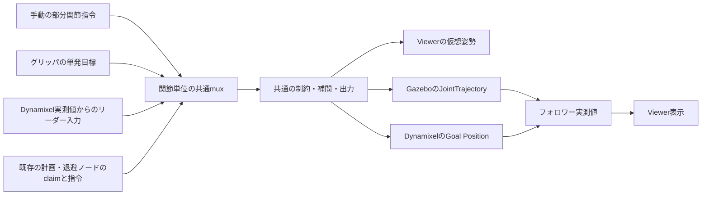

# 共通の関節指令経路

## 構成

関節名と角度を指定する入口を共通化し、仲裁後の出力先だけを切り替える。



`joint_control.launch.py` がmuxと出力ノードを一組だけ起動する。
出力先は `backend:=viewer / gazebo / dynamixel`。既定はviewer。
同じロボット名前空間で複数の出力先を同時起動しない。
`gng_viewer_bridge.launch.py`もこの共通launchを使用する。
既存の`virtual_joint_state_driver`・`target_joint_state_executor`・UDP送信ノードは旧経路であり、共通経路と併用しない。

## 指令の統合

トピックはロボット名前空間配下。入力型は`sensor_msgs/msg/JointState`、角度はrad。

| 入力 | 優先度 | 保持・失効 | 対象 |
| --- | ---: | --- | --- |
| `joint_commands` | 50 | 単発目標を解除まで保持 | 指定した関節のみ |
| `gripper_commands` | 200 | 単発目標を解除まで保持 | URDFの独立グリッパ関節のみ |
| `leader_joint_states` | 100 | 最終受信から0.5秒で関節ごとに失効 | 指定した関節のみ |
| 既存の`control_claims`登録元 | claim指定値 | 既定1.0秒、`command_timeout_sec`で変更 | claimの範囲内 |

- 同じ指令元の部分更新は、指定しなかった関節の目標を上書きしない。
- 腕のリーダー追従とグリッパの単発目標を合成可能。
- 競合判定は関節単位。既存契約どおりexclusive優先、その次にpriorityの大きい指令。
- 同順位・同モードの場合は入力トピック名の辞書順。受信タイミングによる揺れを回避。
- 親とmimicは同じ関節として仲裁。高優先度の親目標と低優先度のmimic目標の競合を解消。
- 未知関節・名前重複・配列長不一致・NaN/Inf・claim範囲外・矛盾するmimic目標はメッセージ全体を拒否。
- 無効入力や未指定関節からゼロ目標を生成しない。
- `target_joint_states`は保持した目標の確認用、`active_joint_commands`は現在有効な目標。どちらもmuxの出力専用。
- 新しい出力ノードは`active_joint_commands`を購読。失効したリーダー目標へ進み続けず、下位の有効指令または保持へ移行。
- 実機・Gazeboで有効指令がなくなった関節は実測姿勢を保持。Viewerは直前の表示姿勢を保持。
- 手動目標解除は`joint_control/release_manual`、グリッパ目標解除は`joint_control/release_gripper`。型は`std_srvs/srv/Trigger`。
- 解除後も次の単発指令を受付。独自のclaim登録元は`enabled=false`で解除し、再開時に再登録。

## 起動

以下はDocker `gng_cpu_container` 内でROS環境をsourceした後の例。
Dynamixelを使う場合、USB接続・トルク・制御モードを設定した`dynamixel_handler`を別途起動し、`/dynamixel/state/present`を配信する。
共通launchからドライバのトルク・制御モードは変更しない。

Viewerを実機の手動操作へ追従させる場合：

```bash
ros2 launch gng_vlut_system gng_viewer_bridge.launch.py enable_dynamixel_input:=true
```

Gazeboをフォロワーにする場合。同じデモの従来起動を終了してから切り替える。

```bash
ros2 launch gng_vlut_system dual_arm_gng_lidar_demo.launch.py \
  enable_external_control:=true enable_dynamixel_leader:=true
```

このモードでは自動回避デモの指令ノードを起動せず、共通経路がコントローラへの指令を担当する。
LiDAR・GNG/VLUTの観測処理は維持。外部指令に自動回避を掛ける機能ではない。
ロボット名前空間は通常`sim_topo_dual_arm_max`。
Dynamixelを接続せずROS指令だけで操作する場合は`enable_dynamixel_leader:=false`。

Dynamixel実機をフォロワーにしてViewerへ実測姿勢を表示する場合：

```bash
ros2 launch gng_vlut_system gng_viewer_bridge.launch.py joint_control_backend:=dynamixel
```

この場合、内蔵する`dynamixel_joint_state_bridge`は実機状態の読取り専用で、実測値を操作指令へ再投入しない。
同じ名前空間に従来のDynamixel bridgeを重複起動しない。
別のリーダーを使う場合、その実測値を当該フォロワーの`leader_joint_states`へ渡す。
既存の外部状態変換を使う場合は`enable_dynamixel_input:=false`で内蔵入力を停止可能。

Harmonicの実測を直接表示する場合は[標準トピック接続](dual_arm_simulation.md#標準ros-2トピックとviewerの接続)を参照。`state_topic`に実測入力、`enable_robot_state_publisher:=false`により外部TFを指定可能。

既存の制御経路が別launchで稼働しているときにViewerだけ追加する場合は、`joint_control_backend:=external`で二重起動を回避する。
`params_file`・`urdf_path`・ロボット名・入力名前空間は対象機種に一致させる。

## グリッパだけの指令

Gazeboの左グリッパを0.2 radへ動かす例。腕や右グリッパの角度は送らない。

```bash
ros2 topic pub --once /sim_topo_dual_arm_max/gripper_commands sensor_msgs/msg/JointState \
  '{name: [L_gripper_joint], position: [0.2]}'
```

リーダー側へグリッパの制御を戻す例：

```bash
ros2 service call /sim_topo_dual_arm_max/joint_control/release_gripper std_srvs/srv/Trigger '{}'
```

同様に`joint_commands`で腕の一部だけを指定できる。リーダーと同じ関節が競合した場合は上表の優先度を適用する。

## 出力・校正・実測

- 共通モデル：URDFの可動範囲・速度・mimicを正本として使用。未指定関節は保持。
- Viewerのみ`enable_direct_tracking:=true`で直接表示可能。物理出力ではURDFと`max_joint_velocity`の速度制限を適用。
- Gazebo：独立した全コントローラ関節の実測値が揃ってから`dual_arm_controller/joint_trajectory`へ送信。未指令関節は実測姿勢で初期化。
- Dynamixel：目標を受けたモータIDだけへ`/dynamixel/command/goal`を送信。型は`DynamixelGoal`。mimicと親が同じIDでも一度だけ送信。
- 対応表は既存の`dynamixel_joint_state_bridge.yaml`を共用。`mapping_file`、Viewer起動では`dynamixel_mapping_file`で差替え可能。
- 逆変換は`position_deg = degrees(joint_angle_rad) / joint_scale - joint_offset_deg`。読み取り側と同じ校正の逆変換。
- 独立関節へのID重複、矛盾した親・mimicの校正、ID未割当関節への実機指令は拒否。
- 現在の対応表にはwaist_jointのIDなし。実機で腰を操作する場合は校正済み対応を追加する。
- グリッパの倍率を含む校正とモータの許容角・制御モードは機種ごとの確認が必要。実機送信は今回未実行。
- フォロワーの状態は`joint_states`から取得し、`viewer_joint_states`へ表示。物理出力でこの2トピックを同一にする設定は拒否。
- 実測失効時は送信を停止。これはトルクOFFではなく、モータへ既に渡した目標の取り消しも行わない。
- mux停止時も`max_command_age_sec`（既定0.5秒）で古い目標を失効。実測期限は`max_state_age_sec`（既定1秒）。
- 状態確認は`joint_control/status`。物理シミュレーションの安定性や従来のODE警告修正は別の課題。

## 任意の運動状態観測

位置・速度・加速度・ジャークの共通管理は
[joint_motion_state.py](../scripts/joint_motion_state.py)。関節ごとの時刻付き状態と短い履歴を保持。
`joint_motion_state`は不変の値オブジェクト、`joint_motion_tracker.update`は名前をキーとする更新結果を返却。
入力は時刻、関節名、位置・速度・加速度・ジャークの各配列。各配列は空または関節名と同じ長さ。
指定しなかった関節の状態を結果へ混在させず、順序の変更・左右別の部分更新に対応。

ROS接続は[joint_motion_observer.py](../scripts/joint_motion_observer.py)。
`sensor_msgs/msg/JointState`を購読し、`control_msgs/msg/DynamicJointState`を`joint_motion_states`へ配信。
[標準メッセージ定義](https://github.com/ros-controls/control_msgs/blob/jazzy/control_msgs/msg/DynamicJointState.msg)の
関節名・インターフェース名と値の組を使用。独自メッセージの追加なし。
Gazebo Harmonic・Isaac Sim・実機の区別なし。入力は対象ロボットの実測トピックを指定。
位置の単位は回転関節rad・直動関節m、微分値は対応する単位/s、/s²、/s³。
手先の並進・回転の微分、effort、目標軌道の状態は対象外。

| インターフェース | 内容 |
| --- | --- |
| `position` | 入力の位置。連続回転関節も入力表現を保持 |
| `velocity` | 入力速度を優先。未取得時のみ位置から推定 |
| `acceleration` | 速度または位置からの推定 |
| `jerk` | 速度または位置からの推定 |
| `is_velocity_estimated` / `is_acceleration_estimated` / `is_jerk_estimated` | 推定値は1、その他は0。欠損判定は値の有限性 |

未取得・履歴不足・未計算はPythonで`None`、ROS出力で`NaN`。静止のゼロと区別。
Pythonの共通部品に速度・加速度・ジャークを直接渡す場合は、その入力値を優先。
推定元は取得済みの最も高い次数。推定値をさらに差分する連鎖なし。
後退補間は最大4点のNumPy多項式補間を現在の入力時刻で微分。不等間隔サンプルに対応。
観測ノイズを除くフィルタ、加速度・ジャーク制限、制御へのフィードバックは未実装。
特に高階微分は入力ノイズを増幅するため、制御用途への採用時は別途評価が必要。

| 設定 | 既定値 | 用途 |
| --- | --- | --- |
| `enable_joint_motion_state` | `false` | 専用launchの起動切替。無効時はノード・購読・計算・配信なし |
| `namespace` | 空 | 専用launchのロボット名前空間 |
| `state_topic` | `joint_states` | `JointState`入力 |
| `motion_state_topic` | `joint_motion_states` | `DynamicJointState`出力 |
| `max_derivative_order` | `3` | 追加推定の次数。0: 計算なし、1: 速度まで、2: 加速度まで、3: ジャークまで |
| `min_sample_period_sec` | `0.0001` | 微分用サンプルの時刻間隔、s |
| `max_sample_gap_sec` | `0.5` | 関節ごとの連続観測期間の判定、s |
| `use_sim_time` | `false` | ROS時刻の選択。微分時刻は常に入力の`header.stamp` |
| `continuous_joint_names` | 空 | ノードの連続回転関節指定。指定関節の微分履歴だけをアンラップ |

重複時刻・短すぎる間隔は関節ごとに入力を無視。時刻の巻き戻り・長い観測欠落は関節ごとに履歴を初期化。
非有限値は該当関節・項目の履歴を破棄。名前重複・配列長不一致はメッセージ全体を拒否。
同一時刻しか出ない送信元には時刻修正が必要。受信壁時計への自動切替なし。
`frame_id`変更は全履歴の初期化。配信停止時の再配信タイマーなし。
利用側は出力の時刻と関節名で鮮度・有効性を確認し、過去の値を最新として保持しないこと。
連続回転の推定は隣接観測間の回転量がπ未満という前提。
ノードの計算設定は起動時に固定。変更時はこの観測ノードだけを再起動。

Harmonic / Isaac Simの実測値を観測する例：

```bash
ros2 launch gng_vlut_system joint_motion_state.launch.py \
  enable_joint_motion_state:=true namespace:=sim_topo_dual_arm_max use_sim_time:=true
```

観測部品の実行依存は`rclpy`・`sensor_msgs`・`control_msgs`・`rcl_interfaces`・NumPy。
パッケージ全体のCMakeには旧`gazebo_ros2_control`依存が残存。
この依存がない環境でも、観測部品はROS環境をsource後にソースから直接起動可能：

```bash
python3 gng_vlut_system/scripts/joint_motion_observer.py --ros-args \
  -r __ns:=/sim_topo_dual_arm_max -p use_sim_time:=true -p max_derivative_order:=3
```

連続回転関節を使う場合は直接起動時に`-p 'continuous_joint_names:=[joint_name]'`を追加。
既存の制御・シミュレーター・Viewerのlaunchからの自動起動なし。
`max_derivative_order=0`は観測ノード内の微分計算だけを停止し、入力済みの速度などは保持。
追加負荷をなくす場合は専用launchを無効にするか、観測ノード自体を起動しない構成。

## 検証

運動状態の数値検証は`test_motion_smoothing.py`、任意起動の検証は`test_dual_arm_launch.py`。
`test_motion_smoothing.py`内のROS通信試験は`ROS_DOMAIN_ID=89`の隔離環境だけで実行。
Humble・Jazzyで標準メッセージの通信を確認。物理シミュレーションや実機での微分推定精度は未評価。

純粋な仲裁・変換テストは`test_joint_command_mux`・`test_joint_command_model`。
ROS通信試験は`test/check_joint_control_ros.py`、実Gazebo試験は`test/check_joint_control_gazebo.py`。
試験専用ROS_DOMAIN_ID=88が必要。実機向け指令は専用トピックへ変更し、USBドライバを起動しない。
実施結果は[リリースノート](releases/2026-09-28_unified_joint_control.md)を参照。
