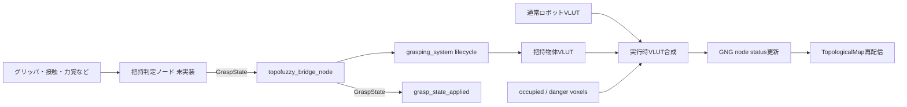

# 2026-08-07 - External grasp state runtime integration

## Summary

外部ROS 2 topicから把持・解放状態を受け取り、把持物体の占有形状を実行時の
エフェクティビティマップへ反映する経路を追加した。

`grasping_system`の責務は把持成否の判定ではなく、把持対象物の形状表現、
把持ライフサイクル、把持物体VLUTの生成と保持である。センサやグリッパ状態から
把持成否を決める把持判定ノードは未実装であり、現時点では外部ノードまたは
手動publishが`GraspState`を供給する。

## Changed

- `topofuzzy_bridge_node`が相対topic `grasp_state`を購読する。
- 把持開始時に全有効GNGノードについて物体占有ボクセルを計算し、把持物体VLUTを
  有効化する。
- 通常のロボットVLUTによる衝突・危険カウントへ、activeな把持物体VLUTのカウントを
  加算する。
- 把持・解放の受信時は、占有topicの次回更新を待たず、保持中の占有・危険ボクセルで
  直ちにエフェクティビティマップを再評価する。
- 解放時は把持物体VLUTの合成を外し、通常のロボット形状だけで再評価する。
- 同一の把持定義を再受信した場合はVLUTを再構築せず、冪等に適用確認だけ返す。

## Added

- `gng_control_msgs/msg/GraspState`
- 適用済み状態topic `grasp_state_applied`
- 直方体寸法から共通の`GraspVoxelModel`を生成する`makeBox()`
- 実GNG/VLUTを使う`gng_grasp_vlut_preview`の把持前・把持中・解放後検証

## Responsibility

| コンポーネント | 現在の責務 |
|---|---|
| 外部把持判定ノード | センサ、グリッパ開度、電流、力覚、接触情報などから把持成否を判定し、`GraspState`をpublishする。未実装 |
| `grasping_system` | 物体形状、手先との相対姿勢、把持状態、把持物体VLUTを管理する。把持成否そのものは判定しない |
| `topofuzzy_bridge_node` | `GraspState`を受信し、把持物体VLUTを通常VLUTへ実行時合成してGNGノード状態を再配信する |
| Viewer / Planner | 更新されたtopological mapのsafe、danger、collision状態を利用する |



## Behavior Impact

- 把持状態が未受信または解放中なら、従来どおり通常のロボットVLUTだけを使用する。
- `STATE_GRASPED`受信後は、物体形状と環境ボクセルの重なりでもGNGノードがcollision
  またはdangerになる。
- `STATE_RELEASED`受信後は、同じ環境ボクセルを保持したまま把持物体由来の状態を除去する。
- releaseの`object_id`がactive objectと異なる場合は誤解放を防ぐため無視する。
- releaseの`object_id`が空なら、現在activeな物体を解放する。

## Topics / Params / Messages

### `gng_control_msgs/msg/GraspState`

| フィールド | 内容 |
|---|---|
| `state` | `STATE_RELEASED=0`または`STATE_GRASPED=1` |
| `object_id` | 把持物体の識別子。把持時は必須 |
| `eef_link` | 把持した手先リンク。把持時は必須 |
| `shape_type` | 現在は`SHAPE_BOX=0`のみ |
| `object_pose_in_eef` | 手先座標系から見た物体原点姿勢 |
| `dimensions` | 直方体のXYZ寸法[m] |

| 種別 | 既定値 | 内容 |
|---|---|---|
| 入力topic | `<namespace>/grasp_state` | 外部からの把持・解放指示 |
| 出力topic | `<namespace>/grasp_state_applied` | 正常に適用した状態。reliable/transient-local |
| launch引数 | `grasp_state_topic:=grasp_state` | 入力topic名 |
| launch引数 | `grasp_applied_state_topic:=grasp_state_applied` | 適用済み状態topic名 |

ToPoDualArmの既定namespaceでは、入力は`/ToPoDualArm/grasp_state`、出力は
`/ToPoDualArm/grasp_state_applied`になる。publish例は
`grasping_system/README.md`の`Runtime topic control`を参照する。

## Verification

- `colcon build --symlink-install --packages-up-to gng_vlut_system`: 成功。
- `colcon test --packages-select grasping_system gng_vlut_system`: 2パッケージ成功。
- `ros2 interface show gng_control_msgs/msg/GraspState`: 生成済み定義を確認。
- `gng_viewer_bridge.launch.py --show-args`: 2つのgrasp topic引数を確認。
- `ToPoDualArm10000`の全10,801有効ノードでオフライン検証に成功。
- 8cm立方体は64 object voxels、691,264 payload relations、672,408 added relations。
- 同じoccupied voxelを保持した外部topic検証で次の状態遷移を確認。

```text
before grasp: collision=0,  grasp=none
while grasped: collision=16, grasp=virtual_box
after release: collision=0,  grasp=none
```

- `grasp_state_applied`からobject id、EEF、相対姿勢、寸法を含む適用状態を確認。
- 同一把持メッセージの再送時にVLUTを再構築しないことをログで確認。

## Risk / Notes

- 現在の形状入力は直方体のみ。mesh、点群、任意voxel形状のtopic入力は未実装。
- 現在の`ToPoDualArm10000`は左腕GNGであり、`eef_link`には`L_tcp`を指定する。
- `eef_link`は把持主体の識別に保持するが、左右腕GNGを自動選択する機能は未実装。
- グリッパ開度、電流、力覚、Gazebo contact、物体追従から把持成否を判定するノードは
  未実装。
- 物体脱落検出、把持失敗判定、再把持、複数物体の同時active化は未実装。
